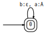
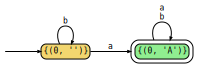
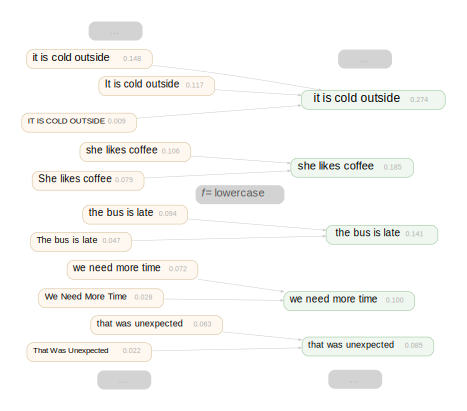
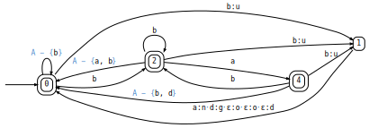
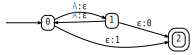

# Transduction

A library for **transducing language models** through finite state transducers (FSTs) — computing the induced distribution over output strings given an LM over input strings and a deterministic string-to-string transformation.

Consider a simple FST that deletes every `b` and maps `a` to `A` (the `delete_b` example):

<p align="center"></p>

Given this FST and a target prefix **y** already generated, transduction computes for each possible next output symbol `z` the **precover** — the set of source strings that transduce through the FST to produce **y**`z`... — partitioned into a **quotient** Q (sources that can continue with any suffix) and a **remainder** R (sources that have terminated):

$$\mathcal{P}(\mathbf{y}) = \mathcal{Q}(\mathbf{y})\mathcal{X}^* \sqcup \mathcal{R}(\mathbf{y})$$

Below is the precover DFA for `delete_b` with target `'A'`. States are colored by their role: green = quotient (universal — accepts any source continuation), magenta = remainder (finite source strings), gold = intermediate (neither final nor universal).

<p align="center"></p>

Both Q and R are returned as finite state automata (FSAs).

## What is transduction?

Given a language model **p(x)** over source strings X\* and an FST **f : X\* → Y\***, transduction computes the **pushforward distribution p(y)** over target strings. Multiple source strings may map to the same target, so p(y) sums over all source preimages. For example, a lowercasing FST maps "It is cold outside", "it is cold outside", and "IT IS COLD OUTSIDE" to the same target, aggregating their probabilities:

<p align="center"></p>

The precover decomposition P(y) = Q(y)X\* ⊔ R(y) enables incremental, symbol-by-symbol computation of this distribution — the key primitive for autoregressive decoding with any string-to-string transformation.

### Applications

- **BPE to character/byte-level LMs** — transduce GPT-2's BPE token distribution into a byte-level distribution (tokenizer inversion)
- **Token-level to word-level LMs** — apply PTB-style tokenization as an FST to get word-level distributions
- **DNA to amino acid sequence LMs** — codon translation tables as FSTs transform nucleotide LMs into protein-level distributions
- **General string-to-string transformations** — case conversion, symbol deletion, pattern replacement, transliteration
- **Constrained decoding** — a special case where the FST is the identity restricted to a constraint language (regex, grammar, schema)

## Installation

Requires Python >= 3.10.

```bash
pip install -e .
```

### Rust acceleration (optional)

For 3-25x speedups, build the Rust extension with [maturin](https://www.maturin.rs/):

```bash
pip install maturin
maturin build --release -m crates/transduction-core/Cargo.toml --interpreter python3.10
pip install --force-reinstall crates/transduction-core/target/wheels/transduction_core-*.whl
```

## Quick start

### Define an FST

```python
from transduction import FST, EPSILON

fst = FST()
fst.add_start(0)
fst.add_stop(0)

# An FST that replaces 'bad' with 'ungood' (a la 1984)
fst.add_arc(0, 'a', 'a', 0)  # copy most characters
fst.add_arc(0, 'b', 'u', 1)  # 'b' might start 'bad' -> 'ungood'
fst.add_arc(1, 'a', 'n', 2)
fst.add_arc(2, 'd', 'g', 3)
fst.add_arc(3, EPSILON, 'o', 4)
fst.add_arc(4, EPSILON, 'o', 5)
fst.add_arc(5, EPSILON, 'd', 0)
# ... (plus identity arcs for other characters)
```

The full `newspeak2` FST (which replaces `bad` → `ungood` while copying all other characters) is shown below. The library's visualization compresses identity arcs (e.g., `a`–`z` minus `b`) into compact labels:

<p align="center"></p>

### Compute a decomposition

```python
from transduction import Precover

result = Precover(fst, target='ab')
print(result.quotient)   # FSA: source strings that can continue after producing 'ab'
print(result.remainder)  # FSA: source strings that terminate after producing 'ab'
```

### Peekaboo: batched next-symbol prediction

The **peekaboo** algorithm computes decompositions for *all* possible next symbols in a single pass — the key primitive for autoregressive constrained decoding:

```python
from transduction.peekaboo_incremental import Peekaboo

peekaboo = Peekaboo(fst)

# Get Q(y·z) and R(y·z) for every possible next symbol z, in one call
decomps = peekaboo('ab')

for symbol, decomp in decomps.items():
    print(f"Next symbol '{symbol}': Q has {len(decomp.quotient.states)} states")
```

Peekaboo supports incremental extension via the `>>` operator, reusing computation across decoding steps.

### Rust backend

Drop-in replacements for the Python algorithms:

```python
from transduction.rust_bridge import RustDecomp, RustDirtyPeekaboo

# Generic decomposition (Rust)
result = RustDecomp(fst, target='ab')

# Dirty-state peekaboo (Rust) — persists DFA state across decoding steps
dirty = RustDirtyPeekaboo(fst)
decomps = dirty.decompose_next()  # first call builds DFA
# extend target incrementally — only re-expands dirty states
```

### LM-weighted enumeration

Combine decomposition with a language model to enumerate or sample valid source strings:

```python
from transduction.lm import StateLM
from transduction.enumeration import prioritized_enumeration, importance_sampling

# Load GPT-2 (or any HuggingFace causal LM)
lm = StateLM.initial('gpt2')

# Best-first search weighted by LM log-probabilities
pe = prioritized_enumeration(lm, fst, target='the', max_steps=20)
for item in pe.quotient_terms:
    print(f"Source: {item.source}, weight: {item.weight:.3f}")

# Or sample paths proportional to LM probability
sampler = importance_sampling(lm, fst, target='the')
sample = sampler.sample(max_length=50)
```

## Algorithms

| Algorithm | Module | Incremental | Notes |
|-----------|--------|:-----------:|-------|
| `Precover` | `eager_nonrecursive.py` | No | Reference implementation; full powerset determinization |
| `NonrecursiveDFADecomp` | `dfa_decomp_nonrecursive.py` | No | Clean reference; rebuilds from scratch each call |
| `TruncatedIncrementalDFADecomp` | `dfa_decomp_incremental_truncated.py` | Yes | Incremental DFA decomp with target-buffer truncation and dirty-state tracking |
| `PeekabooState` | `peekaboo_incremental.py` | Yes | **Recommended.** Batches all next-symbol decompositions; truncation ensures termination |
| `Peekaboo` | `peekaboo_nonrecursive.py` | No | Simpler peekaboo variant without `>>` |
| `TokenDecompose` | `token_decompose.py` | No | BPE-optimized fast path (requires `all_input_universal` FST) |
| `RustDecomp` | `rust_bridge.py` | No | Rust generic decomposition |
| `DirtyPeekaboo` | `peekaboo_dirty.py` | Yes | Dirty-state incremental peekaboo |
| `RustDirtyState` | `rust_bridge.py` | Yes | Rust incremental decomposition with dirty-state tracking |
| `RustDirtyPeekaboo` | `rust_bridge.py` | Yes | Rust dirty-state incremental peekaboo |

### Choosing an algorithm

- **Autoregressive decoding (token by token):** Use `RustDirtyPeekaboo` or `RustDirtyState` for best performance, or `PeekabooState` / `DirtyPeekaboo` (Python) if the Rust extension is unavailable. The dirty-state variants persist DFA state across decoding steps, avoiding redundant recomputation.
- **BPE tokenizers:** Check `check_all_input_universal(fst)` first — if true, `TokenDecompose` gives massive speedups (5000x+).
- **One-shot decomposition:** Use `RustDecomp` or `Precover`.

## Project structure

```
transduction/                Python package
  fst.py                     FST class
  fsa.py                     FSA class (includes DFA minimization)
  base.py                    DecompositionResult, AbstractAlgorithm base classes
  universality.py            UniversalityFilter, check_all_input_universal
  precover_nfa.py            PrecoverNFA variants (PrecoverNFA, PeekabooLookaheadNFA, etc.)
  peekaboo_incremental.py    Peekaboo algorithm (recommended for autoregressive decoding)
  peekaboo_nonrecursive.py   Non-incremental peekaboo
  peekaboo_dirty.py          Dirty-state incremental peekaboo
  eager_nonrecursive.py      Reference Precover implementation
  dfa_decomp_nonrecursive.py Non-incremental DFA decomposition
  dfa_decomp_incremental_truncated.py  Incremental DFA decomp with truncation
  token_decompose.py         BPE-optimized fast path
  enumeration.py             LM-weighted path enumeration
  lazy.py                    Lazy automaton framework (on-demand determinization)
  lazy_incremental.py        LazyIncremental decomposition (finite-language FSTs only)
  lazy_nonrecursive.py       LazyNonrecursive decomposition
  prioritized_lazy_incremental.py  PrioritizedLazyIncremental (finite-language, heuristic BFS)
  viz.py                     Visualization/display utilities for automata
  rust_bridge.py             Python <-> Rust conversion layer
  examples.py                Example FSTs for testing
  applications/              Application-specific FST builders
    bpe.py                   BPE WFST builder (bpe_wfst)
    ptb.py                   PTB tokenizer FST (pynini)
    wikitext.py              WikiText data loading
  lm/                        Language model integration
    base.py                  LMState ABC (logp_next, eos, >>, __call__, greedy/sample decode)
    ngram.py                 ByteNgramLM, CharNgramLM (lightweight n-gram LMs)
    statelm.py               StateLM: incremental LM state with KV caching
    transduced.py            TransducedLM: pushforward of an inner LM through an FST

crates/transduction-core/    Rust acceleration (PyO3)
  src/
    fst.rs                   FST struct with CSR storage + auxiliary indexes
    precover.rs              Precover NFA with epsilon closure caching
    powerset.rs              PowersetArena (hash-consing DFA states)
    decompose.rs             Generic decomposition
    peekaboo.rs              Peekaboo (Rust port)
    incremental.rs           Incremental decomposition with dirty-state tracking
    minimize.rs              DFA minimization
    py.rs                    PyO3 bindings

tests/                       Test suite
  test_general.py            General-case decomposition correctness (9 implementations)
  test_enumeration.py        Enumeration + BPE-scale integration tests
  test_push_labels.py        Push-label tests
  test_transduced.py         Transduced LM tests
  test_finite.py             Finite-language-only algorithm tests
  test_lazy.py               Lazy automaton tests
  test_ngram.py              N-gram LM tests
  test_ptb_nltk.py           PTB tokenizer tests
  test_statelm_kv_cache.py   StateLM KV cache tests
reports/                     Algorithm analysis and benchmarks
```

## Testing

```bash
# Core decomposition tests (9 implementations)
python -m pytest tests/test_general.py -v

# Enumeration + BPE-scale integration tests
python -m pytest tests/test_enumeration.py -v

# All tests
python -m pytest tests/ -v
```

All general-case algorithms terminate on all test inputs.

### Dependencies for full test suite

- `genparse` — required for grammar-based LM tests in `test_enumeration.py`
- `transformers` — required for GPT-2 BPE-scale tests

## Built-in examples

The `examples` module provides FSTs useful for testing and exploration:

```python
from transduction import examples

examples.lookahead()        # FST with epsilon-output lookahead arcs
examples.triplets_of_doom() # Adversarial case: (aaa|bbb)* copy transducer
examples.newspeak2()        # Orwellian: replaces 'bad' -> 'ungood'
examples.delete_b()         # Deletes 'b', replaces 'a' -> 'A' (infinite quotients)
examples.parity({'a','b'})  # Outputs parity bit of input length
examples.togglecase()       # Swaps upper/lowercase
examples.duplicate({'a','b'}, K=3)  # Triplicates each symbol
examples.number_comma_separator(Domain={'0','1',',',' '})  # Comma disambiguation
```

For instance, the `parity` FST consumes an input string over `{a, b}`, outputs nothing until the end, then emits a single bit indicating whether the input length was even or odd:

<p align="center"></p>

## Authors

Tim Vieira, Samuel Kiegeland, Vésteinn Snæbjarnarson, Ryan Cotterell
