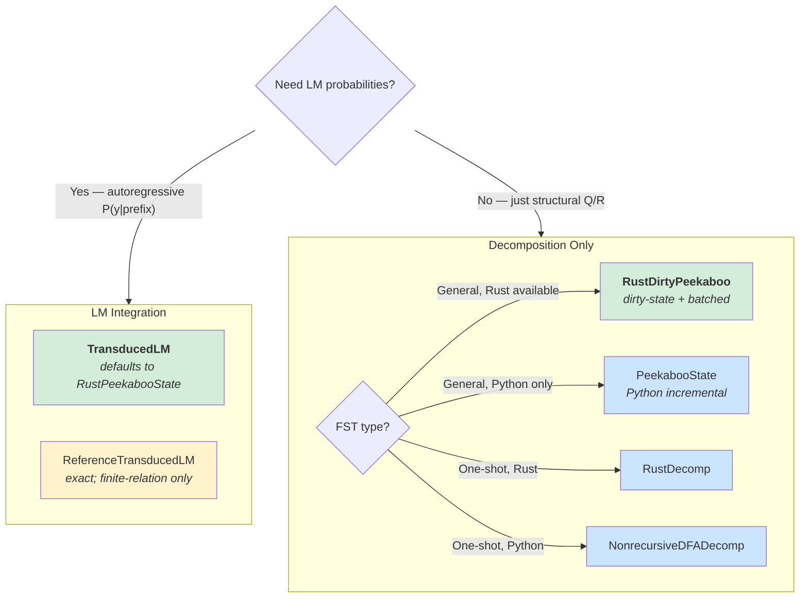

# Algorithm Assessment: Computing Next-Symbol Probabilities of a Transduced Language Model

## The Core Problem

Given an FST `f` and a target prefix **y**, compute for each next symbol `z`:

$$P(z \mid \mathbf{y}) \propto \sum_{x \in \mathcal{Q}(\mathbf{y}z)} P_{\text{LM}}(x) + \sum_{x \in \mathcal{R}(\mathbf{y}z)} P_{\text{LM}}(x \cdot \text{EOS})$$

where $\mathcal{P}(\mathbf{y}) = \mathcal{Q}(\mathbf{y})\mathcal{X}^* \sqcup \mathcal{R}(\mathbf{y})$ is the precover decomposition.

The precover $\mathcal{P}(\mathbf{y})$ is the set of all source strings whose transduction
through `f` begins with **y**. The quotient $\mathcal{Q}$ captures source strings that
can continue producing more output; the remainder $\mathcal{R}$ captures those that
have terminated. Both are represented as finite automata.

---

## Implementations

### General-Case Decomposition Algorithms

These algorithms use target-buffer truncation to guarantee termination on all FSTs,
including those with infinite quotient/remainder languages.

| Algorithm | Language | File | Incremental | Notes |
|-----------|----------|------|:-----------:|-------|
| `Precover` | Python | `precover.py` | No | Reference implementation |
| `NonrecursiveDFADecomp` | Python | `dfa_decomp_nonrecursive.py` | No | Same algorithm, cleaner interface |
| `TruncatedIncrementalDFADecomp` | Python | `dfa_decomp_incremental_truncated.py` | Yes | Dirty-state incremental DFA decomp |
| `PeekabooState` | Python | `peekaboo_incremental.py` | Yes | Batched next-symbol (Python fallback; Rust default is `RustPeekabooState`) |
| `Peekaboo` (nonrecursive) | Python | `peekaboo_nonrecursive.py` | No | Non-incremental peekaboo |
| `Peekaboo` (incremental helper) | Python | `peekaboo_incremental.py` | — | Internal helper used by `PeekabooState` |
| `DirtyPeekaboo` | Python | `peekaboo_dirty.py` | Yes | Dirty-state incremental peekaboo |
| `RustDecomp` | Rust | `rust_bridge.py` → `decompose.rs` | No | 3-10x faster than Python |
| `RustDirtyState` | Rust | `rust_bridge.py` → `incremental.rs` | Yes | Rust-backed dirty-state incremental |
| `RustDirtyPeekaboo` | Rust | `rust_bridge.py` → `peekaboo.rs` | Yes | Rust-backed dirty-state peekaboo |

Note: `Peekaboo` exists in two files. The nonrecursive variant in `peekaboo_nonrecursive.py`
extends `DecompositionResult`. The helper class in `peekaboo_incremental.py` is used
internally by `PeekabooState`. The `__init__.py` exports the latter.

All implementations now support the `>>` operator: incremental algorithms provide
optimized `__rshift__`; non-incremental implementations inherit `DecompositionResult.__rshift__`
which constructs a fresh decomposition for the extended target.

### Rho-Arc Compression Algorithms

Orthogonal to position-set (not TD-specific):

| Algorithm | Language | File | Notes |
|-----------|----------|------|-------|
| `SymbolicLazyDeterminize` | Python | `symbolic_precover.py` | Rho-arc DFA compression for PrecoverNFA |
| `RustRhoDfa` | Rust | `rho.rs` | Rust rho-arc factored determinization |

### Pynini-Backed Reference Implementations

These use OpenFST/pynini WFST operations for composition-based P(y)/Q(y)/R(y).

| Algorithm | Language | File | Notes |
|-----------|----------|------|-------|
| `pynini_ops` | Python | `pynini_ops.py` | Precover, quotient, remainder via pynini composition/projection |
| `PyniniTransducedLM` | Python | `lm/pynini_transduced.py` | Pynini-backed transduced LM with particle inference |

### Finite-Only Decomposition Algorithms

These algorithms lack target-buffer truncation and may diverge on FSTs with infinite
quotients. Tested separately in `test_finite.py`.

| Algorithm | Language | File | Incremental | Notes |
|-----------|----------|------|:-----------:|-------|
| `LazyIncremental` | Python | `lazy_incremental.py` | Yes | Finite-language FSTs only |
| `LazyNonrecursive` | Python | `lazy_nonrecursive.py` | No | Finite-language FSTs only |
| `PrioritizedLazyIncremental` | Python | `prioritized_lazy_incremental.py` | Yes | Heuristic-guided BFS; finite only |

### Inference Algorithms

| Algorithm | File | Approach |
|-----------|------|----------|
| `prioritized_enumeration` | `enumeration.py` | Best-first search weighted by LM log-probs |
| `importance_sampling` | `enumeration.py` | Sample paths, accumulate partition function |
| `crude_importance_sampling` | `enumeration.py` | Same, without Q/R decomposition |

### LM Integration

| Class | File | Description |
|-------|------|-------------|
| `LM` / `LMState` / `LogDistr` | `lm/base.py`, `util.py` | ABCs: `logp_next`, `eos`, `>>`, `__call__`, `greedy_decode`, `sample_decode`; `LogDistr` is the immutable log-probability distribution |
| `ByteNgramLM` / `CharNgramLM` | `lm/ngram.py` | Lightweight n-gram LMs for testing |
| `StateLM` / `TokenizedLLM` | `lm/statelm.py` | Incremental LM state with KV-cache; wraps HuggingFace causal LMs |
| `load_model_by_name` | `lm/statelm.py` | Load `'gpt2'`, `'meta-llama/...'`, etc. |
| `TransducedLM` | `lm/transduced.py` | Pushforward of an inner LM through an FST (beam-sum inference; defaults to Rust backend) |
| `FusedTransducedLM` | `lm/fused_transduced.py` | Single-pass interleaved decomposition + LM search |
| `RustPeekabooState` | `rust_bridge.py` | Rust-backed incremental peekaboo state (default for TransducedLM) |
| `RustLazyPeekabooDFA` | `rust_bridge.py` | Rust-backed lazy DFA interface for TransducedLM beam search |
| `ReferenceTransducedLM` | `lm/reference_transduced.py` | Ground-truth transduced LM via Precover (finite-relation FSTs only) |
| `PyniniTransducedLM` | `lm/pynini_transduced.py` | Pynini-backed transduced LM with particle-based inference |

Self-contained (no external tokenization deps). Example:
```python
from transduction.lm import StateLM
from transduction.enumeration import prioritized_enumeration
lm = StateLM.initial('gpt2')
pe = prioritized_enumeration(lm, fst, target, max_steps=20)
```

---

## Recommended Algorithms

The library has two layers: **decomposition** (compute Q/R structural decompositions)
and **LM integration** (compute next-symbol probabilities using an inner LM). Most
users want the LM integration layer.



### For Autoregressive Decoding with an LM

**Most users should start here.** Use **`TransducedLM`** — it handles decomposition,
beam search, particle carry-forward, and quotient exact marginalization:

```python
from transduction.lm.transduced import TransducedLM
from transduction.lm.ngram import CharNgramLM
from transduction import examples

inner = CharNgramLM.train("hello world", n=2)
fst = examples.lowercase()
tlm = TransducedLM(inner, fst, K=20)
state = tlm >> 'h'
print(state.logp_next['e'])  # log P(next='e' | target='h')
```

`TransducedLM` defaults to `RustPeekabooState` for decomposition. On PTB:
169 ms/step average (45 steps, K=20, max_expansions=200, CharNgramLM).

**`FusedTransducedLM`** interleaves decomposition and LM search in a single pass
(2.4x faster than `TransducedLM` on PTB at 71 ms/step), but has a known logp
disagreement (max |diff| = 2.03 on PTB) that needs investigation before
production use.

**`ReferenceTransducedLM`** computes exact transduced probabilities by enumerating
Q/R languages via Precover. Only works on finite-relation FSTs. Used for
validation, not production.

### For Structural Decomposition (No LM)

For **general FSTs** with incremental autoregressive use, use **`RustDirtyPeekaboo`**
(dirty-state + batched next-symbol):

```python
from transduction.rust_bridge import RustDirtyPeekaboo
peekaboo = RustDirtyPeekaboo(fst)
decomps = peekaboo.decompose_next()  # Q/R for all next symbols
```

For **one-shot decomposition**, use `RustDecomp` (Rust) or `NonrecursiveDFADecomp` (Python).

For **pynini-backed reference** (41x on BPE vs Python), use `PyniniNonrecursiveDecomp`
(requires the `pynini` optional dependency).

### Finite-Only Algorithms

`LazyIncremental`, `LazyNonrecursive`, and `PrioritizedLazyIncremental` lack target-buffer
truncation and may diverge on FSTs with infinite quotients. They are retained for finite-language
FSTs.

### Open Questions

1. **FusedTransducedLM logp disagreement**: Max |logp| diff of 2.03 on PTB vs
   TransducedLM. Need `ReferenceTransducedLM` ground-truth comparison (requires
   finite-relation test FST) to determine which is more accurate.

2. **BPE TransducedLM benchmark**: The BPE notebook cells have no saved outputs.
   Unknown whether BPE behaves differently from PTB at the LM integration layer.

---

## General vs Finite-Only: The Truncation Distinction

The key mechanism separating general-case algorithms from finite-only ones is
**target-buffer truncation**. Algorithms that truncate the target buffer
(`NonrecursiveDFADecomp`, `TruncatedIncrementalDFADecomp`, Peekaboo variants, Rust
backends) terminate on all inputs. Those that don't (`LazyIncremental`,
`LazyNonrecursive`, `PrioritizedLazyIncremental`) may diverge on FSTs with
infinite quotients.

When adding new algorithms or test cases, classify them as general vs finite-only
and place them in the appropriate test file (`test_general.py` vs `test_finite.py`).

---

## Performance Summary

### Rust Peekaboo vs Python

| Example | Rust | Python | Speedup |
|---------|------|--------|---------|
| newspeak2 (depth=3) | 3.0 ms | 67.0 ms | 22x |
| triplets_of_doom (depth=13) | 27 us | 278 us | 10x |
| parity (depth=5) | 13 us | 318 us | 25x |

---

## Key Optimizations

1. **`all_input_universal` precomputation** — O(|arcs|) check; skips universality BFS entirely for BPE/replace FSTs.

2. **Token-level position tracking** — For hub-structured FSTs, NFA states are just positions `{0..N}` instead of `(fst_state, position)`. Collapses thousands of intermediate states per token to 1.

3. **Peekaboo batching** — Build one DFA for all next symbols, not $|\mathcal{Y}|$ separate decompositions.

4. **Dirty-state persistence** — Incremental algorithms persist DFA state across decoding steps, re-expanding only dirty/border states affected by the target extension.

5. **Rust acceleration** — Packed `u64` NFA states, interned `u32` DFA states, `Rc<Vec>` eps cache, single-element intern fast path.

6. **UniversalityFilter cascade** — AUI fast path $\to$ witness check $\to$ monotonicity caches $\to$ BFS fallback.

7. **Rho-arc factoring** — `SymbolicLazyDeterminize`/`RustRhoDfa`: detect complete DFA states and replace the most-common destination with a single rho arc, reducing arc count.

---

## Test Status

- **`test_general.py`**: 380 passed
- **`test_finite.py`**: 119 passed
- **`test_pynini_ops.py`**: 115 passed
- **`test_transduced.py`**: 106 passed
- **`test_lazy.py`**: 100 passed
- **`test_symbolic_precover.py`**: 84 passed
- **`test_fst.py`**: 56 passed
- **`test_enumeration.py`**: 55 passed
- **`test_push_labels.py`**: 35 passed
- **`test_fsa.py`**: 28 passed
- **`test_is_functional.py`**: 26 passed
- **`test_lazy_peekaboo_dfa.py`**: 23 passed
- **`test_ngram.py`**: 22 passed
- **`test_rho_fused.py`**: 15 passed
- **`test_ptb_nltk.py`**: 4 passed
- **`test_make_total.py`**: 3 passed
- **`test_statelm_kv_cache.py`**: 3 passed
- **Total**: 1037 tests across 17 test files

---

## Dependencies

**Core library:** `numpy`, `graphviz`, `IPython`

**LM integration:** `torch`, `transformers`

**Test-only:** `pytest`

**Optional:** `pynini` (PTB FST construction), `nltk` (PTB testing), `datasets` (WikiText), `matplotlib` (notebooks/benchmarks)

**Eliminated:** `arsenal` (inlined into `util.py`), `genlm` (replaced with local `decode_hf_tokenizer`), `tokenization` (inlined into `lm/statelm.py`)
