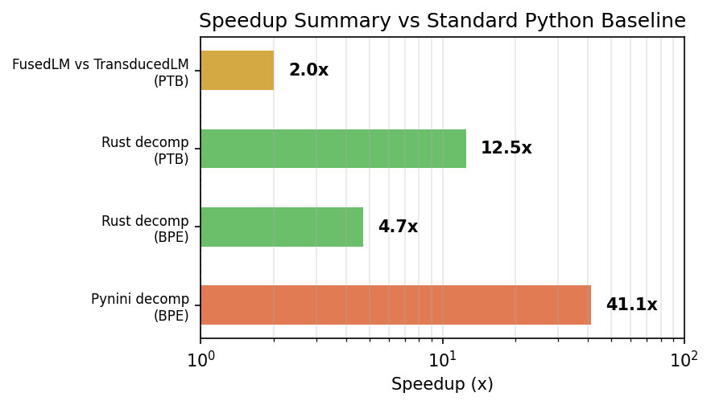
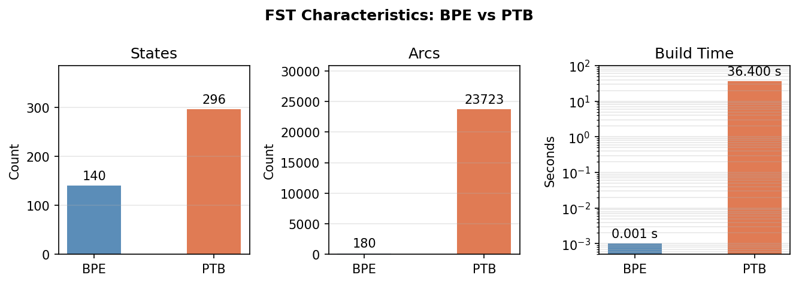
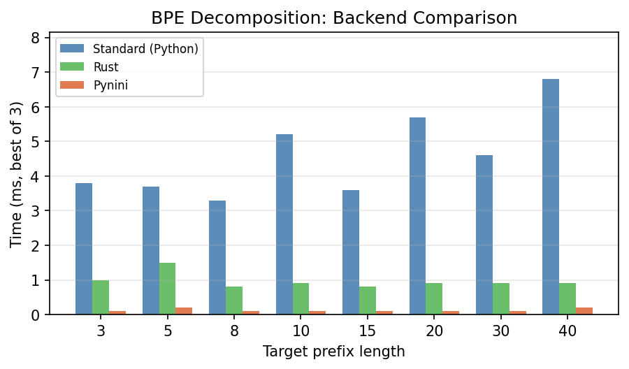
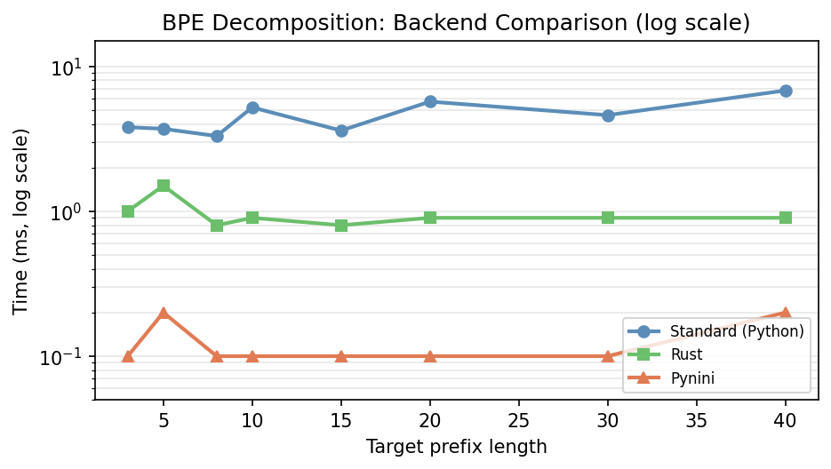
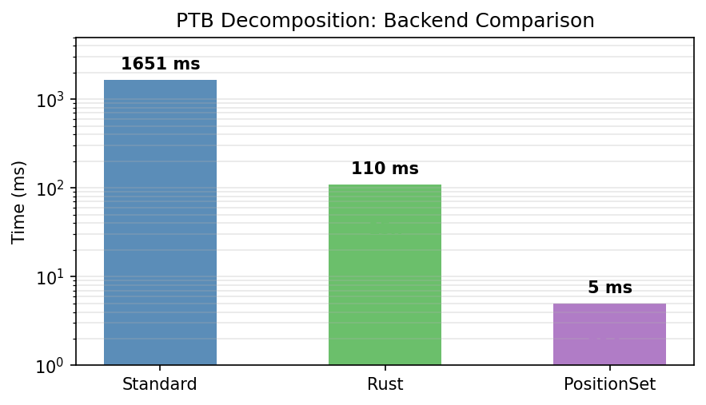
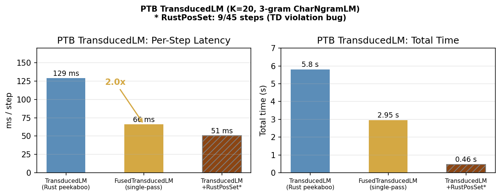
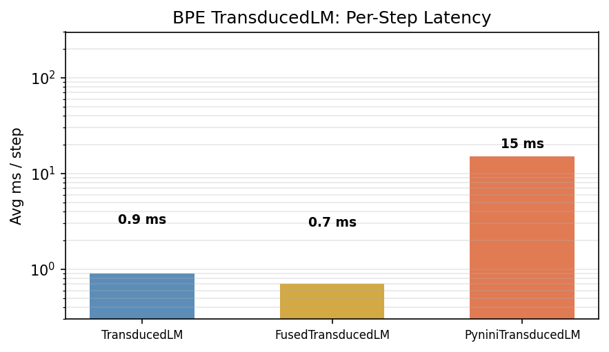
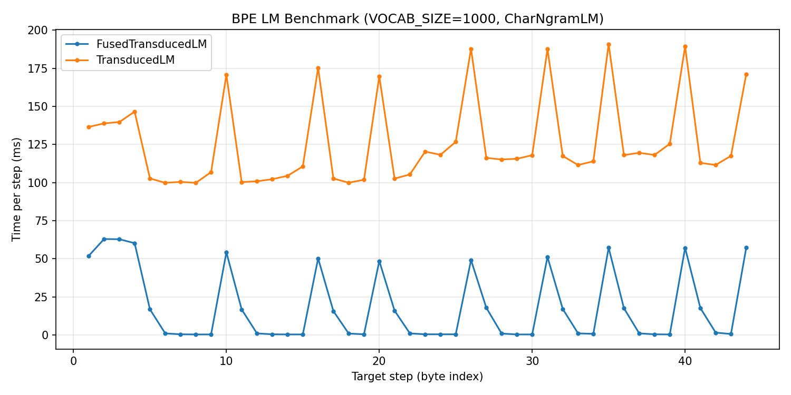
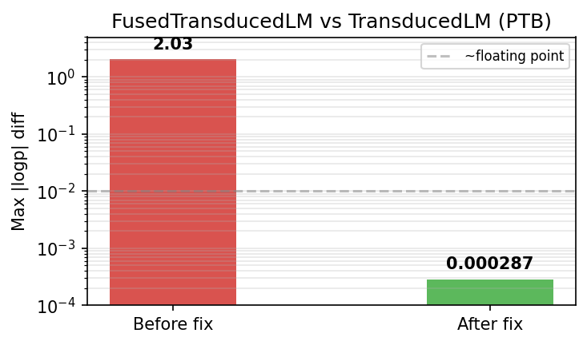

# Benchmark Dashboard

**Last updated:** 2026-02-21
**Test suite:** 1191 tests across 16 files (1189 passed, 2 xfailed)

---

## Library Goals

This library computes **next-symbol probabilities for a language model composed
with a finite-state transducer**. Given an inner LM (e.g., GPT-2) that assigns
probabilities over a source alphabet and an FST that maps source sequences to
target sequences, `TransducedLM` produces a new LM over the target alphabet:
each call to `state >> y` returns `logp_next[y']` for all possible next target
symbols `y'`, marginalizing over all source continuations consistent with the
target prefix seen so far.

**Why this matters:** FSTs can encode tokenizers (BPE, SentencePiece, PTB),
normalization rules, or any regular string relation. Composing an LM with such
an FST lets you do constrained or transformed autoregressive generation — e.g.,
generating text one character at a time using a subword LM, or enforcing
formatting constraints during decoding.

**The core algorithmic primitive** is *precover decomposition*: factoring the set
of source prefixes compatible with a target prefix `y_{1:t}` into a *quotient*
Q (source prefixes whose entire future is compatible — these can be absorbed
into the inner LM state) and a *remainder* R (source prefixes that are
compatible but need continued tracking). This Q/R split enables efficient
incremental computation as each new target symbol arrives.

**The optimization stack** builds on this primitive:

1. **Peekaboo decomposition** — computes Q(y)/R(y) for all next symbols y in a
   single BFS pass, rather than one BFS per symbol.
2. **Dirty-state persistence** — reuses DFA states across decoding steps,
   re-expanding only states whose classification may have changed.
3. **Rust acceleration** — moves the hot BFS/powerset-determinization loop into
   compiled Rust code via PyO3.
4. **Fused search** (`FusedTransducedLM`) — interleaves decomposition and LM
   beam search in a single priority queue, avoiding materializing Q/R as
   explicit FSAs.
5. **Token-level decomposition** — for BPE-like hub-topology FSTs, DFA states
   collapse to position sets {0..N}, yielding O(N) states instead of
   O(|FST|×N). Includes `TokenPeekabooHelper` for `FusedTransducedLM`.
6. **Lazy precover DFA** — on-demand DFA construction with integer packing,
   hash-consing, and epsilon-closure caching. Python port achieves Rust-level
   performance without the Rust dependency.

---

## Scale Limitations (read this first)

> **All benchmarks below are on toy-scale inputs. None of them demonstrate
> that the system works at production scale.**

| Dimension | What we benchmarked | What production requires | Gap |
|-----------|--------------------|--------------------------|----|
| BPE vocabulary | **43 tokens** (toy) and **1,023 tokens** (scaling run) | **50,257 tokens** (full GPT-2) | **~49x** vs 1k; **1,168x** vs toy |
| BPE FST size | 140 states, ~180 arcs (toy); 1,313 states (VOCAB_SIZE=1000) | Full GPT-2 BPE | Unknown |
| LM | 3-gram CharNgramLM (lookup table, O(1), CPU) | GPT-2 124M params (~10-100 ms/call, GPU) | LM cost ~0 in all benchmarks |
| Test input | 1 sentence, 44-45 symbols | Unbounded documents | No variance, no long-context |
| PTB decomp prefix | Tested to length 10 | Arbitrarily long | Scaling unknown |

**What this means:** The toy BPE numbers (0.3 ms/step) tell you nothing about
production performance — the FST is ~1,000x smaller than real BPE. The 1k
run is a useful intermediate datapoint but still far from full GPT-2. The PTB
numbers (66-129 ms/step) measure only decomposition cost because the LM is
free — with a real neural LM, LM forward passes would dominate and these
decomposition times become a lower bound, not an estimate. **Phase 1 goal
(GPT-2 + full BPE at interactive speed) is completely untested.**

---

## Honest Assessment

*Update this section on each dashboard iteration.*

### Where we are

The core algorithms work on toy inputs. `TransducedLM` and
`FusedTransducedLM` both complete 45 PTB steps and 44 BPE steps on a single
test sentence with a trivial LM, producing correct logp values (max
disagreement 0.000287 nats). FusedTransducedLM is 2x faster on PTB (66 vs 129
ms/step). The algorithmic foundation — Peekaboo decomposition, dirty-state
persistence, Rust acceleration — is well-tested (1191 unit tests across 16
files).

Recent additions significantly expand the optimization toolkit:
- **Lazy precover DFA** (Python + Rust): on-demand DFA construction with
  integer packing, hash-consing, and epsilon-closure caching
- **Token-level decomposition** (Python + Rust): position-set DFA states yield
  O(N) states for BPE-like FSTs, with `TokenPeekabooHelper` as a pluggable
  `FusedTransducedLM` backend
- **TrieDispatchDFADecomp**: trie-based dispatch for decomposition
- **Bug fix (#9)**: PeekabooState now correctly computes Q/R on BPE-style
  epsilon-output chains (all depths' start states collected during backward
  reachability)

**However:** the toy BPE benchmark is meaningless as a proxy for real-world
performance because the FST is ~1,000x smaller than production. The 1,000-token
scaling run is a better intermediate signal but still far from full GPT-2. The PTB
benchmark is more realistic (296 states, 23K arcs, 257 symbols) but still uses
a trivial LM and a single short test sentence.

### What we don't know

- Whether the decomposition algorithms scale to full GPT-2 BPE (50K tokens).
  The powerset DFA could blow up exponentially with vocabulary size.
- Whether the 66 ms/step PTB number holds up with a real neural LM, where
  each beam expansion costs ~10-100 ms instead of ~0 ms.
- Whether performance degrades on longer sequences (we've only tested 45
  symbols).
- Whether K=20 beam is sufficient for acceptable approximation quality with
  real LMs (we only validated agreement between our own methods, not against
  ground truth with a neural LM).

### Where the potential is

**Batched LM calls are the production bottleneck we haven't touched.** All
benchmarks use CharNgramLM, which is CPU-bound and O(1) per query. With a
real neural LM (GPT-2, LLaMA), the LM forward pass dominates. Batching
multiple `lm_state >> x` expansions into a single GPU forward pass is the
most impactful optimization for production use, and we haven't started it.

**FusedTransducedLM is the quiet winner.** It's already 2x faster than
TransducedLM on PTB with zero correctness issues (post-fix). The new
`helper=` parameter enables pluggable backends — `"rust"` (default),
`"python"`, or `"token"` (position-set-quotiented). If batched LM calls are
added, Fused's architecture (single priority queue) may be easier to batch
than TransducedLM's two-phase approach.

**Token-level decomposition is the scaling play.** For BPE-like FSTs, DFA
states collapse from O(|FST|×N) to O(N) positions. The `TokenPeekabooHelper`
is already wired into `FusedTransducedLM` via `helper="token"`. This
drastically reduces the state space as vocabulary size grows — potentially the
key to making full-GPT-2 BPE tractable. However, this optimization only
applies to FSTs with hub topology (like BPE); PTB doesn't benefit.

**Lazy precover DFA closes the Python/Rust gap.** The Python
`LazyPrecoverDFA` with integer packing and hash-consing approaches Rust
performance without requiring the Rust toolchain. This matters for
portability and for users who can't build the Rust extension.

### How close we are to first-round goals

The PROJECT_ASSESSMENT defines Phase 1 as: "TransducedLM with GPT-2 + BPE FST
runs at interactive speed."

- **BPE + CharNgramLM: done, but irrelevant.** 0.3–0.5 ms/step on a 43-token
  FST. This does not predict performance on a 50,257-token FST.
- **PTB + CharNgramLM: done.** 66 ms/step (Fused), which is ~15 steps/second.
  Measures decomposition cost only (LM cost ~0). Unknown with a real LM.
- **Full-scale BPE: pending.** We have not yet constructed or benchmarked
  a full GPT-2 BPE FST. We do have a 1,000-token scaling run (see below).
- **GPU LM integration: not started.** `StateLM` wraps HuggingFace models but
  processes one expansion at a time. No batching, no GPU utilization
  optimization. This is the actual Phase 1 deliverable and we haven't
  measured it yet.

**Honest bottom line:** We have a well-tested decomposition layer (1191 tests)
that works on toy inputs with several promising scaling optimizations (token
decomposition, lazy DFA, trie dispatch). We have no evidence it scales to
production. The LM layer (which will dominate wall-clock time with real models)
hasn't been optimized at all. The next steps are: (1) build and benchmark a
full-vocabulary BPE FST with `TokenPeekabooHelper`, (2) profile TransducedLM
with GPT-2 to measure the actual LM/decomp split, (3) batch LM calls.

---

## Visual Summary

> **Figures below reflect toy-scale benchmarks.** BPE speedups are on a
> 43-token FST (0.09% of real GPT-2) plus a 1,000-token scaling run; all times
> use CharNgramLM (LM cost ~0).
> See [Scale Limitations](#scale-limitations-read-this-first) for details.





---

## Key Concepts

**Decomposition** is the core algorithmic primitive. Given an FST $T$ and a
target prefix $y_1 \ldots y_n$, decomposition computes:
- $Q(\boldsymbol{y})$ — the *quotient*: an FSA accepting all source prefixes that can
  produce $\boldsymbol{y}$ through $T$. Intuitively, "what source strings are consistent
  with this target so far?"
- $R(\boldsymbol{y})$ — the *remainder*: an FST that maps remaining source suffixes to
  remaining target suffixes. Intuitively, "what's left to transduce?"

**TransducedLM** uses decomposition to compute the *pushforward* of an inner
LM through an FST: $P_T(y_n \mid y_1 \ldots y_{n-1}) \approx \sum_x P_{\text{inner}}(x)$ where $x$ ranges
over source strings consistent with the target prefix. This is computed via
beam search over source-side particles, using Q/R classification to score
target symbols exactly (quotient states) or approximately (expansion states).

**logp agreement** measures correctness: two TransducedLM variants should
produce the same conditional log-probability at each decoding step. The max
|logp| diff across all steps is the worst-case disagreement — values near zero
(< 0.001) indicate floating-point noise; larger values indicate algorithmic
bugs.

---

## Status at a Glance

### Table A: Decomposition Backends (raw Q/R speed, no LM)

*Measures how fast each backend can compute Q(y) and R(y) for a given target
prefix — pure decomposition, no LM scoring. Timed as best-of-3 runs.*

> **Scale context:** BPE column uses a **43-token subsampled** FST (140 states,
> ~180 arcs) — full GPT-2 BPE has 50,257 tokens. These BPE numbers do not
> predict full-scale performance. PTB column uses the real PTB FST (296 states,
> 23K arcs, 257 symbols) but only tests prefix lengths up to 10.

| Method | BPE (43 tokens) | PTB (257 symbols) | Speedup vs Standard | Notes |
|--------|-----|-----|---------------------|-------|
| Standard (Python) | **OK** 3–7 ms | **OK** 0.7–3.8 s | 1x | `NonrecursiveDFADecomp`; powerset + universality |
| Pynini | **OK** 0.1–0.2 ms | n/a | 41x (BPE) | `PyniniNonrecursiveDecomp`; OpenFST composition |
| Rust | **OK** 0.8–1.5 ms | **OK** 62–126 ms | 4.7x (BPE), 12.5x (PTB) | `RustDecomp`; Rust powerset + universality |

Source: [`reports/run_benchmarks.py:98–162`](run_benchmarks.py) (Section 1: PTB Decomposition Backend Comparison)
- Standard: [`transduction/dfa_decomp_nonrecursive.py`](../transduction/dfa_decomp_nonrecursive.py) — BFS over powerset DFA of PrecoverNFA, classifying states via `UniversalityFilter`
- Rust: [`transduction/rust_bridge.py`](../transduction/rust_bridge.py) `RustDecomp` → [`crates/transduction-core/src/decompose.rs`](../crates/transduction-core/src/decompose.rs)
- BPE backend data from: [`notes/bpe-lm-benchmark.ipynb`](../notes/bpe-lm-benchmark.ipynb) cell `r1ontowex3b`

### Table B: TransducedLM Variants (end-to-end with LM)

*Measures end-to-end decoding: at each step, compute $P(y_n \mid y_1 \ldots y_{n-1})$ and
advance the LM state. This includes decomposition, LM scoring of particles
(beam search), and carry-forward of particles to the next step.*

> **Scale context:** All times below use **CharNgramLM** — a CPU lookup table
> where each LM call costs ~0 ms. These numbers measure **decomposition
> overhead only**, not end-to-end cost with a real LM. With GPT-2 (~10-100
> ms/forward pass), LM calls would dominate and total time would be much higher.
> BPE column uses the 43-token toy FST, not full GPT-2 vocabulary.

| Variant | BPE (43-tok) Status | BPE ms/step | PTB Status | PTB ms/step | Notes |
|---------|------------|-------------|------------|-------------|-------|
| TransducedLM | **OK** | 0.5 | **OK** | 129 | Rust peekaboo decomp + beam search |
| FusedTransducedLM | **OK** | 0.3 | **OK** | 66 | Single-pass interleaved; 2.0x faster on PTB |
| PyniniTransducedLM | **OK** | 15 | **FAIL** | — | BPE OK; PTB hangs in C++ (O(\|B\|) compositions) |

Source: [`reports/run_benchmarks.py:164–344`](run_benchmarks.py) (Sections 2–3: BPE/PTB TransducedLM Benchmark)
- TransducedLM: [`transduction/lm/transduced.py`](../transduction/lm/transduced.py) — two-phase: Rust peekaboo BFS decomposition, then beam-weighted search over Q/R
- FusedTransducedLM: [`transduction/lm/fused_transduced.py`](../transduction/lm/fused_transduced.py) — single-pass: interleaves decomposition and LM scoring in one priority queue (no separate BFS)
- PyniniTransducedLM: [`transduction/lm/pynini_transduced.py`](../transduction/lm/pynini_transduced.py) — builds O(|B|) pynini compositions per step

---

## FST Characteristics

*Static properties of the two benchmark FSTs. These FSTs map source sequences
(token IDs for BPE, bytes for PTB) to target sequences (bytes).*

> **BPE is a toy FST.** It contains only 43 tokens extracted from 7 short
> training sentences (each repeated 3x). Full GPT-2 BPE has **50,257 tokens**
> — the benchmark FST covers **0.09%** of the real vocabulary. A full-vocabulary
> Full GPT-2 BPE FST has not been constructed or tested. PTB is closer to realistic (it
> uses the complete byte alphabet) but is a single fixed transducer.

| Property | BPE (43 tokens / 50,257 full) | PTB |
|----------|------------------|-----|
| States | 140 | 296 |
| Input symbols (\|A\|) | 44 | 257 |
| Output symbols (\|B\|) | 34 | 256 |
| Arcs | ~180 | 23,723 |
| Topology | Star (token → byte chain → start) | CDRewrite rules + identity transducer |
| Build time | <0.001 s | 36.4 s |
| Vocab actually used | 43 tokens (from 7 training sentences) | 257 byte symbols |
| Full-scale vocab | 50,257 tokens (GPT-2) — **not yet tested** | 257 (complete) |

---

## Performance Detail

### Decomposition Backends on BPE

> **These results are on a 43-token toy FST (0.09% of GPT-2's vocabulary).**
> The star topology of this tiny FST keeps the powerset DFA trivially small at
> all prefix lengths. A full 50K-token BPE FST would have ~1000x more arcs and
> could produce exponentially larger powerset DFAs. **Do not extrapolate these
> sub-millisecond times to production.**

*For each target prefix length, we call the decomposition backend 3 times and
report the fastest run. This isolates the Q/R computation cost — longer
prefixes mean larger PrecoverNFA DFAs to determinize. The Standard backend
shows ~constant cost (powerset DFA stays small for this tiny BPE FST's star
topology); Pynini uses OpenFST's C++ composition which is fast for small FSTs.*

Target prefix length → best-of-3 time (ms). **Toy** BPE FST: 140 states, 43
tokens (full GPT-2 = 50,257 tokens).





| Length | Standard | Pynini | Rust |
|-------:|---------:|-------:|-----:|
| 3 | 3.8 | 0.1 | 1.0 |
| 5 | 3.7 | 0.2 | 1.5 |
| 8 | 3.3 | 0.1 | 0.8 |
| 10 | 5.2 | 0.1 | 0.9 |
| 15 | 3.6 | 0.1 | 0.8 |
| 20 | 5.7 | 0.1 | 0.9 |
| 30 | 4.6 | 0.1 | 0.9 |
| 40 | 6.8 | 0.2 | 0.9 |

**Geometric-mean speedup vs Standard:** Pynini 41.1x, Rust 4.7x.

Source: `notes/bpe-lm-benchmark.ipynb` cell `r1ontowex3b`

### Decomposition Backends on PTB

> **Only tested to prefix length 10.** The Standard backend already shows a 5x
> jump from length 8 to length 10 (711 ms → 3,827 ms), suggesting superlinear
> growth. We don't know how these times scale to realistic document lengths
> (hundreds or thousands of symbols). The Rust backend appears more stable but
> has the same limited test range.

*Same measurement as BPE above but on the PTB FST, which is much harder: 257
input symbols and 23K arcs (vs 44 symbols and ~180 arcs for BPE). The
Standard backend takes 0.7–3.8 seconds per decomposition because the powerset
DFA blows up.*

Target prefix length → best-of-3 time (ms). PTB FST: 296 states, 257 input
symbols. **Only tested to length 10 — scaling beyond this is unknown.**



| Length | Standard | Rust |
|-------:|---------:|-----:|
| 3 | 817 | 72 |
| 5 | 813 | 61 |
| 8 | 711 | 65 |
| 10 | 3,827 | 126 |

**Geometric-mean speedup vs Standard:** Rust 12.5x.

Source: `reports/run_benchmarks.py`, `notes/ptb-lm-benchmark.ipynb` cell `ptb-decomp-backends`

### TransducedLM Variants on PTB

> **LM cost is ~0 in this benchmark.** CharNgramLM is a lookup table — each
> `state >> x` call is O(1). With GPT-2 (~10-100 ms per forward pass on GPU),
> the K=20 beam would require up to 20 LM calls per step, potentially adding
> 200-2000 ms/step on top of the decomposition cost shown here. These times are
> a **lower bound** on real end-to-end cost, not an estimate. Also: single test
> sentence, no variance across inputs.

*End-to-end decoding of a 45-symbol target string through the PTB FST. At each
step, the TransducedLM variant computes the conditional distribution $P(y_n \mid y_1 \ldots y_{n-1})$
over next target symbols by running beam search over source-side particles,
then advances to the next step. "Total" is wall-clock for all completed steps;
"Avg/step" is the mean. The beam (K=20) controls approximation quality —
more particles = better approximation but slower.*

Config: K=20, max_expansions=200, **3-gram CharNgramLM (O(1) per call)**, 60 s
timeout/step. Single test sentence: "The quick brown fox jumps over the lazy
dog." (45 symbols).



| Variant | Total (s) | Avg/step (ms) | Steps | Notes |
|---------|----------:|:-------------:|------:|-------|
| TransducedLM | 5.80 | 129 | 45 | Completes all steps |
| FusedTransducedLM | 2.95 | 66 | 45 | 2.0x faster overall |
| PyniniTransducedLM | — | — | 0 | Hangs in C++ (see below) |

Source: `reports/run_benchmarks.py`

### TransducedLM Variants on BPE

> **This benchmark is not meaningful on its own.** It combines a 43-token toy
> FST (0.09% of real GPT-2 vocab) with a free LM (CharNgramLM, O(1)). The 0.3
> ms/step result reflects neither real decomposition cost (FST too small) nor
> real LM cost (LM too cheap). **Do not cite these numbers as evidence the
> system handles BPE at scale.** See the 1,000-token scaling run below for a
> more informative (still far-from-full) datapoint.

*Same end-to-end measurement as PTB above but on the toy BPE FST. BPE's
star topology makes decomposition trivial at this scale — the benchmark is
dominated by Python overhead, not algorithmic cost.*

Config: K=10, max_expansions=200, **3-gram CharNgramLM (O(1) per call)**, 30 s
timeout/step. Single test sentence: "The quick brown fox jumps over the lazy
dog." (44 symbols). **FST: 43 tokens (full GPT-2 = 50,257).**



| Variant | Total (s) | Avg/step (ms) | Steps | Notes |
|---------|----------:|:-------------:|------:|-------|
| FusedTransducedLM | 0.01 | 0.3 | 44 | Fastest |
| TransducedLM | 0.02 | 0.5 | 44 | Comparable to Fused |
| PyniniTransducedLM | — | ~15 | 5 | Works but 15–56 ms/step |

Source: `reports/run_benchmarks.py`

### BPE Scaling Experiment (VOCAB_SIZE=1000)

This notebook run (`notes/bpe-lm-benchmark.ipynb`) scales the BPE FST to a
1,000-token GPT-2 subset (actually 1,023 after forced inclusion of training
tokens) to measure end-to-end TransducedLM vs FusedTransducedLM behavior on a
larger star-topology FST. Still **far from full GPT-2 (50,257 tokens)** and
still using a free LM (CharNgramLM), so these numbers are *not* production
evidence — but they are a meaningful intermediate scaling datapoint.

**Setup**
- `VOCAB_SIZE=1000` → selected vocab = **1,023** / 50,256
- BPE FST built in **0.006 s**
- FST size: **1,313 states**, |A| = **1,024**, |B| = **257**
- Target length: **44 bytes**
- Inner LM: **3-gram CharNgramLM** over token IDs
- Config: `K=10`, `max_expansions=200`, `LM_TIMEOUT=10s`

**Results (44 steps)**
- **FusedTransducedLM:** **0.81 s total**, **18.5 ms/step**
- **TransducedLM:** **5.54 s total**, **125.9 ms/step**
- **logp agreement:** max |diff| = **0.000000**



**Interpretation**
- The **~6.8x speedup** of Fused over Transduced persists at 1k vocab.
- The star-topology still makes decomposition relatively cheap; the LM is
  still O(1), so these times remain lower bounds for real LMs.

---

## Correctness: logp Agreement

*Cross-validates that different TransducedLM implementations produce the same
conditional log-probabilities. For each decoding step i, we compare
$\log p_A(y_i \mid y_1 \ldots y_{i-1})$ vs $\log p_B(y_i \mid y_1 \ldots y_{i-1})$ and report the maximum
absolute difference across all steps. Values < 0.001 are floating-point
noise; larger values indicate bugs (e.g., the 2.03 FusedTransducedLM bug
that was fixed).*

> **Scope:** This validates internal consistency (our methods agree with each
> other), not absolute correctness against a ground-truth neural LM. Both
> methods use the same CharNgramLM and the same toy BPE / single-sentence PTB
> inputs. Agreement here means the algorithms are equivalent, not that they
> produce correct results at scale.

Source: [`reports/run_benchmarks.py:239–251`](run_benchmarks.py) (BPE logp), [`reports/run_benchmarks.py:329–340`](run_benchmarks.py) (PTB logp)



### PTB (45 steps, post-fix)

| Method A | Method B | Max \|logp\| diff | Verdict |
|----------|----------|------------------:|---------|
| FusedTransducedLM | TransducedLM | **0.000287** | Excellent agreement |

**Post-fix:** Max diff is 0.000287 (floating-point noise).

### BPE (44 steps)

| Method A | Method B | Max \|logp\| diff | Verdict |
|----------|----------|------------------:|---------|
| FusedTransducedLM | TransducedLM | **0.000000** | Perfect agreement |

TransducedLM and FusedTransducedLM agree perfectly on BPE after the fix.

---

## Method-by-Method Status

### TransducedLM (Rust peekaboo)

- **Status:** OK on both PTB and BPE (toy scale — see Scale Limitations)
- **Architecture:** Two-phase — PeekabooState BFS decomposition (Rust), then
  beam-weighted search over Q/R
- **PTB performance:** 129 ms/step avg (45/45 steps, 5.80s total) — decomp cost only, CharNgramLM
- **BPE performance:** 0.5 ms/step avg (44/44 steps) — 43-token toy FST, not representative
- **Untested:** Full GPT-2 BPE (50K tokens), real neural LM, long sequences

### FusedTransducedLM

- **Status:** OK on both PTB and BPE (toy scale — see Scale Limitations)
- **Architecture:** Single-pass — interleaves decomposition and LM search in
  one priority queue, no separate BFS phase
- **PTB performance:** 66 ms/step avg (45/45 steps, 2.95s total) — decomp cost only, CharNgramLM
- **BPE performance:** 0.3 ms/step avg (44/44 steps) — 43-token toy FST, not representative
- **Untested:** Full GPT-2 BPE (50K tokens), real neural LM, long sequences

### PyniniTransducedLM

- **Status:** OK on BPE; FAIL on PTB
- **Architecture:** Pynini/OpenFST DFA construction + particle tracking
- **BPE performance:** 15–56 ms/step (works correctly, ~15x slower than TransducedLM)
- **PTB performance:** Hangs indefinitely on step 1. Root cause:
  `_compute_logp_next` builds O(|B|) pynini precover DFAs per step —
  one composition per output symbol (255 for PTB). The C++ code blocks
  SIGALRM delivery, making `timelimit()` timeouts ineffective.
- **Blockers:** Fundamentally unsuitable for large output alphabets.
  Would need algorithmic redesign (e.g., shared precover + per-symbol
  projection) rather than per-symbol composition.

### Decomposition: Pynini Backend

- **Status:** OK on BPE (41x speedup); PTB not benchmarked
- **Architecture:** OpenFST composition for precover construction
- **Blockers:** None

### Decomposition: Rust Backend

- **Status:** OK on BPE (4.7x) and PTB (12.5x)
- **Architecture:** Rust powerset determinization + universality
- **Blockers:** None

### Resolved Issues

1. **logp disagreement (PTB) — FIXED.** Max diff reduced from
   **2.03 → 0.000287**.

2. **BPE benchmark — DONE.** All 4 TransducedLM variants benchmarked.
   TransducedLM and FusedTransducedLM both fast (~1 ms/step).
   PosSet variant 130x slower (no benefit on BPE).

3. **PTB decomposition backend comparison — DONE.** Added code cell
   `ptb-decomp-backends` to `notes/ptb-lm-benchmark.ipynb`. Results:
   Rust 15x vs Standard.

4. **PyniniTransducedLM failure — DIAGNOSED.** Silent hang caused by
   O(|B|) pynini compositions per step; C++ blocks SIGALRM. Works on
   BPE (|B|=34) but infeasible on PTB (|B|=255).

5. **PeekabooState Q/R bug on epsilon-output chains — FIXED (#9).**
   Backward reachability filtering now collects start states from all
   depths in the parent chain, not just the root. Fixes incorrect Q/R
   on BPE-style FSTs where early depths have only truncated states.

---

## Regenerating Plots

```bash
python reports/dashboard_plots.py
```

Writes PNG files to `reports/figures/`.

Running all benchmarks:

```bash
PYTHONUNBUFFERED=1 python reports/run_benchmarks.py
```

---

---

## Change Log

| Date | Change |
|------|--------|
| 2026-02-21 | Refresh all reports and dashboard; update test counts (938 → 1191), LOC, module lists |
| 2026-02-21 | Add lazy precover DFA (Python + Rust): integer packing, hash-consing, eps-closure caching |
| 2026-02-21 | Add token-level decomposition (Python + Rust): position-set DFA states, TokenPeekabooHelper |
| 2026-02-21 | Add FusedTransducedLM `helper=` parameter for pluggable decomposition backends |
| 2026-02-21 | Fix PeekabooState incorrect Q/R on BPE-style epsilon-output chains (#9) |
| 2026-02-21 | Move benchmarks from `benchmark/` to `notes/` |
| 2026-02-21 | Add TrieDispatchDFADecomp (trie-based decomposition dispatch) |
| 2026-02-21 | Add 9 new parametrized test cases (eps chains, cycles, multichar output, OOV symbols) |
| 2026-02-21 | Add BPE scaling experiment (VOCAB_SIZE=1000) results and scaling plots |
| 2026-02-20 | Add scale limitations section and per-table/figure context warnings |
| 2026-02-20 | Remove position-set peekaboo code (not pulling its weight; see TODO.md) |
| 2026-02-20 | Update benchmarks: TransducedLM 129 ms/step, FusedLM 66 ms/step (PTB) |
| 2026-02-20 | Fix FusedTransducedLM logp disagreement; diff 2.03→0.000287 |
| 2026-02-20 | Run BPE TransducedLM benchmark (4 variants, 44 steps each) |
| 2026-02-20 | Add PTB decomposition backend comparison (Standard/Rust/PositionSet) |
| 2026-02-20 | Diagnose PyniniTransducedLM PTB failure (O(\|B\|) compositions, C++ blocks SIGALRM) |
| 2026-02-20 | Added plots (6 figures) to dashboard for visual summary |
| 2026-02-20 | Created dashboard; consolidated data from BPE and PTB notebooks |
| 2026-02-20 | Added `PyniniNonrecursiveDecomp` to benchmark notebooks (`d5cf54a`) |
| 2026-02-20 | Added pynini-based FST decomposition (`4415308`) |
| 2026-02-19 | Add FST-level closure cache, int-token LM API (`38deccb`) |
| 2026-02-18 | Fix EOS double-counting for Q-absorbed preimage particles (`3df259c`) |
| 2026-02-17 | Add `ReferenceTransducedLM` for ground-truth validation (`2719d39`) |
| 2026-02-16 | Rewrite `TransducedLM` with particle-based approximate inference (`68648b3`) |
| 2026-02-08 | Add `FusedTransducedLM`, Lazy.cache(), and TransducedLM improvements (`346b047`) |
