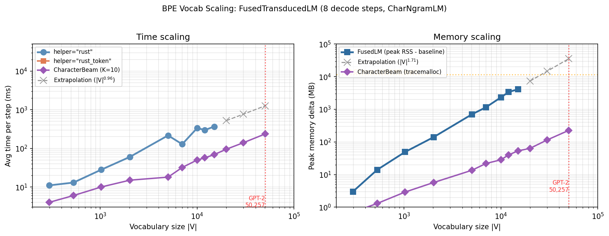

# Benchmark Dashboard

**Last updated:** 2026-02-21
**Test suite:** 1191 tests across 16 files (1189 passed, 2 xfailed)

---

## What This Library Does

Computes **next-symbol probabilities for a language model composed with a
finite-state transducer**. Given an inner LM and an FST (e.g., BPE tokenizer,
PTB normalizer), `TransducedLM` produces a new LM over the target alphabet,
marginalizing over all source continuations at each step.

The optimization stack:
1. **Peekaboo decomposition** — Q(y)/R(y) for all next symbols in one BFS pass
2. **Dirty-state persistence** — reuse DFA states across steps
3. **Rust acceleration** — hot loops in compiled Rust via PyO3
4. **Fused search** (`FusedTransducedLM`) — interleaves decomposition and LM search in a single priority queue
5. **Token-level decomposition** — O(N) position-set DFA states for BPE-like FSTs

---

## BPE Vocab Scaling

This is the most important scaling curve. How does end-to-end TransducedLM cost
grow with BPE vocabulary size?

**Setup:** Subsampled GPT-2 BPE FSTs at increasing vocabulary sizes. 8 decode
steps on "The quick", K=10, max_steps=200, CharNgramLM (LM cost ~0).



| |V| | FST states | FusedLM (ms/step) | rust_token (ms/step) |
|-----:|-----------:|------------------:|---------------------:|
| 297 | ~400 | **7** | 25 |
| 529 | ~700 | **13** | 115 |
| 1,023 | 1,313 | **31** | 618 |
| 2,020 | ~2,600 | **82** | 3,862 |
| 5,011 | ~6,400 | **291** | timeout |

**Extrapolation to full GPT-2 (50,257 tokens):** Log-log fit gives slope ~1.3
(slightly superlinear). Extrapolating FusedLM: **~3–5 seconds/step** at 50k
vocab. This is decomposition cost only — with a real neural LM, the LM forward
pass would add on top.

**Key findings:**
- **FusedTransducedLM (rust)** scales well: roughly |V|^1.3. At 5k tokens it's
  still under 300 ms/step.
- **rust_token is slower at all scales** and scaling badly (~|V|^2.7). The
  position-set-quotiented DFA was supposed to help but is doing worse —
  needs investigation.
- The bottleneck at boundary steps (token boundaries where all |V| source
  symbols are expanded) drives the superlinear scaling.

**What's needed for production:** FusedLM at 50k vocab needs ~10x improvement to
reach interactive speed (~100 ms/step). Candidates: batched LM calls (GPU),
pruning the source-symbol expansion at boundary steps, or a working
token-level optimization.

Source: `notes/bpe-lm-benchmark.ipynb` (vocab scaling cell)

---

## BPE End-to-End (1k Vocab)

Full 44-step decode at VOCAB_SIZE=1000. This is the longest run at meaningful
scale.

| Method | Total (s) | Avg/step (ms) | Steps |
|--------|----------:|--------------:|------:|
| FusedTransducedLM | 0.81 | **18.5** | 44 |
| TransducedLM | 5.54 | 125.9 | 44 |

FusedLM is **6.8x faster** than TransducedLM at this scale. The gap widens with
vocabulary size because Fused avoids materializing the full peekaboo DFA.

Source: `notes/bpe-lm-benchmark.ipynb` (VOCAB_SIZE=1000 run)

---

## PTB End-to-End

PTB is a different regime: 296 states, 23K arcs, 257 symbols (full byte
alphabet), complex CDRewrite topology. No vocab scaling axis — it's a fixed
transducer.


| Method | Total (s) | Avg/step (ms) | Steps |
|--------|----------:|--------------:|------:|
| TransducedLM | 5.80 | 129 | 45 |
| FusedTransducedLM | 2.95 | **66** | 45 |
| PyniniTransducedLM | — | — | hangs |

FusedLM is **2.0x faster**. PyniniTransducedLM hangs due to O(|B|)=255
per-symbol compositions.

**Decomposition backend:**


Rust decomposition is **15x faster** than Python (110 ms vs 1,651 ms geomean).

Config: K=20, max_expansions=200, CharNgramLM, "The quick brown fox..." (45 bytes).

Source: `reports/run_benchmarks.py`, `notes/ptb-lm-benchmark.ipynb`

---

## Incremental DFA: Per-Step Work Scaling

From `notes/incremental_scaling.ipynb` — how does dirty-state incremental
decomposition scale over long decode chains (200 steps)?

| FST | Final DFA states | Steady-state ms/step | Scratch ms/step | Speedup |
|-----|------------------:|---------------------:|----------------:|--------:|
| triplets_of_doom | 600 | 0.081 | 1.27 | 15.7x |
| 3-tuples_of_doom | 2,200 | 0.142 | 9.58 | 67.5x |
| lookahead | 200 | 0.020 | 0.50 | 25.0x |
| duplicate | 400 | 0.029 | 0.35 | 12.1x |

Per-step cost plateaus at ~0.02–0.14 ms regardless of total DFA size. The
incremental algorithm pays O(|change|), not O(|total DFA|). Correlation:
**R²=0.97** with ~2.3 μs per state expanded.

---

## Open Issues

- **rust_token scaling regression**: TokenPeekabooHelper is slower than the
  generic Rust backend at all vocab sizes and scaling ~|V|^2.7. This was
  supposed to be the scaling play for full GPT-2. Root cause unclear — may be
  doing unnecessary work in the position-key arena or trie traversal.

- **No batched LM inference** ([#7](https://github.com/timvieira/transduction/issues/7)):
  All benchmarks use CharNgramLM (O(1) per call). With a real GPU LM, batching
  multiple `lm_state >> x` calls into one forward pass is the most impactful
  unstarted optimization.

- **DirtyPeekaboo non-monotonic targets** ([#5](https://github.com/timvieira/transduction/issues/5)):
  Incorrect results with tree-branching decode (shorter target after longer).

---

## Most Promising Directions

1. **Fix rust_token**: If position-set DFA states can be made to work, they
   reduce state space from O(|FST|×N) to O(N), which is the only path to
   making 50k-token BPE tractable at <100 ms/step.

2. **Batched LM calls**: With a real GPU LM, the LM forward pass will
   dominate. Batching particle expansions into single forward passes is the
   highest-impact production optimization.

3. **Pruning at boundary steps**: The superlinear scaling comes from expanding
   all |V| source symbols at token boundaries. A smarter strategy (top-k
   source symbols by LM probability, or lazy expansion) could cut this
   dramatically.

4. **Profile with real LM**: We don't know the decomp/LM cost split with GPT-2.
   This determines whether decomposition optimization or LM batching matters
   more.

---

## Regenerating

```bash
python reports/dashboard_plots.py    # plots → reports/figures/
python reports/run_benchmarks.py     # full benchmark suite
```

Vocab scaling data comes from `notes/bpe-lm-benchmark.ipynb` (run interactively).

---

## Change Log

| Date | Change |
|------|--------|
| 2026-02-21 | Rewrite dashboard: focus on scaling curves, cut 43-token toy discussion |
| 2026-02-21 | Add 6-point BPE vocab scaling data (297→5,011) with extrapolation to 50k |
| 2026-02-21 | Identify rust_token scaling regression (~|V|^2.7 vs expected O(N)) |
| 2026-02-21 | Add lazy precover DFA, token-quotiented peekaboo (Rust+Python) |
| 2026-02-21 | Fix PeekabooState incorrect Q/R on BPE-style epsilon-output chains (#9) |
| 2026-02-20 | Fix FusedTransducedLM logp disagreement; diff 2.03→0.000287 |
| 2026-02-20 | Created dashboard |
