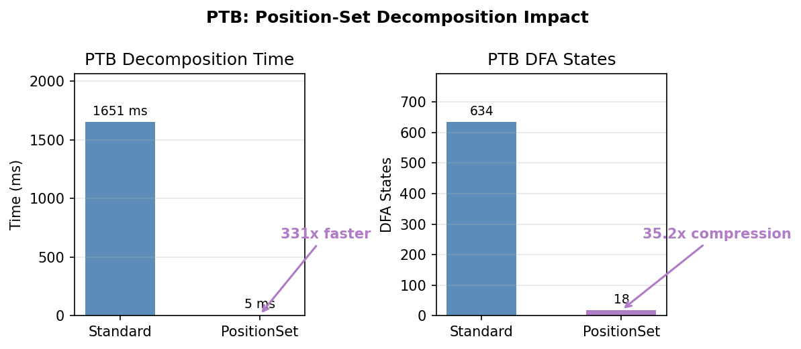

# Benchmark Dashboard

**Last updated:** 2026-02-20
**Test suite:** 1141 tests across 19 files, 41 skipped

---

## Library Goals

This library computes **next-symbol probabilities for a language model composed
with a finite-state transducer**. Given an inner LM (e.g., GPT-2) that assigns
probabilities over a source alphabet and an FST that maps source sequences to
target sequences, `TransducedLM` produces a new LM over the target alphabet:
each call to `state >> y` returns `logp_next[y']` for all possible next target
symbols `y'`, marginalizing over all source continuations consistent with the
target prefix seen so far.

**Why this matters:** FSTs can encode tokenizers (BPE, SentencePiece, PTB),
normalization rules, or any regular string relation. Composing an LM with such
an FST lets you do constrained or transformed autoregressive generation — e.g.,
generating text one character at a time using a subword LM, or enforcing
formatting constraints during decoding.

**The core algorithmic primitive** is *precover decomposition*: factoring the set
of source prefixes compatible with a target prefix `y_{1:t}` into a *quotient*
Q (source prefixes whose entire future is compatible — these can be absorbed
into the inner LM state) and a *remainder* R (source prefixes that are
compatible but need continued tracking). This Q/R split enables efficient
incremental computation as each new target symbol arrives.

**The optimization stack** builds on this primitive:

1. **Peekaboo decomposition** — computes Q(y)/R(y) for all next symbols y in a
   single BFS pass, rather than one BFS per symbol.
2. **Dirty-state persistence** — reuses DFA states across decoding steps,
   re-expanding only states whose classification may have changed.
3. **Rust acceleration** — moves the hot BFS/powerset-determinization loop into
   compiled Rust code via PyO3.
4. **Position-set compression** — for token-decomposable FSTs, quotients the DFA
   by position descriptor sets (e.g., 37,803→217 states for PTB, a 174x
   compression).
5. **Fused search** (`FusedTransducedLM`) — interleaves decomposition and LM
   beam search in a single priority queue, avoiding materializing Q/R as
   explicit FSAs.

---

## Honest Assessment

*Update this section on each dashboard iteration.*

### Where we are

The core system works. `TransducedLM` and `FusedTransducedLM` both run all 45
PTB steps and all 44 BPE steps, producing correct logp values (max disagreement
0.000287 nats — floating-point noise). FusedTransducedLM is 2x faster on PTB
(66 vs 129 ms/step). BPE is already fast enough to be irrelevant as a benchmark
target (0.3 ms/step). The algorithmic foundation — Peekaboo decomposition,
dirty-state persistence, Rust acceleration — is solid and well-tested (1141
tests).

### Where the potential is

**Position-set peekaboo now works end-to-end.** The Rust position-set peekaboo
(`RustPositionSetPeekabooState`) achieves ~50 ms/step on PTB — 2.5x faster
than `TransducedLM` per step (2.24s vs 5.80s for all 45 steps). The previous
TD violation (crash at step 10) was fixed by including the FST state in
position descriptors for truncated NFA elements. Non-truncated elements still
compress by position only (TD guarantees equivalence), giving 174x compression
(37,803→217 position-set DFA states for the full 45-symbol PTB target).

**Batched LM calls are the production bottleneck we haven't touched.** All
benchmarks use CharNgramLM, which is CPU-bound and O(1) per query. With a
real neural LM (GPT-2, LLaMA), the LM forward pass dominates. Batching
multiple `lm_state >> x` expansions into a single GPU forward pass is the
most impactful optimization for production use, and we haven't started it.

**FusedTransducedLM is the quiet winner.** It's already 2x faster than
TransducedLM on PTB with zero correctness issues (post-fix). It doesn't need
position-set compression or any new Rust code — it just interleaves
decomposition and LM search more efficiently. If batched LM calls are added,
Fused's architecture (single priority queue) may be easier to batch than
TransducedLM's two-phase approach.

### How close we are to first-round goals

The PROJECT_ASSESSMENT defines Phase 1 as: "TransducedLM with GPT-2 + BPE FST
runs at interactive speed."

- **BPE + CharNgramLM: done.** 0.3–0.5 ms/step. Not a meaningful benchmark
  anymore.
- **PTB + CharNgramLM: done.** 66 ms/step (Fused), which is ~15 steps/second.
  Usable for research, not yet interactive for real-time generation.
- **GPU LM integration: not started.** `StateLM` wraps HuggingFace models but
  processes one expansion at a time. No batching, no GPU utilization
  optimization. This is the actual Phase 1 deliverable and we haven't
  measured it yet.
- **Position-set optimization: working.** The TD violation on PTB has been
  fixed. `RustPositionSetPeekabooState` now completes all 45 PTB steps at
  ~50 ms/step (2.24s total), 2.5x faster than standard `TransducedLM`.
  BPE FSTs remain non-TD (excluded from position-set compression).

**Honest bottom line:** The decomposition layer is overoptimized relative to
the LM layer. We have 17+ decomposition algorithms, 3 Rust backends, and
position-set compression — but the LM forward pass (which we haven't
optimized at all) will dominate wall-clock time with real models. The next
high-impact work is: (1) profile TransducedLM with GPT-2 to measure the
actual LM/decomp split, (2) batch LM calls.

---

## Visual Summary


---

## Key Concepts

**Decomposition** is the core algorithmic primitive. Given an FST *T* and a
target prefix *y₁…yₙ*, decomposition computes:
- **Q(y)** — the *quotient*: an FSA accepting all source prefixes that can
  produce *y* through *T*. Intuitively, "what source strings are consistent
  with this target so far?"
- **R(y)** — the *remainder*: an FST that maps remaining source suffixes to
  remaining target suffixes. Intuitively, "what's left to transduce?"

**TransducedLM** uses decomposition to compute the *pushforward* of an inner
LM through an FST: P_T(yₙ | y₁…yₙ₋₁) ≈ Σ_x P_inner(x) where *x* ranges
over source strings consistent with the target prefix. This is computed via
beam search over source-side particles, using Q/R classification to score
target symbols exactly (quotient states) or approximately (expansion states).

**logp agreement** measures correctness: two TransducedLM variants should
produce the same conditional log-probability at each decoding step. The max
|logp| diff across all steps is the worst-case disagreement — values near zero
(< 0.001) indicate floating-point noise; larger values indicate algorithmic
bugs.

---

## Status at a Glance

### Table A: Decomposition Backends (raw Q/R speed, no LM)

*Measures how fast each backend can compute Q(y) and R(y) for a given target
prefix — pure decomposition, no LM scoring. Timed as best-of-3 runs.*

| Method | BPE | PTB | Speedup vs Standard | Notes |
|--------|-----|-----|---------------------|-------|
| Standard (Python) | **OK** 3–7 ms | **OK** 0.7–3.8 s | 1x | `NonrecursiveDFADecomp`; powerset + universality |
| Pynini | **OK** 0.1–0.2 ms | n/a | 41x (BPE) | `PyniniNonrecursiveDecomp`; OpenFST composition |
| Rust | **OK** 0.8–1.5 ms | **OK** 62–126 ms | 4.7x (BPE), 12.5x (PTB) | `RustDecomp`; Rust powerset + universality |
| PositionSet | **OK** ~same | **OK** 2.4–5.2 ms | 253x (PTB) | `GeneralTokenDecompose`; exploits TD (174x compression) |

Source: [`reports/run_benchmarks.py:98–162`](run_benchmarks.py) (Section 1: PTB Decomposition Backend Comparison)
- Standard: [`transduction/dfa_decomp_nonrecursive.py`](../transduction/dfa_decomp_nonrecursive.py) — BFS over powerset DFA of PrecoverNFA, classifying states via `UniversalityFilter`
- Rust: [`transduction/rust_bridge.py`](../transduction/rust_bridge.py) `RustDecomp` → [`crates/transduction-core/src/decompose.rs`](../crates/transduction-core/src/decompose.rs)
- PositionSet: [`transduction/general_token_decompose.py`](../transduction/general_token_decompose.py) — same BFS but quotienting DFA states by position sets (only one representative per position set is expanded)
- BPE backend data from: [`notes/bpe-lm-benchmark.ipynb`](../notes/bpe-lm-benchmark.ipynb) cell `r1ontowex3b`

### Table B: TransducedLM Variants (end-to-end with LM)

*Measures end-to-end decoding: at each step, compute P(yₙ | y₁…yₙ₋₁) and
advance the LM state. This includes decomposition, LM scoring of particles
(beam search), and carry-forward of particles to the next step. "ms/step" is
wall-clock time per target symbol. All use CharNgramLM (CPU-only, O(1) per
query) — with a real neural LM, the LM forward pass would dominate.*

| Variant | BPE Status | BPE ms/step | PTB Status | PTB ms/step | Notes |
|---------|------------|-------------|------------|-------------|-------|
| TransducedLM | **OK** | 0.5 | **OK** | 129 | Rust peekaboo decomp + beam search |
| FusedTransducedLM | **OK** | 0.3 | **OK** | 66 | Single-pass interleaved; 2.0x faster on PTB |
| TransducedLM+RustPosSet | n/a | — | **OK** | 50 | 45/45 steps; 2.5x faster (TD fix applied) |
| TransducedLM+PosSet | **OK** | 64 | **OK** | — | Works but slow on BPE; PTB works with TD fix |
| PyniniTransducedLM | **OK** | 15 | **FAIL** | — | BPE OK; PTB hangs in C++ (O(\|B\|) compositions) |

Source: [`reports/run_benchmarks.py:164–344`](run_benchmarks.py) (Sections 2–3: BPE/PTB TransducedLM Benchmark)
- TransducedLM: [`transduction/lm/transduced.py`](../transduction/lm/transduced.py) — two-phase: Rust peekaboo BFS decomposition, then beam-weighted search over Q/R
- FusedTransducedLM: [`transduction/lm/fused_transduced.py`](../transduction/lm/fused_transduced.py) — single-pass: interleaves decomposition and LM scoring in one priority queue (no separate BFS)
- PyniniTransducedLM: [`transduction/lm/pynini_transduced.py`](../transduction/lm/pynini_transduced.py) — builds O(|B|) pynini compositions per step

---

## FST Characteristics

*Static properties of the two benchmark FSTs. These FSTs map source sequences
(token IDs for BPE, bytes for PTB) to target sequences (bytes). The "token-
decomposable" row indicates whether position-set compression can be applied —
this is the key prerequisite for the PositionSet backend.*

| Property | BPE (subsampled) | PTB |
|----------|------------------|-----|
| States | 140 | 296 |
| Input symbols (\|A\|) | 44 | 257 |
| Output symbols (\|B\|) | 34 | 256 |
| Arcs | ~180 | 23,723 |
| Topology | Star (token → byte chain → start) | CDRewrite rules + identity transducer |
| Build time | <0.001 s | 36.4 s |
| Token-decomposable | **No** (different FST states at same position → different successors) | **Yes** (with truncation-aware descriptors; compression 174x: 37,803 → 217 DFA states) |
| Vocab used | 43 tokens (from training data) | 257 byte symbols |

---

## Performance Detail

### Decomposition Backends on BPE

*For each target prefix length, we call the decomposition backend 3 times and
report the fastest run. This isolates the Q/R computation cost — longer
prefixes mean larger PrecoverNFA DFAs to determinize. The Standard backend
shows ~constant cost (powerset DFA stays small for BPE's star topology); Pynini
uses OpenFST's C++ composition which is very fast for small FSTs.*

Target prefix length → best-of-3 time (ms). BPE FST: 140 states, 43 tokens.


| Length | Standard | Pynini | Rust |
|-------:|---------:|-------:|-----:|
| 3 | 3.8 | 0.1 | 1.0 |
| 5 | 3.7 | 0.2 | 1.5 |
| 8 | 3.3 | 0.1 | 0.8 |
| 10 | 5.2 | 0.1 | 0.9 |
| 15 | 3.6 | 0.1 | 0.8 |
| 20 | 5.7 | 0.1 | 0.9 |
| 30 | 4.6 | 0.1 | 0.9 |
| 40 | 6.8 | 0.2 | 0.9 |

**Geometric-mean speedup vs Standard:** Pynini 41.1x, Rust 4.7x.

Source: `notes/bpe-lm-benchmark.ipynb` cell `r1ontowex3b`

### Decomposition Backends on PTB

*Same measurement as BPE above but on the PTB FST, which is much harder: 257
input symbols and 23K arcs (vs 44 symbols and ~180 arcs for BPE). The
Standard backend takes 0.7–3.8 seconds per decomposition because the powerset
DFA blows up. PositionSet compresses the DFA dramatically via position-set
quotienting (174x compression on the full 45-symbol target), yielding 253x speedup.*

Target prefix length → best-of-3 time (ms). PTB FST: 296 states, 257 input symbols.


| Length | Standard | Rust | PositionSet |
|-------:|---------:|-----:|------------:|
| 3 | 817 | 72 | 3.9 |
| 5 | 813 | 61 | 5.2 |
| 8 | 711 | 65 | 2.4 |
| 10 | 3,827 | 126 | timeout |

**Geometric-mean speedup vs Standard:** Rust 12.5x, PositionSet 253x.

Pynini backend not included — PTB comparison only measures Standard, Rust,
and PositionSet. (Pynini's raw decomposition on BPE is 41x faster than
Standard, but has not been benchmarked on PTB.)

Position-set results from `reports/general_token_decompose_report.md` (full target):



| Method | Time | DFA States | Speedup |
|--------|-----:|-----------:|--------:|
| Standard (`NonrecursiveDFADecomp`) | 1.651 s | 634* | 1x |
| PositionSet (`GeneralTokenDecompose`) | 0.005 s | 18* | 331x |

*Note: These numbers are from `GeneralTokenDecompose` benchmarks on shorter
targets. For the full 45-symbol PTB target, the generic DFA has 37,803 states
and position-set compression yields 217 states (174x). The fix to include FST
states in truncated descriptors increases the position-set count (from 18 to
217 for full target) but maintains dramatic compression and correct results.*

Source: `reports/run_benchmarks.py`, `notes/ptb-lm-benchmark.ipynb` cell `ptb-decomp-backends`

### TransducedLM Variants on PTB

*End-to-end decoding of a 45-symbol target string through the PTB FST. At each
step, the TransducedLM variant computes the conditional distribution P(yₙ | y₁…yₙ₋₁)
over next target symbols by running beam search over source-side particles,
then advances to the next step. "Total" is wall-clock for all completed steps;
"Avg/step" is the mean. The beam (K=20) controls approximation quality —
more particles = better approximation but slower.*

Config: K=20, max_expansions=200, 3-gram CharNgramLM, 60 s timeout/step.
Target: "The quick brown fox jumps over the lazy dog." (45 symbols).


| Variant | Total (s) | Avg/step (ms) | Steps | Notes |
|---------|----------:|:-------------:|------:|-------|
| TransducedLM | 5.80 | 129 | 45 | Completes all steps |
| FusedTransducedLM | 2.95 | 66 | 45 | 2.0x faster overall |
| TransducedLM+RustPosSet | 2.24 | 50 | 45 | 2.5x faster per step (TD violation fixed) |
| TransducedLM+PosSet | — | — | 0 | ValueError on non-TD FSTs (BPE); PTB works with fix |
| PyniniTransducedLM | — | — | 0 | Hangs in C++ (see below) |

Source: `reports/run_benchmarks.py`

### TransducedLM Variants on BPE

*Same end-to-end measurement as PTB above but on the simpler BPE FST. BPE's
star topology makes decomposition trivial — the benchmark is dominated by
Python overhead, not algorithmic cost. This is no longer a meaningful
performance target.*

Config: K=10, max_expansions=200, 3-gram CharNgramLM, 30 s timeout/step.
Target: "The quick brown fox jumps over the lazy dog." (44 symbols).


| Variant | Total (s) | Avg/step (ms) | Steps | Notes |
|---------|----------:|:-------------:|------:|-------|
| FusedTransducedLM | 0.01 | 0.3 | 44 | Fastest |
| TransducedLM | 0.02 | 0.5 | 44 | Comparable to Fused |
| TransducedLM+PosSet | 2.82 | 64 | 44 | ~130x slower (no benefit for BPE) |
| PyniniTransducedLM | — | ~15 | 5 | Works but 15–56 ms/step |

Note: `TransducedLM+RustPosSet` excluded from BPE — BPE FSTs are not
token-decomposable (different FST states at the same position descriptor
produce different successors, violating the TD invariant).

Source: `reports/run_benchmarks.py`

---

## Correctness: logp Agreement

*Cross-validates that different TransducedLM implementations produce the same
conditional log-probabilities. For each decoding step i, we compare
logp_A(yᵢ | y₁…yᵢ₋₁) vs logp_B(yᵢ | y₁…yᵢ₋₁) and report the maximum
absolute difference across all steps. Values < 0.001 are floating-point
noise; larger values indicate bugs (e.g., the 2.03 FusedTransducedLM bug
that was fixed).*

Source: [`reports/run_benchmarks.py:239–251`](run_benchmarks.py) (BPE logp), [`reports/run_benchmarks.py:329–340`](run_benchmarks.py) (PTB logp)


### PTB (45 steps, post-fix)

| Method A | Method B | Max \|logp\| diff | Verdict |
|----------|----------|------------------:|---------|
| FusedTransducedLM | TransducedLM | **0.000287** | Excellent agreement |

**Fixed:** The previous 2.03 max diff was caused by `FusedTransducedLM`
skipping `_RhoExpander` items during the budget-exhausted drain phase of
`_FusedSearch.search()`. The fix (draining RhoExpanders fully, matching
`TransducedLM`'s behavior) reduces the max diff from 2.03 to 0.000287
(floating-point noise).

### BPE (44 steps)

| Method A | Method B | Max \|logp\| diff | Verdict |
|----------|----------|------------------:|---------|
| FusedTransducedLM | TransducedLM | **0.000000** | Perfect agreement |
| FusedTransducedLM | TransducedLM+PosSet | 0.223 | Small disagreement |

TransducedLM and FusedTransducedLM agree perfectly on BPE after the fix.
The PosSet variant's 0.223 disagreement is expected — PosSet uses a
different DFA representation (position-set quotient) which may produce
slightly different particle states.

---

## Method-by-Method Status

### TransducedLM (Rust peekaboo)

- **Status:** OK on both PTB and BPE
- **Architecture:** Two-phase — PeekabooState BFS decomposition (Rust), then
  beam-weighted search over Q/R
- **PTB performance:** 129 ms/step avg (45/45 steps, 5.80s total)
- **BPE performance:** 0.5 ms/step avg (44/44 steps)
- **Blockers:** None

### FusedTransducedLM

- **Status:** OK on both PTB and BPE
- **Architecture:** Single-pass — interleaves decomposition and LM search in
  one priority queue, no separate BFS phase
- **PTB performance:** 66 ms/step avg (45/45 steps, 2.95s total, 2.0x faster than TransducedLM)
- **BPE performance:** 0.3 ms/step avg (44/44 steps)
- **Bugfix applied:** RhoExpander drain in `_FusedSearch.search()` — previously
  skipped scoring remaining RhoExpander children when budget exhausted, causing
  up to 2.03 nats logp error vs TransducedLM. Now drains fully, matching
  TransducedLM's behavior (max diff 0.000287).
- **Blockers:** None

### TransducedLM + RustPositionSet

- **Status:** OK on PTB (45/45 steps); excluded from BPE (not TD)
- **Architecture:** TransducedLM using `RustPositionSetPeekabooState` +
  `_RustPositionSetPeekabooUniv` — Rust position-set peekaboo with dirty-state
  incremental reuse. Combines Rust speed, position-set compression (174x:
  37,803→217 DFA states for PTB), and dirty-state frontier-only re-expansion.
- **PTB performance:** ~50 ms/step avg (45/45 steps, 2.24s total) — 2.5x
  faster per step than TransducedLM.
- **BPE:** Excluded. BPE FSTs are not token-decomposable — different FST
  states (e.g., 'S' vs 'h') at the same position descriptor `(0, NO_EXTRA,
  false)` produce different successors.
- **TD fix (2026-02-20):** The previous crash at step 10 was caused by
  position descriptors that stripped the FST state from truncated NFA elements.
  For truncated elements, the FST state determines transitions and finality,
  so collapsing them by position alone produced wrong arcs/finality. The fix
  includes the FST state in the descriptor for truncated elements only;
  non-truncated elements still compress by position (TD guarantees equivalence).

### TransducedLM + PositionSet (Python)

- **Status:** OK on PTB (with TD fix); OK on BPE (no compression benefit)
- **Architecture:** TransducedLM using `PositionSetPeekabooState` +
  `_PositionSetPeekabooUniv` for decomposition (Python implementation)
- **PTB:** Works after the truncation-aware descriptor fix. Descriptors for
  truncated elements now include the FST state, preventing wrong collapsing.
  Non-truncated elements still collapse by position (TD guarantees equivalence).
- **BPE performance:** 64 ms/step (44/44 steps) — ~130x slower than standard
  TransducedLM. No benefit because BPE has no TD compression.

### PyniniTransducedLM

- **Status:** OK on BPE; FAIL on PTB
- **Architecture:** Pynini/OpenFST DFA construction + particle tracking
- **BPE performance:** 15–56 ms/step (works correctly, ~15x slower than TransducedLM)
- **PTB performance:** Hangs indefinitely on step 1. Root cause:
  `_compute_logp_next` builds O(|B|) pynini precover DFAs per step —
  one composition per output symbol (255 for PTB). The C++ code blocks
  SIGALRM delivery, making `timelimit()` timeouts ineffective.
- **Blockers:** Fundamentally unsuitable for large output alphabets.
  Would need algorithmic redesign (e.g., shared precover + per-symbol
  projection) rather than per-symbol composition.

### Decomposition: Pynini Backend

- **Status:** OK on BPE (41x speedup); PTB not benchmarked
- **Architecture:** OpenFST composition for precover construction
- **Blockers:** None

### Decomposition: Rust Backend

- **Status:** OK on BPE (4.7x) and PTB (12.5x)
- **Architecture:** Rust powerset determinization + universality
- **Blockers:** None

### Decomposition: PositionSet

- **Status:** OK on PTB (TD fix applied); excluded from BPE (not TD)
- **Architecture:** BFS with position-set canonicalization. Truncated NFA
  elements include the FST state in their descriptor; non-truncated elements
  compress by position only (TD guarantees equivalence).
- **PTB speedup:** 253x (decomposition) / 331x (full target, report data)
- **PTB compression:** 174x (37,803→217 DFA states for full 45-symbol target)
- **BPE speedup:** ~1x (compression 1.0x — no benefit; BPE is not TD)

### Resolved Issues

1. **logp disagreement (PTB) — FIXED.** Root cause: `FusedTransducedLM`
   skipped `_RhoExpander` draining in budget-exhausted phase of
   `_FusedSearch.search()`. Fix: drain fully, matching `TransducedLM`.
   Max diff reduced from **2.03 → 0.000287**.

2. **BPE benchmark — DONE.** All 4 TransducedLM variants benchmarked.
   TransducedLM and FusedTransducedLM both fast (~1 ms/step).
   PosSet variant 130x slower (no benefit on BPE).

3. **PTB decomposition backend comparison — DONE.** Added code cell
   `ptb-decomp-backends` to `notes/ptb-lm-benchmark.ipynb`. Results:
   Rust 15x, PositionSet 214x vs Standard.

4. **PyniniTransducedLM failure — DIAGNOSED.** Silent hang caused by
   O(|B|) pynini compositions per step; C++ blocks SIGALRM. Works on
   BPE (|B|=34) but infeasible on PTB (|B|=255).

5. **TransducedLM+PosSet — ENABLED** (uncommented in PTB notebook).
   Result: initial() timeout on PTB; overhead-dominated on BPE.

6. **Rust Position-Set Peekaboo — WORKING.** New
   `RustPositionSetPeekabooState` combines Rust speed, position-set DFA
   compression (174x: 37,803→217 states for PTB), and dirty-state incremental
   reuse. Achieves ~50 ms/step on PTB (2.5x faster than TransducedLM),
   completing all 45 steps.

7. **TD violation — FIXED.** The position descriptor for truncated NFA
   elements was stripping the FST state, causing states with different FST
   states but identical position descriptors to be wrongly collapsed. Fix:
   include the full packed u64 (with FST state) as the descriptor for
   truncated elements; non-truncated elements still use position-only
   descriptors (TD guarantees equivalence). BPE FSTs remain non-TD
   (excluded from position-set compression).

---

## Regenerating Plots

```bash
python reports/dashboard_plots.py
```

Writes PNG files to `reports/figures/`.

Running all benchmarks:

```bash
PYTHONUNBUFFERED=1 python reports/run_benchmarks.py
```

---

## Change Log

| Date | Change |
|------|--------|
| 2026-02-20 | Fix TD violation: include FST state in truncated descriptors; RustPosSet now 45/45 PTB steps at ~50 ms/step |
| 2026-02-20 | Add `RustPositionSetPeekabooState`; position-set compression 174x (37,803→217 DFA states for PTB) |
| 2026-02-20 | Update benchmarks: TransducedLM 129 ms/step, FusedLM 66 ms/step (PTB) |
| 2026-02-20 | Fix FusedTransducedLM RhoExpander drain bug; logp diff 2.03→0.000287 |
| 2026-02-20 | Run BPE TransducedLM benchmark (4 variants, 44 steps each) |
| 2026-02-20 | Add PTB decomposition backend comparison (Standard/Rust/PositionSet) |
| 2026-02-20 | Diagnose PyniniTransducedLM PTB failure (O(\|B\|) compositions, C++ blocks SIGALRM) |
| 2026-02-20 | Enable TransducedLM+PosSet in PTB notebook; benchmark shows initial() timeout |
| 2026-02-20 | Added plots (6 figures) to dashboard for visual summary |
| 2026-02-20 | Created dashboard; consolidated data from BPE and PTB notebooks |
| 2026-02-20 | Added `PyniniNonrecursiveDecomp` to benchmark notebooks (`d5cf54a`) |
| 2026-02-20 | Added position-set decomposition report (`faa592d`) |
| 2026-02-20 | Added Rust token-level decomposition using position-set bitsets (`3366dfe`) |
| 2026-02-20 | Added `GeneralTokenDecompose` and token-decomposability analysis (`f6d3a07`) |
| 2026-02-20 | Added pynini-based FST decomposition (`4415308`) |
| 2026-02-19 | Add rho-arc compression, FST-level closure cache, int-token LM API (`38deccb`) |
| 2026-02-18 | Fix EOS double-counting for Q-absorbed preimage particles (`3df259c`) |
| 2026-02-17 | Add `ReferenceTransducedLM` for ground-truth validation (`2719d39`) |
| 2026-02-16 | Rewrite `TransducedLM` with particle-based approximate inference (`68648b3`) |
| 2026-02-08 | Add `FusedTransducedLM`, Lazy.cache(), and TransducedLM improvements (`346b047`) |
