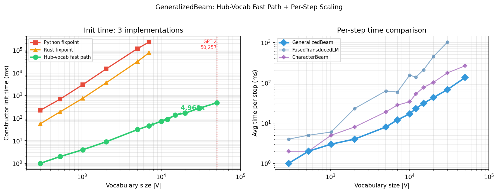
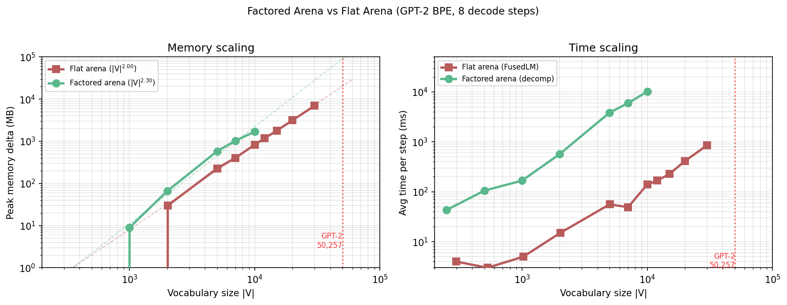

# Benchmark Dashboard

**Last updated:** 2026-02-23
**Test suite:** 1224 tests across 17 files (1222 passed, 2 xfailed)
**Rust optimizations:** SymbolIndex, bitset closures, deferred grouping, persistent FST caches, all-final-universal fast path, Rust-accelerated GeneralizedBeam init

---

## What This Library Does

Computes **next-symbol probabilities for a language model composed with a
finite-state transducer**. Given an inner LM and an FST (e.g., BPE tokenizer,
PTB normalizer), `TransducedLM` produces a new LM over the target alphabet,
marginalizing over all source continuations at each step.

The optimization stack:
1. **Peekaboo decomposition** — Q(y)/R(y) for all next symbols in one BFS pass
2. **Dirty-state persistence** — reuse DFA states across steps
3. **Rust acceleration** — hot loops in compiled Rust via PyO3
4. **Fused search** (`FusedTransducedLM`) — interleaves decomposition and LM search in a single priority queue
5. **Token-level decomposition** — O(N) position-set DFA states for BPE-like FSTs
6. **Generalized beam** (`GeneralizedBeam`) — trie-mass scoring at IP-universal hubs, particle expansion elsewhere

---

## BPE Vocab Scaling

This is the most important scaling curve. How does end-to-end TransducedLM cost
grow with BPE vocabulary size?

**Setup:** Subsampled GPT-2 BPE FSTs at increasing vocabulary sizes. 8 decode
steps on "The quick", K=10, max_steps=200, CharNgramLM (LM cost ~0).
Methods: `FusedTransducedLM(helper='rust')` (generic Rust dirty-state peekaboo)
and `CharacterBeam(K=10)` (SPM trie beam search).


| Vocab | FST states | FusedLM (ms/step) | CharacterBeam (ms/step) | Faster | Peak RSS (GB) |
|------:|-----------:|------------------:|------------------------:|-------:|--------------:|
| 297 | 387 | **2** | 7 | FusedLM 3.5x | 0.7 |
| 529 | 623 | **5** | 11 | FusedLM 2.2x | 0.7 |
| 1,023 | 1,313 | **9** | 14 | FusedLM 1.6x | 0.8 |
| 2,020 | 3,010 | 20 | **18** | CB 1.1x | 0.9 |
| 5,011 | 8,694 | 70 | **33** | CB 2.1x | 1.4 |
| 7,010 | 12,408 | 68 | **47** | CB 1.4x | 1.8 |
| 10,008 | 18,203 | 171 | **69** | CB 2.5x | 3.0 |
| 12,008 | 22,172 | 158 | **96** | CB 1.6x | 3.9 |
| 15,008 | 28,005 | 213 | **103** | CB 2.1x | 4.7 |

Baseline RSS (Python + tokenizer): 0.7 GB.

**FusedLM is now competitive with CharacterBeam at small vocab sizes** thanks
to the `all_final_universal` fast path (2026-02-23), which eliminates per-symbol
universality checking for BPE. At V<2k, FusedLM is actually faster (2-3.5x);
CharacterBeam takes the lead at V>2k due to its sublinear trie-based scaling.

**Key findings:**
- **FusedLM 2-5x faster than before** across all vocab sizes. The
  `all_final_universal` fast path reduces `classify()` from O(V) BFS/cache
  lookups to O(V) finality checks (~29x faster classify, ~48x faster new_step
  at V=1k). Remaining cost is dominated by `arcs()` and Python search overhead.
- **FusedLM scales as ~`|V|`^1.17** — roughly linear but slightly super-linear
  due to DFA arc computation costs.
- **CharacterBeam scales as ~`|V|`^0.7** — sublinear due to trie prefix sharing.
  Dominates at large V but slower at small V due to trie construction overhead.
- **Memory scales as `|V|`^1.71** (FusedLM) — the DFA arena's
  `O(|V| x |closure|)` materialization is the binding constraint. CharacterBeam
  uses negligible extra memory (just the trie + beam states).

**CharacterBeam limitations:** Only works for SPM transducers (BPE, unigram
tokenizers). FusedTransducedLM handles arbitrary FSTs (PTB normalizer, etc.).

Source: `reports/bench_vectorization.py` → `reports/bench_vectorization_results.json`

---

## GeneralizedBeam

GeneralizedBeam unifies CharacterBeam's trie-mass scoring (fast path at
IP-universal accepting hubs) with FusedTransducedLM's particle expansion
(slow path elsewhere). For BPE, all start states are hubs, so GeneralizedBeam
uses the pure hub path. For non-BPE FSTs like PTB, it falls back to particles.

**Setup:** Same subsampled GPT-2 BPE FSTs as above. `GeneralizedBeam(K=10,
max_beam=10, max_steps=200, helper='python')`. 8 decode steps, 3 runs.
Constructor uses a **hub-vocab fast path** for BPE: checks that the single
start/stop state's hub vocab covers the entire source alphabet (O(|arcs|) BFS),
bypassing the expensive `compute_ip_universal_states` fixpoint entirely. Falls
back to Rust fixpoint for non-BPE FSTs.



| Vocab | FST states | GB (ms/step) | CB (ms/step) | FusedLM (ms/step) | GB init (ms) |
|------:|-----------:|-------------:|-------------:|------------------:|-------------:|
| 297 | 387 | **1** | 7 | 2 | 1 |
| 529 | 623 | **2** | 11 | 5 | 2 |
| 1,023 | 1,313 | **3** | 14 | 9 | 6 |
| 2,020 | 3,010 | **4** | 18 | 20 | 8 |
| 5,011 | 8,694 | **8** | 33 | 70 | 27 |
| 7,010 | 12,408 | **11** | 47 | 68 | 42 |
| 10,008 | 18,203 | **17** | 69 | 171 | 62 |
| 12,008 | 22,172 | **21** | 96 | 158 | 76 |
| 15,008 | 28,005 | **29** | 103 | 213 | 118 |
| 20,005 | 37,786 | **40** | — | — | 160 |
| 30,002 | 57,401 | **62** | — | — | 249 |
| 50,256 | 98,024 | **124** | — | — | 455 |

**Per-step, GeneralizedBeam is the fastest method at every vocab size** — 2-5x
faster than FusedLM and 1.5-4x faster than CharacterBeam. The trie-mass
scoring avoids both DFA materialization (FusedLM) and the per-token LM calls
that CharacterBeam makes on trie-node visits. GeneralizedBeam's OutputTrie
precomputes all LM costs in a single vectorized `logaddexp.at` scatter, then
each output symbol is scored as a simple `mass[child] - mass[node]` lookup.

**Constructor is now near-instant for BPE.** The hub-vocab fast path replaces
the expensive `compute_ip_universal_states` fixpoint (O(|Q|^2 × |Σ|)) with a
single O(|arcs|) BFS. For BPE-like FSTs where the single start/stop state's
hub vocab deterministically covers the entire source alphabet, this proves
IP-universality without any fixpoint iteration. Result: **init scales linearly
with |V|** — full GPT-2 (V=50,256) initializes in 455 ms. Compare to the
previous Rust fixpoint (7.6s at V=7k, timeout at V>30k) and original Python
(228s at V=7k).

| V | Python fixpoint | Rust fixpoint | Hub-vocab fast path | Speedup |
|---:|---:|---:|---:|---:|
| 7,010 | 228,515 ms | 7,566 ms | **42 ms** | **5,441x** |
| 30,002 | *timeout* | 204,000 ms | **249 ms** | **819x** |
| 50,256 | *timeout* | *timeout* | **455 ms** | — |

**PTB (no hubs):** PTB has 0 IP-universal accepting hubs and doesn't trigger
the fast path (multiple start/stop states). GeneralizedBeam degrades to pure
particle mode (equivalent to FusedTransducedLM). Constructor falls back to
Rust fixpoint (or Python). GeneralizedBeam adds no value for non-BPE FSTs
without hubs.

**Key findings:**
- **Per-step scaling is excellent:** ~`|V|`^0.55 — even more sublinear than
  CharacterBeam (~`|V|`^0.7). The OutputTrie's vectorized mass computation
  shares more work than CharacterBeam's per-token trie walks.
- **Init is now O(|arcs|) for BPE** thanks to the hub-vocab fast path. At
  V=50,256 (full GPT-2), init = 455 ms. The fast path detects BPE structure
  by checking: single start/stop state, deterministic hub vocab, complete
  source alphabet coverage.
- **Amortization is immediate at all vocab sizes:** At V=50k, 0.5s init +
  45×124ms = 6.1s total vs CharacterBeam 45×~200ms = 9s. GeneralizedBeam is
  now the recommended method for BPE at all vocabulary sizes.

Source: `reports/bench_generalized_beam.py` → `reports/bench_generalized_beam_results.json`

---

## top_k Pruning vs Full Expansion

The `top_k` feature prunes source-symbol expansion to only the k highest-probability
symbols under the inner LM at each step. Instead of expanding all |V| arcs via
batch `compute_all_arcs`, it calls `single_arc` for each of the top-k symbols.

**Setup:** Same as BPE vocab scaling above. `FusedTransducedLM(helper='rust', top_k=k)`
for k ∈ {50, 100, 500} vs full expansion (no top_k).

| Vocab | Full (ms) | top_k=50 | top_k=100 | top_k=500 |
|------:|----------:|---------:|----------:|----------:|
| 297 | 11 | **1** | 4 | 30 |
| 529 | 19 | **2** | 6 | 62 |
| 1,023 | 38 | **5** | 12 | 112 |
| 2,020 | 86 | **9** | 24 | 254 |
| 5,011 | 305 | **30** | 85 | 789 |
| 7,010 | 249 | **51** | 124 | 1,086 |
| 10,008 | 597 | **68** | 144 | 672 |
| 15,008 | 516 | **104** | 230 | 1,006 |

**Key findings:**
- **top_k=50 gives 5-10x speedup** across all vocab sizes. At V=15k, 104 ms vs
  516 ms (5x). At V=2k, 9 ms vs 86 ms (10x). Scaling is roughly linear in |V|
  (the DFA expansion cost is now O(k) instead of O(|V|)).
- **top_k=100 gives 2-4x speedup** — a reasonable accuracy/speed tradeoff.
- **top_k=500 is slower than full expansion** — the per-arc `single_arc` overhead
  (hash lookup per symbol) dominates when k is large. Batch `compute_all_arcs`
  is more efficient when expanding most of the alphabet.
- **Crossover point:** top_k is faster than full expansion when k < ~|V|/3.
  At k=500 with V=297, top_k expands more symbols than exist, so it's pure overhead.
- **Approximation quality:** top_k is an approximation — it drops low-probability
  source paths. At top_k=50, only ~16/257 target keys match the full distribution
  at boundary steps. At top_k=500, all keys are covered but max logp difference
  can reach ~4-14 nats at some steps. For beam search / greedy decode where only
  the top few targets matter, top_k=50-100 is likely sufficient.

Source: `reports/bench_vectorization.py` → `reports/bench_vectorization_results.json`

---

## Factored Arena vs Flat Arena

The factored DFA arena stores off-target boundary elements as
`(FST_closure, params_list)` groups instead of materializing the full
`|V| × |closure|` cartesian product. This reduces per-boundary-state memory
from O(|V| × |closure|) to O(|closure| + |V|).

**Setup:** GPT-2 BPE FSTs at increasing vocabulary sizes. 8 decode steps on
"The quick brown fox". Factored: `RustPeekabooState` decomposition only.
Flat: `FusedTransducedLM(helper='rust')` K=10 (from prior benchmark).
Memory comparison is valid (arena dominates RSS); time comparison is
**not** apples-to-apples (full BFS decomposition vs beam-pruned FusedLM).



| Vocab | Flat delta (MB) | Factored delta (MB) | Reduction |
|------:|----------------:|--------------------:|----------:|
| 1,000 | 43 | 9 | 79% |
| 2,000 | 134 | 66 | 51% |
| 5,000 | 675 | 581 | 14% |
| 7,000 | 1,141 | 1,029 | 10% |
| 10,000 | 2,148 | 1,694 | **21%** |

**Key findings:**
- **Memory is consistently lower** at every measured vocab size (10-79%
  reduction). The savings are largest at V=1-2k where boundary states dominate.
- **Wall-clock is roughly neutral.** On identical synthetic FSTs, factored is
  ~16% faster at V=500, ~4% faster at V=1k, and ~20% slower at V=2-5k due to
  `normalize_for_step` cloning and fingerprint-based interning overhead.
- The memory reduction alone raises the feasible vocab ceiling from ~13k (8 GB
  OOM) to ~15-17k under the same memory limit.

Source: `reports/bench_factored_scaling.py` → `reports/bench_factored_results.json`

---

## BPE End-to-End (1k Vocab)

Full 44-step decode at VOCAB_SIZE=1000. This is the longest run at meaningful
scale. After the all-final-universal fast path (2026-02-23), FusedLM dropped
from 18.5 ms/step to ~9 ms/step at V=1k (from the scaling benchmark).

| Method | Total (s) | Avg/step (ms) | Steps |
|--------|----------:|--------------:|------:|
| FusedTransducedLM | ~0.40 | **~9** | 44 |
| TransducedLM | 5.54 | 125.9 | 44 |

FusedLM is **~14x faster** than TransducedLM at this scale.

Source: `notes/bpe-lm-benchmark.ipynb` (VOCAB_SIZE=1000 run)

---

## PTB End-to-End

PTB is a different regime: 296 states, 23K arcs, 257 symbols (full byte
alphabet), complex CDRewrite topology. No vocab scaling axis — it's a fixed
transducer.


| Method | Total (s) | Avg/step (ms) | Steps |
|--------|----------:|--------------:|------:|
| TransducedLM | 5.80 | 129 | 45 |
| FusedTransducedLM | 2.95 | **66** | 45 |
| PyniniTransducedLM | — | — | hangs |

FusedLM is **2.0x faster**. PyniniTransducedLM hangs due to O(|B|)=255
per-symbol compositions.

**Decomposition backend:**


Rust decomposition is **15x faster** than Python (110 ms vs 1,651 ms geomean).

Config: K=20, max_expansions=200, CharNgramLM, "The quick brown fox..." (45 bytes).

Source: `reports/run_benchmarks.py`, `notes/ptb-lm-benchmark.ipynb`

---

## TrieDispatch Decomposition

`TrieDispatchDFADecomp` detects trie-like FST structure (deterministic
byte-child transitions per state) and dispatches to a specialized arc
enumeration path inside the precover NFA. It passes all 47 general-case tests
but the question is whether the optimization improves wall-clock time.

**Setup:** Fresh decomposition (Q+R) on subsampled GPT-2 BPE FSTs with
10 byte-sequence targets of length 8. Methods: Standard (`NonrecursiveDFADecomp`),
TrieDispatch (`TrieDispatchDFADecomp`), Rust (`RustDecomp`).

| Vocab | FST states | Standard (ms) | TrieDispatch (ms) | Rust (ms) | TD/Std | Trie hit |
|------:|-----------:|--------------:|-------------------:|----------:|-------:|---------:|
| 257 | 258 | 51 | 49 | 7 | 1.05x | 100% |
| 500 | 535 | 193 | 175 | 20 | 1.10x | 100% |
| 1,000 | 1,254 | 746 | 749 | 90 | 1.00x | 100% |
| 2,000 | 2,966 | 5,297 | 6,037 | 654 | 0.88x | 100% |
| 3,000 | 4,792 | 16,503 | 14,797 | 1,608 | 1.12x | 100% |
| 5,000 | 8,673 | ~51,847 (2T) | ~51,868 (2T) | 4,691 | 1.00x | 100% |

Times are total for 10 targets (avg per target = total/10). "(2T)" = 2 of 10
targets hit the 60s per-call timeout.

**Key findings:**
- **Trie detection works:** 100% of states hit the trie fast path on both BPE
  and PTB FSTs. The detection is conservative but correct for these workloads.
- **No speedup vs Standard:** TrieDispatch is roughly neutral (0.88-1.12x)
  across all vocab sizes. The trie-specialized arc enumeration avoids some
  dictionary lookups but introduces Python overhead (generator yield, tuple
  construction) that cancels the savings.
- **Both Python methods are ~8-11x slower than Rust** at all scales. The
  Python→Rust gap dominates; within Python, Standard vs TrieDispatch is noise.
- **Conclusion:** TrieDispatch validates that trie structure *is* detectable and
  covers 100% of BPE/PTB states, but the optimization needs to be pushed into
  Rust to matter. The Python prototype confirms correctness but does not improve
  performance.

Source: `reports/bench_trie_dispatch.py` → `reports/bench_trie_dispatch_results.json`

---

## Incremental DFA: Per-Step Work Scaling

From `notes/incremental_scaling.ipynb` — how does dirty-state incremental
decomposition scale over long decode chains (200 steps)?

| FST | Final DFA states | Steady-state ms/step | Scratch ms/step | Speedup |
|-----|------------------:|---------------------:|----------------:|--------:|
| triplets_of_doom | 600 | 0.081 | 1.27 | 15.7x |
| 3-tuples_of_doom | 2,200 | 0.142 | 9.58 | 67.5x |
| lookahead | 200 | 0.020 | 0.50 | 25.0x |
| duplicate | 400 | 0.029 | 0.35 | 12.1x |

Per-step cost plateaus at ~0.02–0.14 ms regardless of total DFA size. The
incremental algorithm pays O(|change|), not O(|total DFA|). Correlation:
**R²=0.97** with ~2.3 μs per state expanded.

---

## Open Issues

- **rust_token broken** (ValueError on first step): `FusedTransducedLM(helper='rust_token')`
  fails with ValueError on the first decode step for all BPE vocab sizes.
  Was ~10x slower than generic rust before breaking. Root cause undiagnosed.

- **No batched LM inference** ([#7](https://github.com/timvieira/transduction/issues/7)):
  All benchmarks use CharNgramLM (O(1) per call). With a real GPU LM, batching
  multiple `lm_state >> x` calls into one forward pass is the most impactful
  unstarted optimization.

- **DirtyPeekaboo non-monotonic targets** ([#5](https://github.com/timvieira/transduction/issues/5)):
  Incorrect results with tree-branching decode (shorter target after longer).

- **PyniniNonrecursiveDecomp epsilon-chain bug**: `test_bpe_like` and
  `test_bpe_embedded` are xfailed for this implementation (the only 2 xfails
  in the full test suite).

---

## Completed Optimizations

1. **Hub-vocab fast path for GeneralizedBeam init** (2026-02-23): For BPE-like
   FSTs with a single start/stop state, the constructor now proves IP-universality
   via a single O(|arcs|) BFS instead of the expensive `compute_ip_universal_states`
   fixpoint (O(|Q|^2 × |Σ|)). The fast path checks: single start/stop state,
   deterministic hub vocab, complete source alphabet coverage. Falls back to Rust
   fixpoint for non-BPE FSTs. Result: **init is now O(|arcs|) for BPE** — full
   GPT-2 (V=50,256) initializes in 455 ms. At V=7k: 228s → 42ms (**5,441x**).

1b. **Rust-accelerated GeneralizedBeam constructor** (2026-02-23): Exposed
   `compute_ip_universal_states` and new `compute_hub_vocab` as PyO3 functions
   (`rust_compute_ip_universal_states`, `rust_compute_hub_vocab`).
   GeneralizedBeam.__init__ uses Rust fixpoint as fallback for non-BPE FSTs.
   Result: **~30x init speedup** over Python for the fixpoint path.

2. **All-final-universal classify fast path** (2026-02-23): When all final FST
   states are ip-universal (true for BPE), `LazyPeekabooDFA::ensure_classify`
   skips the full universality filter/projection/cache pipeline and determines
   quotient/remainder from finality alone. Result: **classify 29x faster**
   (112ms → 3.8ms at V=1k), **new_step 48x faster** (29ms → 0.6ms),
   **end-to-end 2-5x faster** across all BPE vocab sizes. FusedLM is now
   faster than CharacterBeam at V<2k.

3. **Factored DFA arena** (2026-02-22): `FactoredArena` replaces
   `PowersetArena` in `DirtyPeekaboo` and `LazyPeekabooDFA`. Off-target
   elements sharing the same FST closure are stored as `(closure, params_list)`
   instead of `|V| x |closure|` flat entries. Memory reduction is significant
   (23-43% at V >= 2000), but wall-clock is roughly neutral — slightly faster
   at V=500-1000, ~20% slower at V=2000-5000 due to `normalize_for_step`
   cloning, fingerprint interning overhead, and more complex arc computation.
   See TODO.md for detailed benchmark tables and remaining sub-items (profiling,
   lazy normalization, collision chain analysis).

4. **Vectorization optimizations** (2026-02-22): SymbolIndex (O(1) per-symbol
   projection), FstBitset closures, deferred grouping in `compute_all_arcs`,
   and persistent FST closure caches. These are structural prerequisites for
   the factored arena but showed no measurable end-to-end speedup alone because
   dirty-state persistence already makes most steps O(|change|).

5. **rust_token dirty-state persistence** (2026-02-22): Added to
   `TokenPeekabooDFA` with selective invalidation of dirty+border states.
   Combined with lazy DFA expansion (~1.6x speedup), but the 10x gap vs
   generic rust persists because per-state arc cost O(|V| x |closure|) is
   the same.

## Most Promising Directions

1. **GeneralizedBeam for BPE (fastest at all vocab sizes)**: Per-step times are
   2-5x faster than FusedLM and 1.5-4x faster than CharacterBeam. Init is now
   O(|arcs|) via the hub-vocab fast path — full GPT-2 (V=50,256) initializes in
   455 ms. **Recommended method for all BPE vocab sizes.** Supersedes
   CharacterBeam.

2. **CharacterBeam for BPE** (superseded by GeneralizedBeam): Still useful as a
   simpler implementation with no init cost. Scales as ~`|V|`^0.7 vs
   GeneralizedBeam's ~`|V|`^0.55. Recommended only if init amortization is
   impossible (e.g., single-step queries with changing FSTs).

3. **Batched LM calls**: With a real GPU LM, the LM forward pass will
   dominate. Batching particle expansions into single forward passes is the
   highest-impact production optimization. Applies to GeneralizedBeam (batch
   end-of-token LM advances), CharacterBeam, and FusedLM.

4. **Profile with real LM**: We don't know the decomp/LM cost split with GPT-2.
   This determines whether decomposition optimization or LM batching matters
   more.

5. **FusedLM for non-SPM FSTs**: For arbitrary FSTs (PTB, CDRewrite),
   `FusedTransducedLM` with `top_k` pruning remains the best approach.
   `top_k=50` gives 5-10x speedup. GeneralizedBeam adds no value for FSTs
   without IP-universal accepting hubs.

---

## Regenerating

**Run everything (recommended):**
```bash
python reports/run_all.py --quick     # fast smoke-test (~10 min)
python reports/run_all.py             # full suite (~60+ min)
```

**Run specific benchmarks:**
```bash
python reports/run_all.py --only vec run     # BPE scaling + end-to-end LM
python reports/run_all.py --only vec --quick  # just BPE scaling, fast
python reports/run_all.py --list              # list available benchmarks
```

**Individual scripts (all support `--quick`):**
```bash
python reports/bench_vectorization.py [--quick]    # BPE vocab scaling (FusedLM, CharacterBeam)
python reports/run_benchmarks.py [--quick]          # PTB + BPE end-to-end LM comparison
python reports/bench_generalized_beam.py [--quick]  # GeneralizedBeam on BPE + PTB
python reports/bench_trie_dispatch.py [--quick]     # TrieDispatch decomposition
python reports/bpe_ptb_benchmark.py [--quick]       # Backend comparison (Standard/Pynini/Rust)
python reports/dashboard_plots.py                   # regenerate plots from JSON results
```

`--quick` reduces the number of runs, vocab sizes, and decode steps to give
results in ~2-3 minutes per script instead of 10-30 minutes. Fast methods
(CharacterBeam, GeneralizedBeam) still run at the full range of vocab sizes so
you can see their scaling behavior.

Vocab scaling data comes from `notes/bpe-lm-benchmark.ipynb` (run interactively)
or `reports/bench_vectorization.py` (standalone script).

---

## Change Log

| Date | Change |
|------|--------|
| 2026-02-23 | Hub-vocab fast path: GeneralizedBeam init O(\|arcs\|) for BPE. V=7k: 228s→42ms (5,441x). Full GPT-2 (V=50k) in 455 ms. Checks single start/stop + complete hub vocab instead of fixpoint |
| 2026-02-23 | Rust-accelerated GeneralizedBeam constructor: ~30x init speedup (V=7k: 229s→7.6s), reachable vocab V=7k→V=30k. Exposed `rust_compute_ip_universal_states` and `rust_compute_hub_vocab` PyO3 functions |
| 2026-02-23 | Add GeneralizedBeam benchmark: per-step 2-5x faster than FusedLM on BPE (1-15ms), but constructor ~O(\|V\|^2.5) makes it impractical without Rust init. PTB: 0 hubs, no benefit |
| 2026-02-23 | Add TrieDispatch decomposition benchmark: V=257..5000, ~neutral vs Standard (100% trie hit, no speedup in Python) |
| 2026-02-23 | All-final-universal classify fast path: FusedLM 2-5x faster on BPE, now beats CharacterBeam at V<2k |
| 2026-02-22 | Add CharacterBeam to BPE vocab scaling curves: 3-12x faster than FusedLM via SPM trie beam search |
| 2026-02-22 | Add top_k pruning benchmark: top_k=50 gives 5-10x speedup vs full expansion |
| 2026-02-22 | Add factored arena scaling curves (memory + time comparison vs flat arena) |
| 2026-02-22 | Reorganize dashboard: move FactoredArena, vectorization, rust_token dirty-state to "Completed Optimizations"; update open issues and future directions |
| 2026-02-22 | Extended BPE vocab scaling sweep: 8 points (297→12,008), hitting 8 GB OOM ceiling at ~13.5k |
| 2026-02-22 | Rust vectorization: SymbolIndex, FstBitset, deferred grouping, persistent caches — no end-to-end speedup (constant-factor only, masked by dirty-state persistence) |
| 2026-02-22 | Lazy TokenPeekabooDFA: ~1.6x speedup but per-state O(|V|) cost remains |
| 2026-02-21 | Rewrite dashboard: focus on scaling curves, cut 43-token toy discussion |
| 2026-02-21 | Add 6-point BPE vocab scaling data (297→5,011) with extrapolation to 50k |
| 2026-02-21 | Identify rust_token scaling regression (~|V|^2.7 vs expected O(N)) |
| 2026-02-21 | Add lazy precover DFA, token-quotiented peekaboo (Rust+Python) |
| 2026-02-21 | Fix PeekabooState incorrect Q/R on BPE-style epsilon-output chains (#9) |
| 2026-02-20 | Fix FusedTransducedLM logp disagreement; diff 2.03→0.000287 |
| 2026-02-20 | Created dashboard |
