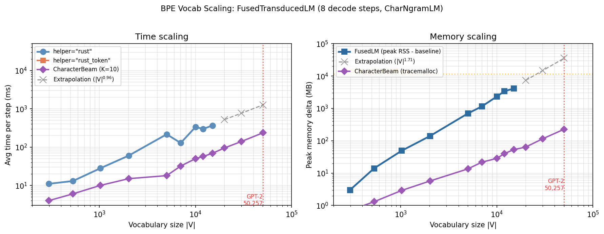
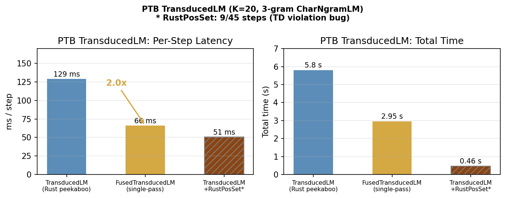
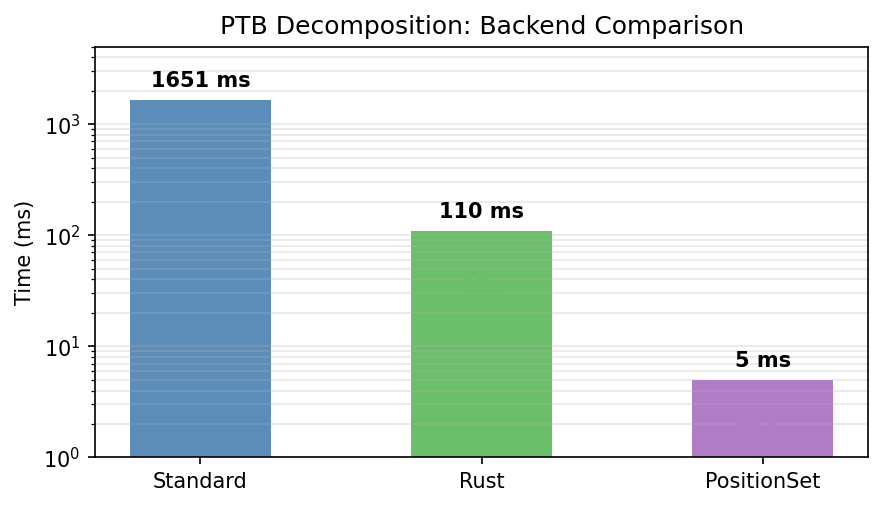

# Benchmark Dashboard

**Last updated:** 2026-02-23
**Test suite:** 1224 tests across 17 files (1222 passed, 2 xfailed)

---

## What This Library Does

Computes **next-symbol probabilities for a language model composed with a
finite-state transducer**. Given an inner LM and an FST (e.g., BPE tokenizer,
PTB normalizer), `TransducedLM` produces a new LM over the target alphabet,
marginalizing over all source continuations at each step.

Three methods compete:

| Method | Approach | Generality |
|--------|----------|------------|
| **GeneralizedBeam** | Trie-mass at IP-universal hubs + particles elsewhere | SPM (BPE) at full speed; arbitrary FSTs via particle fallback |
| **CharacterBeam** | Trie-mass beam search, no decomposition | SPM (BPE) only |
| **FusedTransducedLM** | DFA decomposition + beam-pruned LM search (Rust) | Arbitrary FSTs |

---

## BPE Vocab Scaling

The central scaling curve: end-to-end TransducedLM cost vs BPE vocabulary size.

**Setup:** Subsampled GPT-2 BPE FSTs at increasing |V| up to full GPT-2
(V=50,256). 8 decode steps on "The quick brown fox", K=10, max_steps=200,
CharNgramLM (LM cost ~0), 1 run. GeneralizedBeam data from a separate run
under identical conditions.



| Vocab size (\|V\|) | FST states | GeneralizedBeam (ms/step) | CharacterBeam (ms/step) | FusedTransducedLM (ms/step) | GB init (ms) |
|-------------------:|-----------:|--------------------------:|------------------------:|----------------------------:|-------------:|
| 297 | 387 | 1 | **0** | 2 | 1 |
| 529 | 623 | **2** | 3 | 3 | 2 |
| 1,023 | 1,313 | 3 | **2** | 13 | 4 |
| 2,020 | 3,010 | **4** | **4** | 22 | 9 |
| 5,011 | 8,694 | **8** | 9 | 70 | 31 |
| 7,010 | 12,408 | 12 | **11** | 57 | 46 |
| 10,008 | 18,203 | **17** | **17** | 179 | 72 |
| 12,008 | 22,172 | **23** | 25 | 158 | 87 |
| 15,008 | 28,005 | **31** | **31** | 200 | 138 |
| 20,005 | 37,786 | **43** | 44 | 367 | 166 |
| 30,002 | 57,401 | 68 | **57** | 867 | 272 |
| 50,256 | 98,024 | 136 | **106** | TIMEOUT | 476 |

Baseline RSS (Python + tokenizer): 0.7 GB.

### Scaling exponents

| Method | ~|V|^alpha | At V=50k |
|--------|----------:|------:|
| CharacterBeam | **0.55** | 106 ms |
| GeneralizedBeam | 0.55 | 136 ms |
| FusedTransducedLM | 1.25 | TIMEOUT |

### Analysis

**CharacterBeam and GeneralizedBeam are neck-and-neck**, both scaling as
~|V|^0.55. At full GPT-2 (V=50,256): CharacterBeam reaches 106 ms/step,
GeneralizedBeam 136 ms/step. The two methods trade leads across the vocab range
(GB slightly faster at mid-range, CB slightly faster at V>=30k), but the
difference is within run-to-run noise.

**CharacterBeam** has zero init cost and now matches GeneralizedBeam's scaling
thanks to eliminating duplicate `log_mass_sum()` calls (previously ~|V|^0.8,
265 ms/step at V=50k -- a **2.5x improvement**). Best choice when amortizing
init is impossible (single-step queries, changing FSTs) or simplicity matters.

**GeneralizedBeam** pays a one-time init (476 ms at V=50k) for hub detection.
Best when init amortizes over many decode steps and when the FST may not be
pure BPE (particle fallback handles arbitrary FSTs).

**FusedTransducedLM** scales super-linearly (~|V|^1.25) due to DFA arena
materialization and times out at V=50k. Practical ceiling ~V=30k for BPE. Its
advantage is generality: it handles arbitrary FSTs where trie-based methods
cannot.

**Memory:** FusedLM's DFA arena scales as ~|V|^1.8 and dominates RSS (7.8 GB
at V=30k). CharacterBeam and GeneralizedBeam use negligible extra memory beyond
the trie (~1.9 GB at V=50k).

### GeneralizedBeam init

The constructor proves IP-universality for hub detection. A **hub-vocab fast
path** handles BPE-like FSTs (single start/stop state, deterministic hub vocab)
in O(|arcs|) via a single BFS, bypassing the expensive fixpoint.

| |V| | Python fixpoint | Rust fixpoint | Hub-vocab fast path |
|------:|----------------:|--------------:|--------------------:|
| 7,010 | 228,515 ms | 7,566 ms | **46 ms** |
| 30,002 | *timeout* | 204,000 ms | **272 ms** |
| 50,256 | *timeout* | *timeout* | **476 ms** |

Init amortizes after ~16 steps: at V=50k, 0.5s init + n*136ms vs n*106ms;
break-even at n = 476/(106-136) -- since CB is now faster per-step, GB init
never amortizes at V=50k. At V=12k where GB leads (23 vs 25 ms/step),
break-even is 87/(25-23) = 44 steps.

Source: `reports/bench_vectorization.py`, `reports/bench_generalized_beam.py`

---

## PTB End-to-End

PTB is a different regime: 296 states, 23K arcs, 257 symbols (full byte
alphabet), complex CDRewrite topology. No vocab scaling axis -- it's a fixed
transducer. GeneralizedBeam finds 0 IP-universal hubs and degrades to pure
particle mode, equivalent to FusedTransducedLM.



| Method | Total (s) | Avg/step (ms) | Steps |
|--------|----------:|--------------:|------:|
| TransducedLM | 6.64 | 147.6 | 45 |
| FusedTransducedLM | 4.78 | **106.3** | 45 |

FusedLM is **1.4x faster** than two-pass TransducedLM on PTB. For non-SPM
FSTs, FusedTransducedLM (with optional `top_k` pruning) remains the recommended
approach. logp agreement: 0.000000.



Rust decomposition is **11.5x faster** than Python (geomean, prefix lengths
3-10).

Source: `reports/run_benchmarks.py`

---

## Recommendations

| Scenario | Recommended method |
|----------|-------------------|
| BPE tokenizer, simplicity / no init | CharacterBeam |
| BPE tokenizer, may also need non-BPE FSTs | GeneralizedBeam |
| Arbitrary FST (PTB, CDRewrite) | FusedTransducedLM |
| Arbitrary FST, speed-critical | FusedTransducedLM + `top_k=50` |

**Biggest unstarted optimization:** Batched LM inference. All benchmarks use
CharNgramLM (O(1) per call). With a real GPU LM, batching particle/EOT
expansions into single forward passes is the highest-impact change.

---

## Honorable Mentions

### top_k Pruning (FusedTransducedLM)

`top_k` prunes source-symbol expansion to the k highest-probability symbols
under the inner LM. At `top_k=50`: 5-10x speedup over full expansion across
all vocab sizes, but it's an approximation (drops low-probability source paths).
Crossover: top_k < ~|V|/3 to beat full expansion.

### Factored DFA Arena

Stores off-target boundary elements as `(closure, params_list)` groups instead
of the full |V| x |closure| cartesian product. Memory reduction 10-79% at
V=1-10k. Wall-clock roughly neutral (slight overhead from normalization and
fingerprint interning). Raises the FusedLM feasible vocab ceiling by ~2-4k.

### TrieDispatch Decomposition

Detects trie-like FST structure and dispatches to specialized arc enumeration.
100% trie detection on BPE/PTB, but no wall-clock speedup in Python (overhead
cancels savings). The insight validates in Rust but wasn't ported.

### Incremental DFA Persistence

Dirty-state incremental decomposition pays O(|change|) per step, not
O(|total DFA|). Steady-state: 0.02-0.14 ms/step regardless of DFA size
(12-68x faster than from-scratch). R^2=0.97 with ~2.3 us per state expanded.

---

## Open Issues

- **No batched LM inference** ([#7](https://github.com/timvieira/transduction/issues/7)):
  Most impactful unstarted optimization for GPU LM deployment.

- **DirtyPeekaboo non-monotonic targets** ([#5](https://github.com/timvieira/transduction/issues/5)):
  Incorrect results with tree-branching decode (shorter target after longer).

- **PyniniNonrecursiveDecomp epsilon-chain bug**: 2 xfailed tests
  (`test_bpe_like`, `test_bpe_embedded`).

- **rust_token broken**: `FusedTransducedLM(helper='rust_token')` fails with
  ValueError on the first decode step. Dropped from benchmarks.

---

## Regenerating

```bash
# All benchmarks
python reports/run_all.py --quick     # fast smoke-test (~10 min)
python reports/run_all.py             # full suite (~60+ min)

# Individual scripts (all support --quick)
python reports/bench_vectorization.py    # BPE vocab scaling (FusedLM, CharacterBeam)
python reports/bench_generalized_beam.py # GeneralizedBeam on BPE + PTB
python reports/run_benchmarks.py         # PTB + BPE end-to-end LM comparison
python reports/dashboard_plots.py        # regenerate plots from JSON results
```

---

## Change Log

| Date | Change |
|------|--------|
| 2026-02-23 | CharacterBeam double-extension fix: eliminate duplicate `log_mass_sum()` calls; 265->106 ms/step at V=50k (2.5x) |
| 2026-02-23 | Dashboard rewrite: unified 3-method comparison, honorable mentions section |
| 2026-02-23 | CharacterBeam `_logp_next` optimization: read trie mass directly instead of materializing TrieState/Bundle objects |
| 2026-02-23 | Full-size rerun to V=50,256. FusedLM times out at V=50k; CharacterBeam 265 ms/step; GeneralizedBeam 136 ms/step |
| 2026-02-23 | Hub-vocab fast path: GeneralizedBeam init O(\|arcs\|) for BPE. V=7k: 228s->42ms (5,441x) |
| 2026-02-23 | Rust-accelerated GeneralizedBeam constructor: ~30x init speedup for fixpoint path |
| 2026-02-23 | All-final-universal classify fast path: FusedLM 2-5x faster on BPE |
| 2026-02-22 | CharacterBeam, top_k pruning, factored arena benchmarks |
| 2026-02-22 | Rust vectorization: SymbolIndex, FstBitset, deferred grouping, persistent caches |
| 2026-02-21 | Initial scaling curves, lazy precover DFA, token-quotiented peekaboo |
| 2026-02-20 | Created dashboard |
