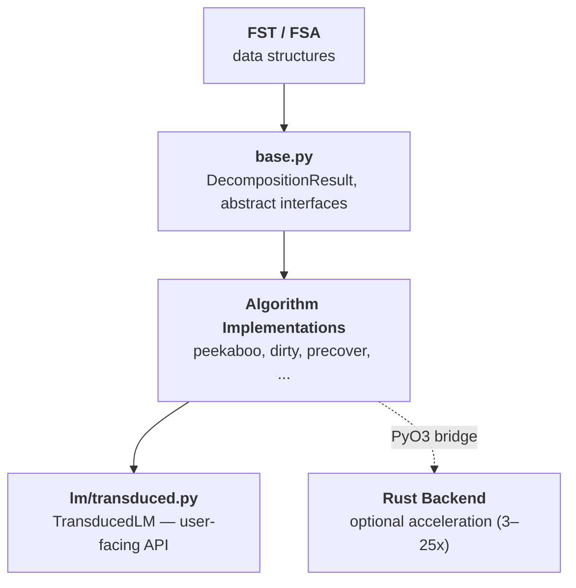
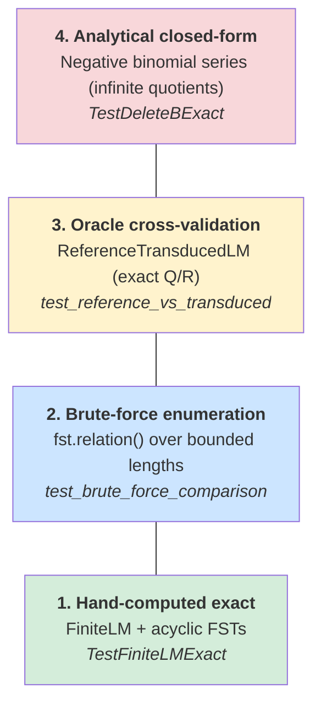

# Project Assessment: Delivering on the Transduced LM Mission

## 2026-02-18

---

## Executive Summary

The transduction library efficiently computes next-symbol probabilities for a
language model composed with a finite-state transducer — enabling constrained
and transformed autoregressive generation. The algorithmic core is strong:
Peekaboo decomposition, dirty-state persistence, and
Rust acceleration form a layered optimization stack that achieves real-time
per-step costs on production-scale FSTs. The user-facing `TransducedLM`
now defaults to the Rust backend (`RustPeekabooState`) and implements
particle-based beam-sum approximate inference (deterministic top-K, consistent
as K -> inf). Quotient states provide exact marginalization over infinitely many
source continuations — the key variance reduction mechanism. All decomposition
implementations now support the `>>` operator via `DecompositionResult.__rshift__`.
Rich notebook display (`_repr_html_`) enables interactive exploration.
The LM integration layer uses clean log-space types (`LogVector`, `LogDistr`)
replacing ad-hoc patterns. Test coverage is comprehensive: 881 tests across
13 files, all passing with 0 skipped. Documentation now covers all public
modules (module docstrings), constructors, abstract interfaces, and the Rust
bridge classes; a tutorial notebook (`examples/tutorial.ipynb`) provides an
end-to-end walkthrough with rich Graphviz and HTML display. The remaining
path to production readiness: batch LM calls for GPU utilization.

---

## What's Working Well

### 1. Algorithmic Depth

11 decomposition algorithms spanning the full design space: reference
implementations, incremental variants, batched variants, and Rust backends.
Each variant serves a distinct niche:

| Layer | Algorithm | Purpose |
|-------|-----------|---------|
| Reference | `Precover`, `NonrecursiveDFADecomp` | Correctness oracle |
| Batched | `PeekabooState`, `Peekaboo` (nonrecursive) | Amortize DFA across all next symbols |
| Incremental | `DirtyPeekaboo`, `TruncatedIncrementalDFADecomp` | Reuse DFA state across decode steps |
| Rust | `RustDecomp`, `RustDirtyState`, `RustDirtyPeekaboo` | 3-25x over Python |
| Finite-only | `LazyIncremental`, `LazyNonrecursive`, `PrioritizedLazy` | Finite-language FSTs |

The parametrized test suite (`test_general.py`: 353 tests) ensures all
general-case algorithms agree. All 353 tests now pass with 0 skipped after
adding `DecompositionResult.__rshift__` so every implementation supports `>>`.

### 2. Optimizations With Measured Impact

| Optimization | Impact | Mechanism |
|-------------|--------|-----------|
| `all_input_universal` | 11,500x on BPE | Skip universality BFS entirely |
| Peekaboo batching | ~\|Y\|x amortization | One DFA for all next symbols |
| Dirty-state persistence | Per-step -> 0.1ms | Reuse clean DFA states across steps |
| Rust backend | 3-25x | Packed u64 NFA states, interned DFA states |

### 3. Clean Internal Architecture

~11.5K lines of Python across 31 modules. No circular dependencies. Well-layered:



The Rust bridge is optional and degrades gracefully. The LM submodule (`lm/`)
is self-contained with no pollution of core algorithms.

### 4. Solid Test Infrastructure

- **881 tests** across 13 test files, all passing, 0 skipped
- Parametrized cross-algorithm validation catches disagreements automatically
- Reference implementations (`Precover`) serve as correctness oracles
- Real-model integration tests (GPT-2 + BPE FST in `test_enumeration.py`)
- TransducedLM tests: multi-state FSTs, brute-force comparison, consistency
  convergence, carry-forward prefix-domination regression tests
- `test_fst.py`: 57 tests covering FST methods (99% coverage)
- `test_lazy_peekaboo_dfa.py`: Rust lazy DFA integration tests
- Clear general vs. finite-only test separation
- CI via GitHub Actions (`.github/workflows/test.yml`)

### 5. Elegant User-Facing API

The `TransducedLM` API mirrors the inner LM interface:

```python
tlm = TransducedLM(inner_lm, fst)
state = tlm >> 'h'          # advance by target symbol
p = state.logp_next['e']    # query next-symbol probability
```

Users don't need to understand precovers, peekaboo, or dirty states. The
`>>` operator and `logp_next` property are the entire surface area.
`TransducedLM` now defaults to the Rust backend for decomposition. Both
`TransducedState` and `FusedTransducedState` support rich notebook display
via `_repr_html_` with unified visualization.

### 6. Documentation

- **Module docstrings** on all public modules (`fst.py`, `fsa.py`, `lm/base.py`,
  `util.py`, `base.py`, `rust_bridge.py`, `lm/transduced.py`, `lm/ngram.py`)
- **Constructor docstrings** on `FST.__init__`, `FSA.__init__` with Args blocks
- **Abstract interface docs**: `LMState.logp_next`, `LMState.__rshift__`,
  `AbstractAlgorithm` class docstring explaining the BFS hook pattern
- **Rust bridge coverage**: `RustDirtyState` and `RustDirtyPeekaboo` — all
  public methods documented (`__init__`, `quotient`, `remainder`, `__rshift__`,
  `decompose_next`)
- **K/max_expansions coupling** documented in `TransducedLM` docstring
- **Utility coverage**: `Integerizer` methods, `dfs()` in `fsa.py`
- **Tutorial notebook** (`examples/tutorial.ipynb`): end-to-end walkthrough
  using Graphviz FST/FSA diagrams, `display_table` for relations, and
  `_repr_html_` for TransducedState particle visualization
- **Existing strength**: `base.py` has a 55-line module docstring covering the
  precover decomposition theory; `README.md` is substantial with code examples,
  performance tables, and architecture diagrams

### 7. Testing Strategy for TransducedLM

The `TransducedLM` tests use a four-level cross-validation pyramid, where each
level provides independent verification:



1. **Hand-computed exact values** — `FiniteLM` + acyclic FSTs where the
   pushforward can be computed by hand. With `FiniteLM`, zero-probability
   transitions are pruned, so beam-sum BFS terminates with the full support;
   there is no approximation. Results must match brute-force enumeration to
   1e-10. (Tests: `TestFiniteLMExact`)

2. **Brute-force enumeration** — `fst.relation()` enumerates all source/target
   pairs up to a bounded length. `brute_force_pushforward()` sums inner LM
   probabilities over all source preimages. This is completely independent of
   Precover, Peekaboo, or any decomposition algorithm. (Tests:
   `test_brute_force_comparison`, `test_brute_force_multi_state`)

3. **Oracle cross-validation** — `ReferenceTransducedLM` computes exact
   transduced probabilities by enumerating Q/R languages via Precover on
   finite-relation FSTs. `TransducedLM` and `FusedTransducedLM` are both
   validated against this oracle. (Tests: `TestReferenceTransducedLM`,
   `test_reference_vs_transduced`, `test_reference_vs_fused`)

4. **Analytical closed-form** — `delete_b` with `TinyLM` (memoryless:
   P(a)=0.6, P(b)=0.3, P(EOS)=0.1) has infinite quotients, yet the
   pushforward has a closed-form: P(next='A' | any prefix) = 6/7,
   P(EOS | any prefix) = 1/7, by the negative binomial series. This tests
   correctness on infinite-quotient FSTs where brute-force enumeration cannot
   reach. (Tests: `TestDeleteBExact`)

**Structural invariants** are also tested: normalization (probabilities sum to
1), incremental consistency (`>>` matches fresh decomposition), path recovery,
and carry-forward prefix-domination regression tests.

---

## Open Issues

### Medium: No Batched LM Inference ([#7](https://github.com/timvieira/transduction/issues/7))

`TransducedLM` processes one sequence at a time. The LM state advance
(`lm_state >> x`) consumes 30-40% of `_compute_logp_next` time. Batching
multiple source-symbol expansions into a single forward pass would improve
GPU utilization for neural LMs.

### Medium: DirtyPeekaboo Non-Monotonic Target Sequences ([#5](https://github.com/timvieira/transduction/issues/5))

`RustDirtyPeekabooDecomp.decompose_for_beam` produces incorrect results when
called with a shorter target after a longer one (e.g., tree-branching decode).
The dirty-state logic assumes monotonic forward extension; backward steps
cause stale state to corrupt the decomposition.

### ~~Low: K and max_expansions Must Scale Together~~ (Resolved)

Now documented in the `TransducedLM` docstring (Note section).

### Low: StateLM KV Cache Sharing with DynamicCache ([#1](https://github.com/timvieira/transduction/issues/1))

`StateLM` shares `past_key_values` between parent and child states. Works
with GPT-2's tuple caches but will silently corrupt results with modern
`DynamicCache`-based models (transformers >= 4.40).

### Low: No Type Annotations on Public API

`base.py`, `fst.py`, `lm/base.py`, `lm/transduced.py` lack type annotations.

---

## Codebase Health Metrics

### Size and Complexity

| Component | Files | Lines | Notes |
|-----------|-------|-------|-------|
| Core (FST/FSA/base) | 4 | ~1,920 | Stable, well-tested (precover.py split out) |
| Algorithms | 12 | ~3,790 | Active development |
| LM integration | 6 | ~1,880 | Self-contained (includes FusedTransducedLM) |
| Rust backend | 9 | ~5,480 | Well-optimized (expanded py.rs bindings) |
| Applications | 3 | ~580 | BPE, PTB, WikiText |
| Utilities | 6 | ~3,320 | viz, examples, lazy, util, rust_bridge, enumeration |
| **Total Python** | **31** | **~11,480** | |
| Tests | 13 | ~4,820 | 881 tests |

### Technical Debt

| Item | Severity | Location | Effort |
|------|----------|----------|--------|
| DirtyPeekaboo non-monotonic targets ([#5](https://github.com/timvieira/transduction/issues/5)) | Medium | `rust_bridge.py`, `peekaboo.rs` | Medium |
| No batched LM calls ([#7](https://github.com/timvieira/transduction/issues/7)) | Medium | `lm/transduced.py` | Medium |
| StateLM KV cache with DynamicCache ([#1](https://github.com/timvieira/transduction/issues/1)) | Low | `lm/statelm.py` | Small |
| ~~K/max_expansions coupling undocumented~~ | ~~Low~~ | ~~`lm/transduced.py`~~ | ~~Resolved~~ |
| No type annotations | Medium | Public API modules | Large |

---

## Roadmap

### Phase 1: Make It Fast for Real LMs

**Goal:** TransducedLM with GPT-2 + BPE FST runs at interactive speed.

1. **Profile the TransducedLM hot loop with a neural LM.** Establish a
   baseline and identify the current bottleneck.

2. **Batch source-symbol expansions.** Group particles by DFA state, batch
   `lm_state >> x` calls into a single forward pass. This is the biggest
   remaining performance win for GPU-backed LMs.

### Phase 2: Make It Usable by Others

**Goal:** A new contributor can understand and extend the library.

3. **Add type annotations to public API.** Start with `base.py`, `fst.py`,
   `lm/base.py`, `lm/transduced.py`.

4. **Benchmark regression tracking.** Run PTB benchmarks in CI, store timing
   in `output/`, alert on regressions > 20%.

### Phase 3: Scale (ongoing)

5. **FusedTransducedLM evaluation.** Benchmark against standard TransducedLM
   on GPT-2 + BPE to determine when the fused single-pass approach wins.

6. **Streaming / multi-sequence support.** Enable batched inference across
   multiple decode sequences (e.g., for beam search at the TransducedLM level).

7. **FST construction toolkit.** Add utilities for regex-to-FST,
   grammar-to-FST without requiring pynini (GPL dependency risk).

---

## Summary

| Dimension | Grade | Key Finding |
|-----------|-------|-------------|
| **Algorithms** | A | 11 implementations, well-tested, genuine innovations (Peekaboo, dirty-state) |
| **Performance** | A | 25x Rust acceleration, 0.1ms per-step dirty-state; Rust now default backend |
| **Architecture** | A- | Clean layering, no circular deps, optional Rust, self-contained LM module |
| **Testing** | A+ | 881 tests across 13 files, 0 skipped; fst.py at 99% coverage; carry-forward regression tests |
| **End-to-End Product** | A- | Particle-based beam-sum inference; quotient exact marginalization; rich notebook display |
| **API/Packaging** | A- | Exports correct; Rust default; `_repr_html_`; all impls support `>>`; end-to-end example |
| **Documentation** | A- | Module, class, and method docstrings across public API; tutorial notebook with rich display |

**Bottom line:** The hard parts — fast, correct FST decomposition AND a working
`TransducedLM` with particle-based approximate inference — are done. The LM
integration layer now uses clean log-space types (`LogVector` for mutable
accumulation, `LogDistr` for immutable distributions) replacing the ad-hoc
`LogpNext` class and `defaultdict` pattern. Test coverage stands at 881 tests
with 0 skipped. Documentation is now comprehensive: every public module has a
module docstring, all key classes and methods are documented (including the
Rust bridge and abstract interfaces), the K/max_expansions coupling is
documented in the API, and a tutorial notebook (`examples/tutorial.ipynb`)
walks through the full pipeline with Graphviz and rich HTML display. The
remaining work is performance (batched LM calls) and usability (type
annotations, benchmarks).
