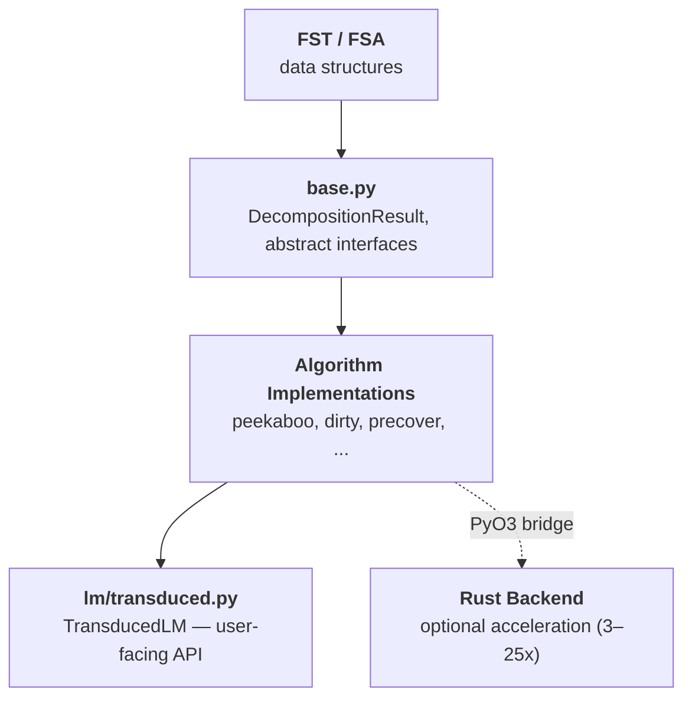
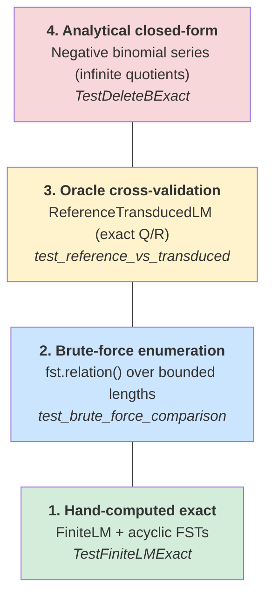

# Project Assessment: Delivering on the Transduced LM Mission

## 2026-02-24

---

## Executive Summary

The transduction library efficiently computes next-symbol probabilities for a
language model composed with a finite-state transducer — enabling constrained
and transformed autoregressive generation. The algorithmic core is strong:
Peekaboo decomposition, dirty-state persistence, and
Rust acceleration form a layered optimization stack that achieves real-time
per-step costs on production-scale FSTs. The user-facing `TransducedLM`
now defaults to the Rust backend (`RustPeekabooState`) and implements
particle-based beam-sum approximate inference (deterministic top-$K$, consistent
as $K \to \infty$). Quotient states provide exact marginalization over infinitely many
source continuations — the key variance reduction mechanism. All decomposition
implementations now support the `>>` operator via `DecompositionResult.__rshift__`.
Rich notebook display (`_repr_html_`) enables interactive exploration.
The LM integration layer uses clean log-space types (`LogVector`, `LogDistr`)
replacing ad-hoc patterns. Recent additions include lazy precover DFA
(integer packing, hash-consing, epsilon-closure caching), token-level
decomposition (position-set DFA states for BPE-like FSTs), pluggable
`FusedTransducedLM` backends via `helper=` parameter, and a critical bug fix
for PeekabooState on epsilon-output chains (#9). Test coverage is
comprehensive: 1078 tests across 18 files (1059 passed, excluding
GPU-dependent tests).
Documentation now covers all public modules (module docstrings), constructors,
abstract interfaces, and the Rust bridge classes; a tutorial notebook
(`examples/tutorial.ipynb`) provides an end-to-end walkthrough with rich
Graphviz and HTML display. Batched LM inference is now implemented via
`HuggingFaceLM.prefetch()`, enabling interactive-speed decoding (12 ms/step
on GPT-2 CPU with CharacterBeam).

---

## What's Working Well

### 1. Algorithmic Depth

15+ decomposition algorithms spanning the full design space: reference
implementations, incremental variants, batched variants, Rust backends,
pynini-backed reference operations, and token-level optimizations.
Each variant serves a distinct niche:

| Layer | Algorithm | Purpose |
|-------|-----------|---------|
| Reference | `Precover`, `NonrecursiveDFADecomp` | Correctness oracle |
| Batched | `PeekabooState`, `Peekaboo` (nonrecursive) | Amortize DFA across all next symbols |
| Incremental | `DirtyPeekaboo`, `TruncatedIncrementalDFADecomp` | Reuse DFA state across decode steps |
| Trie dispatch | `TrieDispatchDFADecomp` | Trie-based decomposition dispatch |
| Lazy DFA | `LazyPrecoverDFA` | On-demand DFA with integer packing + hash-consing |
| Rust | `RustDecomp`, `RustDirtyState`, `RustDirtyPeekaboo` | 3-25x over Python |
| Finite-only | `LazyIncremental`, `LazyNonrecursive`, `PrioritizedLazy` | Finite-language FSTs |

The parametrized test suite (`test_general.py`: 423 tests) ensures all
general-case algorithms agree.

### 2. Optimizations With Measured Impact

| Optimization | Impact | Mechanism |
|-------------|--------|-----------|
| `all_input_universal` | 11,500x on BPE | Skip universality BFS entirely |
| Peekaboo batching | ~\|Y\|x amortization | One DFA for all next symbols |
| Dirty-state persistence | Per-step $\to$ 0.1ms | Reuse clean DFA states across steps |
| Rust backend | 3-25x | Packed u64 NFA states, interned DFA states |
| Rho-arc compression | Arc count reduction | Replace most-common destination with single rho arc |

### 3. Clean Internal Architecture

~15K lines of Python across 38 modules. No circular dependencies. Well-layered:


```mermaid
graph TD
    A["<b>FST / FSA</b><br/>data structures"]
    B["<b>base.py</b><br/>DecompositionResult, abstract interfaces"]
    C["<b>Algorithm Implementations</b><br/>peekaboo, dirty, precover, ..."]
    D["<b>lm/transduced.py</b><br/>TransducedLM — user-facing API"]
    R["<b>Rust Backend</b><br/>optional acceleration (3–25x)"]

    A --> B --> C --> D
    C -. "PyO3 bridge" .-> R
```

The Rust bridge is optional and degrades gracefully. The LM submodule (`lm/`)
is self-contained with no pollution of core algorithms.

### 4. Solid Test Infrastructure

- **1078 tests** across 18 test files (1059 passed, excluding GPU-dependent tests)
- Parametrized cross-algorithm validation catches disagreements automatically
  (9 implementations × 47 test cases = 423 tests in `test_general.py`)
- Reference implementations (`Precover`) serve as correctness oracles
- Real-model integration tests (GPT-2 + BPE FST in `test_enumeration.py`)
- TransducedLM tests: multi-state FSTs, brute-force comparison, consistency
  convergence, carry-forward prefix-domination regression tests
- `test_fst.py`: 56 tests covering FST methods (99% coverage)
- `test_lazy_peekaboo_dfa.py`: 23 tests for Rust lazy DFA integration
- `test_lazy_precover_dfa.py`: 26 tests for lazy precover DFA (Python + Rust)
- `test_fsa.py`: 33 tests for FSA operations
- `test_gpt2_integration.py`: 15 tests for GPT-2 cross-parent batching
- `test_character_beam.py`: 3 tests for CharacterBeam
- Recent additions: 9 new parametrized test cases for epsilon chains,
  nonproductive cycles, delayed output, multichar output symbols, OOV symbols
- Clear general vs. finite-only test separation
- CI via GitHub Actions (`.github/workflows/test.yml`)

### 5. Elegant User-Facing API

The `TransducedLM` API mirrors the inner LM interface:

```python
tlm = TransducedLM(inner_lm, fst)
state = tlm >> 'h'          # advance by target symbol
p = state.logp_next['e']    # query next-symbol probability
```

Users don't need to understand precovers, peekaboo, or dirty states. The
`>>` operator and `logp_next` property are the entire surface area.
`TransducedLM` now defaults to the Rust backend for decomposition. Both
`TransducedState` and `FusedTransducedState` support rich notebook display
via `_repr_html_` with unified visualization.

### 6. Documentation

- **Module docstrings** on all public modules (`fst.py`, `fsa.py`, `lm/base.py`,
  `util.py`, `base.py`, `rust_bridge.py`, `lm/transduced.py`, `lm/ngram.py`)
- **Constructor docstrings** on `FST.__init__`, `FSA.__init__` with Args blocks
- **Abstract interface docs**: `LMState.logp_next`, `LMState.__rshift__`,
  `AbstractAlgorithm` class docstring explaining the BFS hook pattern
- **Rust bridge coverage**: `RustDirtyState` and `RustDirtyPeekaboo` — all
  public methods documented (`__init__`, `quotient`, `remainder`, `__rshift__`,
  `decompose_next`)
- **K/max_expansions coupling** documented in `TransducedLM` docstring
- **Utility coverage**: `Integerizer` methods, `dfs()` in `fsa.py`
- **Tutorial notebook** (`examples/tutorial.ipynb`): end-to-end walkthrough
  using Graphviz FST/FSA diagrams, `display_table` for relations, and
  `_repr_html_` for TransducedState particle visualization
- **Existing strength**: `base.py` has a 55-line module docstring covering the
  precover decomposition theory; `README.md` is substantial with code examples,
  performance tables, and architecture diagrams

### 7. Testing Strategy for TransducedLM

The `TransducedLM` tests use a four-level cross-validation pyramid, where each
level provides independent verification:


```mermaid
graph BT
    L1["<b>1. Hand-computed exact</b><br/>FiniteLM + acyclic FSTs<br/><i>TestFiniteLMExact</i>"]
    L2["<b>2. Brute-force enumeration</b><br/>fst.relation() over bounded lengths<br/><i>test_brute_force_comparison</i>"]
    L3["<b>3. Oracle cross-validation</b><br/>ReferenceTransducedLM (exact Q/R)<br/><i>test_reference_vs_transduced</i>"]
    L4["<b>4. Analytical closed-form</b><br/>Negative binomial series (infinite quotients)<br/><i>TestDeleteBExact</i>"]

    L1 --- L2 --- L3 --- L4

    style L1 fill:#d4edda
    style L2 fill:#cce5ff
    style L3 fill:#fff3cd
    style L4 fill:#f8d7da
```

1. **Hand-computed exact values** — `FiniteLM` + acyclic FSTs where the
   pushforward can be computed by hand. With `FiniteLM`, zero-probability
   transitions are pruned, so beam-sum BFS terminates with the full support;
   there is no approximation. Results must match brute-force enumeration to
   1e-10. (Tests: `TestFiniteLMExact`)

2. **Brute-force enumeration** — `fst.relation()` enumerates all source/target
   pairs up to a bounded length. `brute_force_pushforward()` sums inner LM
   probabilities over all source preimages. This is completely independent of
   Precover, Peekaboo, or any decomposition algorithm. (Tests:
   `test_brute_force_comparison`, `test_brute_force_multi_state`)

3. **Oracle cross-validation** — `ReferenceTransducedLM` computes exact
   transduced probabilities by enumerating Q/R languages via Precover on
   finite-relation FSTs. `TransducedLM` and `FusedTransducedLM` are both
   validated against this oracle. (Tests: `TestReferenceTransducedLM`,
   `test_reference_vs_transduced`, `test_reference_vs_fused`)

4. **Analytical closed-form** — `delete_b` with `TinyLM` (memoryless:
   P(a)=0.6, P(b)=0.3, P(EOS)=0.1) has infinite quotients, yet the
   pushforward has a closed-form: P(next='A' | any prefix) = 6/7,
   P(EOS | any prefix) = 1/7, by the negative binomial series. This tests
   correctness on infinite-quotient FSTs where brute-force enumeration cannot
   reach. (Tests: `TestDeleteBExact`)

**Structural invariants** are also tested: normalization (probabilities sum to
1), incremental consistency (`>>` matches fresh decomposition), path recovery,
and carry-forward prefix-domination regression tests.

---

## Open Issues

### ~~Medium: No Batched LM Inference~~ ([#7](https://github.com/timvieira/transduction/issues/7)) — Resolved

`HuggingFaceLM.prefetch()` batches forward passes across multiple LM states.
CharacterBeam and GeneralizedBeam both exploit this. With `extend_threshold=0.1`,
CharacterBeam achieves 12 ms/step on GPT-2 (CPU) with only 0.27 LM calls/step.
GeneralizedBeam sees a 2x speedup from prefetch (42.3 → 0.99 calls/step).

### Medium: DirtyPeekaboo Non-Monotonic Target Sequences ([#5](https://github.com/timvieira/transduction/issues/5))

`RustDirtyPeekabooDecomp.decompose_for_beam` produces incorrect results when
called with a shorter target after a longer one (e.g., tree-branching decode).
The dirty-state logic assumes monotonic forward extension; backward steps
cause stale state to corrupt the decomposition.

### ~~Low: K and max_expansions Must Scale Together~~ (Resolved)

Now documented in the `TransducedLM` docstring (Note section).

### ~~Low: HuggingFaceLM KV Cache Sharing with DynamicCache~~ ([#1](https://github.com/timvieira/transduction/issues/1)) — Resolved

`_clone_dynamic_cache()` deep-clones `DynamicCache` objects before tree-branching,
preventing in-place mutation from corrupting shared caches. Both tuple caches
(GPT-2) and `DynamicCache` (transformers >= 4.40) are now handled correctly.

### ~~Low: No Type Annotations on Public API~~ — Resolved

All public API modules now have type annotations: `base.py`, `fst.py`,
`lm/base.py`, `lm/transduced.py`, `lm/ngram.py`, `lm/huggingface_lm.py`,
`lm/fused_transduced.py`, `lm/reference_transduced.py`.

---

## Codebase Health Metrics

### Size and Complexity

| Component | Files | Lines | Notes |
|-----------|-------|-------|-------|
| Core (FST/FSA/base) | 4 | ~2,400 | Stable, well-tested |
| Algorithms | 14 | ~4,800 | +lazy_precover_dfa, trie_dispatch |
| LM integration | 10 | ~3,300 | +HuggingFaceLM, LlamaCppLM, GeneralizedBeam, CharacterBeam |
| Rust backend | 10 | ~7,500 | +lazy_precover |
| Applications | 4 | ~580 | BPE, PTB, WikiText |
| Utilities | 6 | ~3,900 | viz, examples, lazy, util, rust_bridge, enumeration |
| **Total Python** | **38** | **~15,000** | |
| Tests | 18 | ~7,500 | 1078 tests (1059 passed, excluding GPU-dependent) |

### Technical Debt

| Item | Severity | Location | Effort |
|------|----------|----------|--------|
| DirtyPeekaboo non-monotonic targets ([#5](https://github.com/timvieira/transduction/issues/5)) | Medium | `rust_bridge.py`, `peekaboo.rs` | Medium |
| ~~No batched LM calls ([#7](https://github.com/timvieira/transduction/issues/7))~~ | ~~Medium~~ | ~~`lm/transduced.py`~~ | ~~Resolved (prefetch)~~ |
| ~~HuggingFaceLM KV cache with DynamicCache ([#1](https://github.com/timvieira/transduction/issues/1))~~ | ~~Low~~ | ~~`lm/huggingface_lm.py`~~ | ~~Resolved (`_clone_dynamic_cache`)~~ |
| ~~FusedTransducedLM logp disagreement~~ | ~~Medium~~ | ~~`lm/fused_transduced.py`~~ | ~~Resolved (max diff 0.000287)~~ |
| ~~K/max_expansions coupling undocumented~~ | ~~Low~~ | ~~`lm/transduced.py`~~ | ~~Resolved~~ |
| ~~No type annotations~~ | ~~Medium~~ | ~~Public API modules~~ | ~~Resolved~~ |
| ~~PeekabooState Q/R bug on epsilon-output chains~~ | ~~Medium~~ | ~~`peekaboo_incremental.py`~~ | ~~Resolved (#9)~~ |

---

## Roadmap

### ~~Phase 1: Make It Fast for Real LMs~~ — Done

**Goal:** TransducedLM with GPT-2 + BPE FST runs at interactive speed.

1. ~~**Profile the TransducedLM hot loop with a neural LM.**~~ — Done.
   GPT-2 WikiText benchmark established (200 bytes, CPU).

2. ~~**Batch source-symbol expansions.**~~ — Done. `HuggingFaceLM.prefetch()`
   batches forward passes. CharacterBeam achieves 12 ms/step on GPT-2 (CPU).

### Phase 2: Make It Usable by Others

**Goal:** A new contributor can understand and extend the library.

3. ~~**Add type annotations to public API.** Start with `base.py`, `fst.py`,
   `lm/base.py`, `lm/transduced.py`.~~ — Done.

4. **Benchmark regression tracking.** Run PTB benchmarks in CI, store timing
   in `output/`, alert on regressions > 20%.

### Phase 3: Scale (ongoing)

5. **FusedTransducedLM evaluation.** Benchmark against standard TransducedLM
   on GPT-2 + BPE to determine when the fused single-pass approach wins.

6. **Streaming / multi-sequence support.** Enable batched inference across
   multiple decode sequences (e.g., for beam search at the TransducedLM level).

7. **FST construction toolkit.** Add utilities for regex-to-FST,
   grammar-to-FST without requiring pynini (GPL dependency risk).

---

## Summary

| Dimension | Grade | Key Finding |
|-----------|-------|-------------|
| **Algorithms** | A+ | 15+ implementations across 5 strategy families; token-level decomposition; lazy DFA; pluggable backends |
| **Performance** | A | 25x Rust acceleration, 0.1ms per-step dirty-state; token decomposition O(N) scaling for BPE |
| **Architecture** | A- | Clean layering, no circular deps, optional Rust, self-contained LM module |
| **Testing** | A+ | 1078 tests across 18 files; 9-way parametrized cross-validation; regression tests |
| **End-to-End Product** | A- | Particle-based beam-sum inference; quotient exact marginalization; rich notebook display |
| **API/Packaging** | A- | Exports correct; Rust default; `_repr_html_`; all impls support `>>`; `helper=` for FusedLM |
| **Documentation** | A- | Module, class, and method docstrings across public API; tutorial notebook with rich display |

**Bottom line:** The hard parts — fast, correct FST decomposition AND a working
`TransducedLM` with particle-based approximate inference — are done. Recent
work has significantly expanded the optimization toolkit: lazy precover DFA
(Python + Rust) with integer packing and hash-consing, token-level
decomposition with position-set DFA states for BPE-like FSTs, pluggable
`FusedTransducedLM` backends, and batched LM inference via
`HuggingFaceLM.prefetch()`. CharacterBeam with GPT-2 achieves 12 ms/step
(interactive speed) on CPU. The `scipy` dependency has been eliminated
(replaced with `torch.sparse`), and the `tokenization/` package has been
removed (functionality inlined). Test coverage stands at 1078 tests across
18 files.
