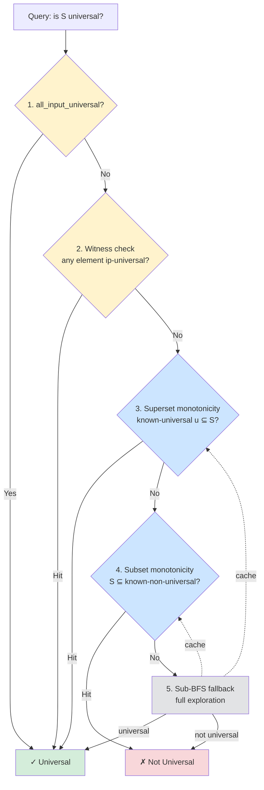

# Epsilon-Chain Collapsing: Optimization Report

## Overview

This report documents four optimizations introduced to the decomposition pipeline,
targeting both Rust and Python codepaths. The changes reduce the cost of universality
detection (the main bottleneck in decomposition) and shrink powerset state sizes by
eliminating transit-only NFA states from epsilon closures.

These optimizations are now merged into `main` and reflected in the current codebase.

---

## Optimization 1: Epsilon-Chain Collapsing

**Files**: `precover.rs`, `fst.rs`

### Problem

In the precover NFA, epsilon closures can include many "transit-only" states —
NFA states whose FST state has only epsilon-input arcs and that aren't NFA-final.
These states generate no non-epsilon NFA arcs (don't affect DFA transitions),
don't affect DFA finality, and only serve as intermediaries in epsilon chains.
Including them inflates powerset state sizes, slowing interning, universality
checks, and overall DFA construction.

### Solution

**`fst.rs`**: A per-FST-state flag `has_non_eps_input: Vec<bool>`, computed once
during FST construction. True if the state has at least one arc with non-epsilon input.

**`precover.rs`**: An `is_productive()` predicate on NFA states:

```rust
fn is_productive(&self, packed: u64) -> bool {
    let (fst_state, buf_pos) = unpack(packed, self.target_len);
    self.fst.has_non_eps_input[fst_state as usize]
        || (self.fst.is_final[fst_state as usize] && buf_pos == self.target_len)
}
```

A state is productive if it can generate non-epsilon arcs OR if it's NFA-final.
Transit-only states (epsilon-only, non-final) are filtered out.

**`eps_closure_single_cached`**: The BFS still follows all epsilon arcs to find all
reachable states, but then filters the result to keep only productive states before
caching:

```rust
let mut result: Vec<u64> = all_reachable
    .into_iter()
    .filter(|&s| self.is_productive(s))
    .collect();
```

### Correctness Argument

For any powerset state S, let S' = {s in S : is_productive(s)}. Then:

1. **Transitions**: Non-epsilon arcs from S equal those from S', since transit-only
   states have no non-epsilon arcs by definition.
2. **Finality**: S contains an NFA-final state iff S' does, since NFA-final states
   are productive by definition.
3. **Closure stability**: Filtering after BFS preserves all productive endpoints,
   since BFS still follows through transit-only intermediaries to reach them.

### Impact

For FSTs with long epsilon chains (e.g., BPE trie structures), this significantly
reduces average powerset state sizes. For FSTs without epsilon chains, the filter
is a no-op — every state is productive.

---

## Optimization 2: UniversalityFilter (Multi-Strategy Optimizer)

**Files**: `decompose.rs` (Rust), `universality.py` (Python)

### Problem

The old `is_universal()` function had two strategies: a fast path
(`all_input_universal`) and a BFS fallback with a flat cache of known-universal
DFA state IDs. The flat cache only helped when the *exact same* DFA state was
re-encountered. It missed two common patterns:

- **Supersets**: If state S is universal, any S' where S is a subset is also universal (monotonicity).
- **Subsets**: If state S is non-universal, any S' where S' is a subset of S is also non-universal.

### Solution

Replace the flat cache with a `UniversalityFilter` implementing five strategies
in priority order:



1. **Fast path**: If `all_input_universal`, return true immediately.
2. **Witness check**: If any NFA element in the powerset state is a known
   ip-universal witness (see Optimization 3), the state is universal. O(|S|) check.
3. **Superset monotonicity**: If a known-universal set u is a subset of the
   current set (u is a subset of S), then S is universal. Uses hit-counting: for each
   element of S, increment hit counts for cached entries containing that element.
   If any entry's count reaches its stored size, it's a subset match.
4. **Subset monotonicity**: If S is a subset of a known-non-universal set (S is a subset of nu),
   then S is non-universal. Uses set-intersection of entry-ID lists.
5. **BFS fallback**: Full sub-BFS determinization. Results are added to the
   positive or negative cache for future lookups.

### Element-Indexed Caches

Both positive and negative caches use element-indexed data structures (inverted
indexes) rather than linear scans over stored sets:

```rust
// Positive cache: element -> list of entry IDs containing it
pos_index: FxHashMap<u64, Vec<u32>>,
pos_sizes: Vec<usize>,  // entry_id -> stored set size

// Negative cache: element -> list of entry IDs containing it
neg_index: FxHashMap<u64, Vec<u32>>,
```

The Python implementation (`UniversalityFilter` in `universality.py`) mirrors
this structure using `defaultdict(set)`.

---

## Optimization 3: Per-State IP-Universal Witnesses

**Files**: `fst.rs`, `universality.py`

### Problem

The `all_input_universal` flag is all-or-nothing: either the *entire* FST's input
projection is universal from the start state, or the flag is false. For FSTs where
only some sub-machines are universal, this provides no benefit.

### Solution

`compute_ip_universal_states()`: a greatest-fixpoint computation that determines,
for each individual FST state q, whether the input projection of the FST started
from ip_eps_close({q}) accepts Sigma*.

**Algorithm**: Start by assuming all states are candidates. Iteratively remove
states that fail any of three conditions:

1. **Finality**: eps-closure must contain a final state.
2. **Completeness**: Must have arcs for all source alphabet symbols.
3. **Successor coverage**: For each symbol, the successor eps-closure must contain
   at least one remaining candidate.

Iterate until no more states are removed (greatest fixpoint).

**Integration**: During `UniversalityFilter` initialization, pack each ip-universal
FST state q as the NFA state `(q, target_len)`. These form the witness set. During
universality checking, if any NFA element in a powerset state matches a witness,
the state is immediately known to be universal.

---

## Optimization 4: `check_all_input_universal` Closure Caching

**Files**: `fst.rs`, `universality.py`

### Problem

`check_all_input_universal` called `ip_eps_close()` once per source alphabet symbol
to compute each symbol's successor closure. For GPT-2 BPE (~50K symbols, ~98K states),
this meant ~50K BFS traversals — causing FST construction to hang.

### Root Cause

In BPE FSTs, all ~50K token symbols route to the same hub state. Their successor
sets are identical, producing identical closures. But the old code computed each
independently.

### Solution

Cache closure results keyed by the sorted, deduplicated destination state set:

```rust
let mut closure_cache: FxHashMap<Vec<u32>, bool> = FxHashMap::default();
for (_sym, raw_dests) in &by_symbol {
    let mut raw_vec: Vec<u32> = raw_dests.iter().copied().collect();
    raw_vec.sort_unstable();
    raw_vec.dedup();
    if let Some(&result) = closure_cache.get(&raw_vec) {
        if !result { return false; }
        continue;
    }
    let closed = ip_eps_close(&raw_vec, fst);
    let ok = start.iter().all(|&s| closed.binary_search(&s).is_ok());
    closure_cache.insert(raw_vec, ok);
    if !ok { return false; }
}
```

### Impact

For BPE FSTs: 50K BFS calls reduced to 1. FST construction goes from hanging
indefinitely to completing in ~0.7s.

---

## Optimization 5: `arcs_x` Methods (Python)

**Files**: `precover.py`, `peekaboo_nonrecursive.py`, `peekaboo_incremental.py`

Added `arcs_x(state, x)` methods to lazy NFA/DFA wrapper classes. These return
only successor states for a specific input symbol x, avoiding the overhead of
generating all arcs and then filtering. This is the Python-side analogue of
`index_ix_j` in the Rust FST.

---

## Optimization 6: FST-Level Closure Cache in `compute_all_arcs`

**Files**: `peekaboo.rs`

### Problem

`compute_all_arcs` — the function that materializes all DFA arcs from a
powerset state — calls `eps_closure_single` for each non-epsilon arc destination.
The standard `eps_closure_single` operates on packed u64 NFA states and is
cached by packed state.

For off-target NFA states (those with `extra_sym != NO_EXTRA` and
`buf_len > step_n`), the epsilon closure only changes the FST state component —
the buffer parameters `(buf_len, extra_sym)` are invariant through epsilon
transitions.  Two packed states that differ only in `extra_sym` produce
structurally identical closures (same FST states reachable), but the packed-state
cache treats them as distinct entries, recomputing the BFS for each.

With V source-side symbols (e.g. V=5000 BPE token IDs), a single DFA state
can contain NFA elements for ~V distinct `extra_sym` values, all sharing the same
FST state.  Each `eps_closure_single` cache miss does a BFS through O(|NFA|)
states (~8675 states for a typical BPE FST with V=5000), so the total cost is
O(V × |NFA|) — the dominant bottleneck at large V.

### Why buffer parameters are invariant

For an off-target, non-truncated NFA state `(fst_q, buf_len, extra_sym, false)`
with `buf_len > step_n`, the `arcs()` method produces:

- **Epsilon-output arcs** (input=ε, output=ε): destination
  `(j, buf_len, extra_sym, false)` — buffer unchanged.
- **Non-epsilon-output arcs** (input=ε, output≠ε): destination
  `(j, buf_len, extra_sym, true)` — buffer unchanged but truncated.

In both cases, `(buf_len, extra_sym)` is preserved.  Only `fst_state` and
`truncated` change.  So the set of reachable FST states depends only on the
starting FST state, not on `(buf_len, extra_sym)`.

From truncated states `(j, buf_len, extra_sym, true)`, **all** arcs (regardless
of output label) produce truncated destinations with the same buffer parameters.
So the reachable FST states from a truncated starting state also depend only on
the starting FST state.

### Solution

Add a local FST-level closure cache keyed by FST state (u32) instead of packed
NFA state (u64).  For each unique FST state, a two-phase BFS computes the
reachable FST states:

```
fst_full_closure(fst_state) → (non_trunc_productive: Vec<u32>, trunc: Vec<u32>)

  Phase 1 (non-truncated): BFS from {fst_state} following eps_input_arcs
  where output = EPSILON.  These are arcs that don't change the buffer.

  Phase 2 (truncated): From phase-1 states, follow eps_input_arcs where
  output ≠ EPSILON (these cause truncation).  Then transitively follow ALL
  eps_input_arcs from those destinations (truncated states accept all outputs).

  Filter non-truncated results by productivity: has_non_eps_input || is_final.
  All truncated results are productive (truncated flag ⇒ productive).
```

A separate `fst_trunc_closure(fst_state)` handles destinations that are
already truncated — just follow all eps_input_arcs transitively.

In `compute_all_arcs`, for each non-epsilon arc destination:

```
if extra_sym ≠ NO_EXTRA and buf_len > step_n:
    look up fst_full_cache or fst_trunc_cache by dest_fst_state
    repack each FST-level result with (buf_len, extra_sym, truncated)
else:
    standard eps_closure_single (for on-target or pre-step_n states)
```

The FST-level BFS uses pre-extracted `eps_input_arcs` slices from the FST
(u32 states, no packing/unpacking), which is cheaper per step than the
packed-state BFS that calls `self.arcs()` on u64 packed states.

### Correctness Argument

For off-target NFA states with `buf_len > step_n`:

1. **Arc equivalence**: The `arcs()` method for these states maps every FST arc
   to an NFA arc with the same `(buf_len, extra_sym)` in the destination
   (either preserving or truncating).  No arcs are filtered by buffer content.

2. **Closure equivalence**: The epsilon closure (BFS following input=ε arcs)
   visits exactly the states reachable via the FST-level eps_input_arcs.
   Non-epsilon-output arcs create truncated destinations; epsilon-output arcs
   preserve non-truncated status.  The two-phase BFS captures both paths.

3. **Productivity equivalence**: For non-truncated states with
   `buf_len = step_n + 1` and `extra_sym ≠ NO_EXTRA`:
   `is_productive = has_non_eps_input[fst_state] || is_final[fst_state]`.
   This depends only on the FST state, not on `extra_sym`.
   All truncated states are unconditionally productive.

4. **Sort stability**: Closure results are pre-sorted by FST state.  Since
   `fst_state` occupies bits [63:32] of the packed u64 (the most significant
   field), packed entries are nearly sorted, enabling pdqsort to verify
   sortedness in O(n) instead of a full O(n log n) sort.

### Pre-sorted closure optimization

The FST-level closure results are sorted by FST state before caching.  When
repacked with `(buf_len, extra_sym)` and pushed into per-symbol buckets, the
packed u64 entries preserve the sort order (since `fst_state` is the dominant
sort key in the packing).

For BPE FSTs, each input symbol typically has exactly one arc destination,
so each per-symbol bucket receives entries from a single sorted closure.
Rust's pdqsort (`sort_unstable`) detects the pre-sorted run in O(n) comparisons
instead of O(n log n).  This reduces the sort+dedup phase from ~550ms to ~100ms
at V=5000.

### Impact

Measured on FusedTransducedLM with BPE FSTs, CharNgramLM(n=3), max_steps=200,
max_beam=10, decoding "The quic" (8 bytes), averaged per step:

| V (tokens) | Before (ms) | After (ms) | Speedup |
|------------|-------------|------------|---------|
| 500        | 13          | 13         | 1.0x    |
| 2,000      | 169         | 143        | 1.2x    |
| 5,000      | 849         | 445        | 1.9x    |
| 10,000     | 3,417       | 1,610      | 2.1x    |

At V=5000, internal profiling shows:
- BFS work: reduced from O(V × |NFA|) ≈ 40M BFS steps to
  O(|unique_FST_states| × |eps_closure|) ≈ 2K BFS steps.
- Sort+dedup: reduced from 550ms (full O(n log n) on 43M entries) to
  100ms (O(n) verification of pre-sorted data).
- Loop (arc generation + repacking): 240ms for 43M pack+push operations.
- Intern: 60ms for 5002 powerset state interns.

### Remaining bottleneck

The output of `compute_all_arcs` is O(V × |closure|) packed entries (43M at
V=5000).  This materialization cost dominates at large V and cannot be reduced
without changing the DFA representation — e.g. parameterized powerset states
that share a single FST-level closure across `extra_sym` values, avoiding the
V-fold blowup in materialized NFA sets.

