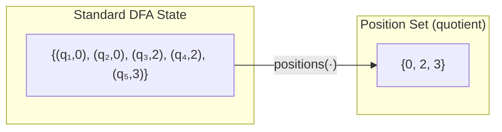
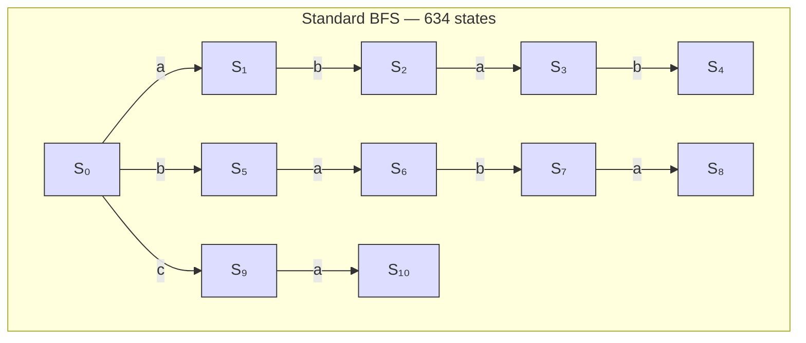
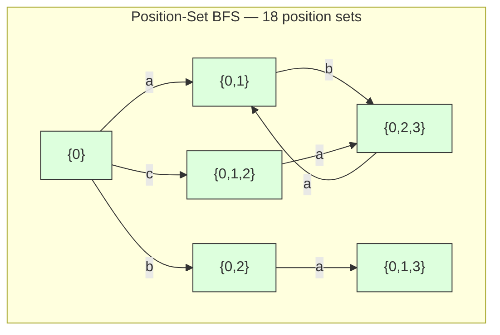
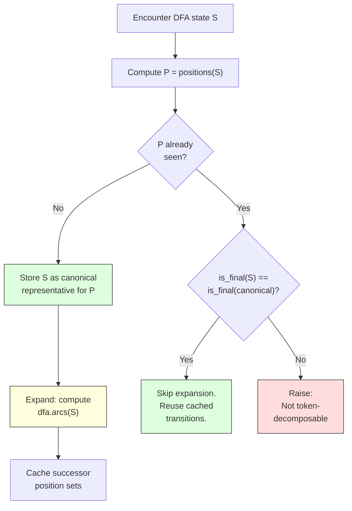
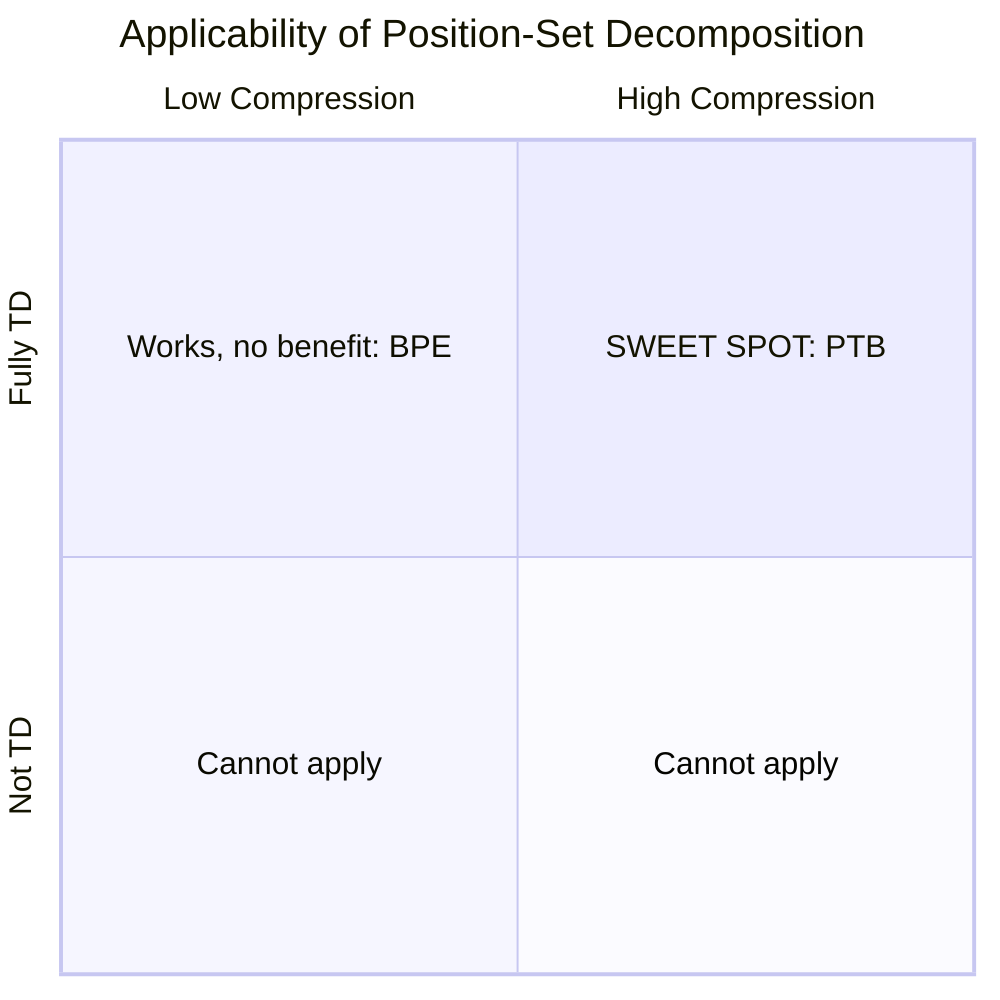
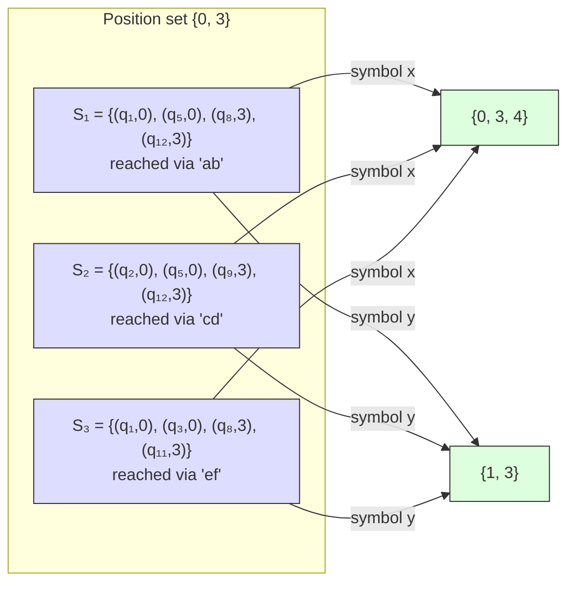
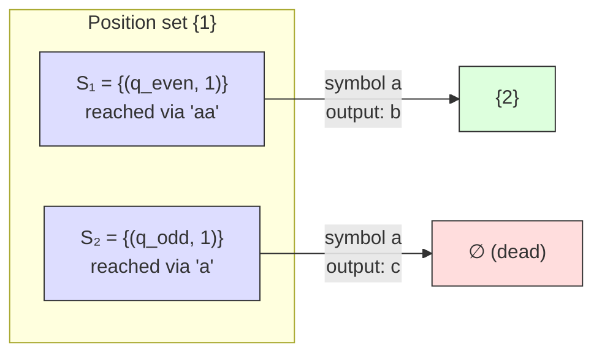
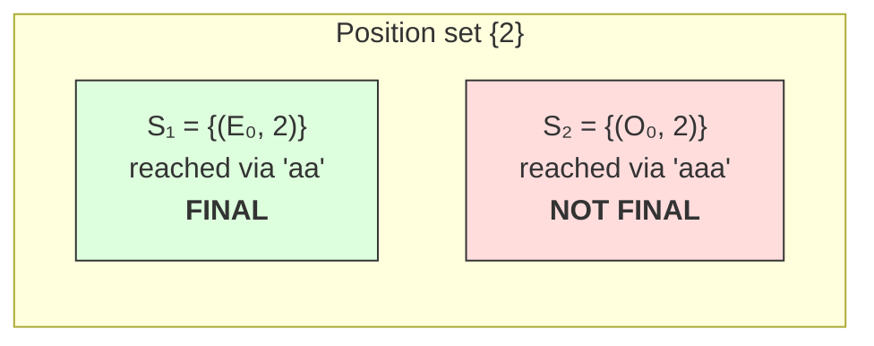
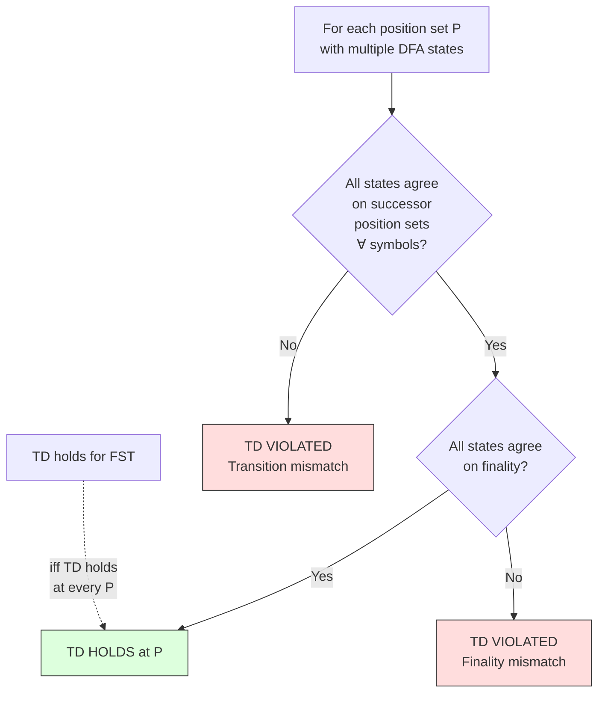

# Position-Set Decomposition for Token-Decomposable FSTs

## 1. Problem

Given an FST $f : \mathcal{X}^* \to \mathcal{Y}^*$ and a target prefix
$\boldsymbol{y}$, the **precover decomposition** computes:

$$\mathcal{P}(\boldsymbol{y}) = \mathcal{Q}(\boldsymbol{y}) \cdot \mathcal{X}^* \;\sqcup\; \mathcal{R}(\boldsymbol{y})$$

where $\mathcal{Q}(\boldsymbol{y})$ is the quotient (source strings whose
output starts with $\boldsymbol{y}$ and can continue) and
$\mathcal{R}(\boldsymbol{y})$ is the remainder (source strings that produce
exactly $\boldsymbol{y}$ and stop).

The standard algorithm (`NonrecursiveDFADecomp`) builds a DFA from the
PrecoverNFA via powerset construction. Each DFA state is a set of NFA states
$(q, \text{buf})$, where $q$ is an FST state and $\text{buf}$ is the prefix of
the target consumed so far. For large FSTs, this powerset DFA can have many
states — PTB produces 634 DFA states for typical targets.

**This report describes an optimization that achieves dramatic DFA state
compression (174x for PTB's full 45-symbol target: 37,803→217 states) and
a 331x speedup, by exploiting a structural property called
token-decomposability.**


## 2. Background: The Standard Decomposition

### PrecoverNFA

The PrecoverNFA for target $\boldsymbol{y} = y_0 y_1 \cdots y_{N-1}$ has:

- **States**: pairs $(q, j)$ where $q$ is an FST state and $j \in \{0, \ldots, N\}$ is
  the number of target symbols consumed (the *position*)
- **Transitions on source symbol $a$**: from $(q, j)$, follow FST arcs
  $(q, a, b, q')$:
  - If $b = \varepsilon$: go to $(q', j)$ — position unchanged
  - If $b = y_j$ and $j < N$: go to $(q', j+1)$ — position advances
  - If $b \ne \varepsilon$ and $b \ne y_j$: dead — no transition
  - If $j = N$ (target consumed): go to $(q', N)$ for any output $b$
- **Start states**: $\{(q, 0) : q \in \text{fst.start}\}$
- **Final states**: $\{(q, N) : q \in \text{fst.stop}\}$

### Powerset DFA

The DFA is the powerset construction of the (epsilon-removed) PrecoverNFA.
Each DFA state $S$ is a set of NFA states:

$$S = \{(q_1, j_1),\; (q_2, j_2),\; (q_3, j_3),\; \ldots\}$$

The **position set** of $S$ is:

$$\text{positions}(S) = \{j : (q, j) \in S\}$$

### Standard BFS

```python
def StandardDecompose(fst, target):
    dfa = PrecoverNFA(fst, target).determinize()
    Q, R = empty_FSAs()
    worklist = deque(dfa.start_states)
    visited = set()

    while worklist:
        S = worklist.popleft()
        if S in visited: continue
        visited.add(S)

        if dfa.is_final(S):
            if is_universal(S):          # all extensions stay in P(y)
                Q.add_stop(S); continue  # prune: don't expand further
            else:
                R.add_stop(S)            # some extensions leave P(y)

        for a in source_alphabet:
            S_prime = dfa.successor(S, a) # EXPENSIVE: powerset construction
            Q.add_arc(S, a, S_prime)
            R.add_arc(S, a, S_prime)
            worklist.append(S_prime)

    return Q, R
```

**Cost**: $O(|D| \cdot |\Sigma|)$ successor computations, where $|D|$ is the
number of reachable DFA states and $|\Sigma|$ is the source alphabet size. Each
successor computation iterates over all NFA states in $S$.


## 3. Token-Decomposability

### Definition

An FST is **token-decomposable (TD)** for target $\boldsymbol{y}$ if the DFA's
behavior is fully determined by position sets. Formally, for all reachable DFA
states $S_1, S_2$:

**Condition 1** (position-deterministic transitions): If
$\text{positions}(S_1) = \text{positions}(S_2)$, then for every source symbol
$a \in \Sigma$:

$$\text{positions}(\delta(S_1, a)) = \text{positions}(\delta(S_2, a))$$

**Condition 2** (position-deterministic finality): If
$\text{positions}(S_1) = \text{positions}(S_2)$, then:

$$\text{is\_final}(S_1) = \text{is\_final}(S_2)$$

When both hold, we can quotient the DFA by position sets: replace each state
$S$ with $\text{positions}(S)$, and the resulting automaton accepts the same
language.

### Intuition

TD says: the FST states inside a DFA state are *passengers* — they're carried
along but don't influence which positions appear next. Only the positions
matter for the DFA's transition structure.



Different DFA states may carry different FST states at position 0 (say
$\{q_1,q_2\}$ vs $\{q_1,q_6\}$), but TD guarantees that when we apply any
source symbol, the resulting position sets are identical.

### Token-Decomposability Spectrum

| FST | TD? | Compression | Violations |
|-----|-----|-------------|------------|
| BPE | 100% TD | 1.0x | 0 |
| **PTB** | **100% TD** | **174x** | **0** |
| replace | 100% TD | 1.0x | 0 |
| delete_b | 100% TD | 1.0x | 0 |
| newspeak2 | 91% TD | 1.8x | 21,195 |
| parity_copy | 71% TD | 1.2x | 0 (finality violations) |
| doom(K=3) | 62% TD | 1.4x | 24 |
| anbn | 45% TD | 1.4x | 30 |

TD holds for all `all_input_universal` FSTs (BPE, replace, delete_b) and also
for PTB despite it *not* being `all_input_universal`.

TD fails for FSTs with source-dependent output branching (doom, anbn) or
position-dependent finality (parity_copy).


## 4. The Algorithm

### Overview

`GeneralTokenDecompose` modifies the standard BFS in one key way: it maintains
a **canonical representative** for each position set. When a new DFA state's
position set has already been seen, it is **not expanded** — the cached
transitions from the canonical representative are reused.





In the standard BFS, every state ($S_0$ through $S_{633}$) is a distinct
frozenset that must be fully expanded. In the position-set BFS, many of those
states collapse to the same position set, and only one representative per
position set is expanded.

### Pseudocode

```python
def GeneralTokenDecompose(fst, target):
    dfa = PrecoverNFA(fst, target).determinize()
    aiu = check_all_input_universal(fst)

    # Phase 1: BFS with position-set canonicalization
    canonical = {}      # position_set -> representative DFA state
    pos_arcs  = {}      # position_set -> {symbol: succ_position_set}
    pos_final = {}      # position_set -> bool

    for S in dfa.start_states:
        canonical[positions(S)] = S

    worklist = deque(canonical.keys())
    expanded = set()

    while worklist:
        P = worklist.popleft()
        if P in expanded: continue
        expanded.add(P)

        S_rep = canonical[P]                       # the representative
        pos_final[P] = dfa.is_final(S_rep)

        if aiu and pos_final[P]:                   # aiu => all final states universal
            pos_arcs[P] = {}
            continue                               # prune

        arcs = {}
        for a in source_alphabet:
            S_prime = dfa.successor(S_rep, a)      # full powerset (EXPENSIVE)
            P_prime = positions(S_prime)
            arcs[a] = P_prime

            if P_prime not in canonical:
                canonical[P_prime] = S_prime       # new representative
                worklist.append(P_prime)
            else:
                # TD validation: check finality consistency
                if dfa.is_final(S_prime) != dfa.is_final(canonical[P_prime]):
                    raise "Not token-decomposable"

        pos_arcs[P] = arcs

    # Phase 2: Universality via greatest fixpoint
    if aiu:
        universal = {P for P in expanded if pos_final[P]}
    else:
        universal = greatest_fixpoint_universality(
            expanded, pos_arcs, pos_final, source_alphabet
        )

    # Phase 3: Build Q and R from position-set DFA
    Q, R = empty_FSAs(start=positions(dfa.start))
    for P in expanded:
        if pos_final[P] and P in universal:
            Q.add_stop(P)
            continue                                # don't expand past universal
        if pos_final[P]:
            R.add_stop(P)
        for a, P_prime in pos_arcs[P].items():
            Q.add_arc(P, a, P_prime)
            R.add_arc(P, a, P_prime)

    return Q, R
```

```python
def greatest_fixpoint_universality(states, arcs, final, alphabet):
    """A position set P is universal iff it is final AND every source
    symbol leads to another universal position set."""
    candidates = {P for P in states
                  if final[P] and all(a in arcs[P] for a in alphabet)}
    while True:
        to_remove = {P for P in candidates
                     if any(arcs[P][a] not in candidates for a in alphabet)}
        if not to_remove: break
        candidates -= to_remove
    return candidates
```

### Per-State Decision Diagram




## 5. Correctness Argument

**Claim.** If the FST is token-decomposable for target $\boldsymbol{y}$, then
`GeneralTokenDecompose` produces $\mathcal{Q}$ and $\mathcal{R}$ automata that
accept the same languages as `NonrecursiveDFADecomp`.

### Step 1: The position-set DFA is a valid quotient

Define the equivalence relation $S_1 \sim S_2$ iff
$\text{positions}(S_1) = \text{positions}(S_2)$.

TD Condition 1 guarantees that $\sim$ is a **congruence** with respect to
transitions: if $S_1 \sim S_2$ and we apply source symbol $a$, then
$\delta(S_1, a) \sim \delta(S_2, a)$. This means the successor's equivalence
class (position set) is well-defined — it does not depend on which
representative we chose.

TD Condition 2 guarantees that $\sim$ respects finality:
$S_1 \sim S_2 \implies \text{is\_final}(S_1) = \text{is\_final}(S_2)$.

Together, these mean the quotient DFA $D/{\sim}$ (whose states are equivalence
classes, i.e., position sets) is a well-defined DFA that simulates $D$. By the
standard quotient theorem for DFAs:

$$\mathcal{L}(D/{\sim}) = \mathcal{L}(D)$$

### Step 2: Universality is preserved

Universality of a state depends only on the DFA's transition structure and
finality from that state forward. Since the quotient DFA $D/{\sim}$ has
identical transition structure and finality (by conditions 1 and 2),
universality of a position set $P$ in $D/{\sim}$ equals universality of any
representative $S$ with $\text{positions}(S) = P$ in the original DFA $D$.

Therefore, the $\mathcal{Q}/\mathcal{R}$ split (which depends on finality +
universality) is the same in both the original and quotiented DFA.

### Step 3: The BFS explores all reachable position sets

The BFS starts from $\text{positions}(S_{\text{start}})$ and follows
position-set transitions. Since $D/{\sim}$ is a quotient of $D$, every
reachable position set in $D/{\sim}$ corresponds to at least one reachable
state in $D$. The BFS is complete because:

1. The start position set is seeded from the actual DFA start state
2. Each transition in the position-set DFA comes from an actual DFA transition
   (computed on the representative)
3. The worklist processes every newly discovered position set

### Step 4: On-the-fly validation

During Phase 1, when a successor DFA state $S'$ has the same position set as
an already-stored canonical representative, we verify finality consistency. A
mismatch means TD Condition 2 is violated, and we raise an error — ensuring we
never silently produce incorrect results for non-TD FSTs.

> **Note:** Transition violations (Condition 1) are not checked on-the-fly —
> doing so would require expanding the non-canonical state, defeating the
> optimization. For production use, TD should be verified offline on sample
> targets using `reports/token_decomposability.py`.


## 6. Performance Analysis

### Why it's fast

The dominant cost is the BFS loop: for each DFA state, compute successors on
every source symbol via powerset construction. `GeneralTokenDecompose` reduces
the number of iterations from $|D|$ (DFA states) to $|D/{\sim}|$ (position
sets):

$$\text{speedup} \approx \frac{|D|}{|D/{\sim}|}$$

For PTB (full 45-symbol target): $37{,}803 / 217 = 174\times$ fewer BFS
iterations. (Note: the original 634→18 numbers were from shorter targets
and used a buggy descriptor that stripped FST state from truncated elements.
With the fix — including FST state for truncated elements — the compression
ratio is 174x for the full target.) The measured speedup ($331\times$)
exceeds the raw state ratio because:

1. **Universality is cheaper**: greatest fixpoint on 217 states vs BFS over 37,803
2. **No wasted work**: the standard BFS computes transitions for equivalent
   states — all redundant
3. **Smaller $\mathcal{Q}/\mathcal{R}$**: 217 states vs 37,803 accelerates
   downstream operations

### Cost Breakdown

|  | Standard | Position-Set |
|--|----------|-------------|
| **Phase 1** (BFS) | $|D|$ expansions $\times$ $O(\bar{s} \cdot \lvert\Sigma\rvert)$ | $|D/{\sim}|$ expansions $\times$ $O(\bar{s} \cdot \lvert\Sigma\rvert)$ |
| **Phase 2** (universality) | BFS over $|D|$-state DFA | Fixpoint over $|D/{\sim}|$-state graph |
| **Phase 3** ($\mathcal{Q}/\mathcal{R}$ build) | $|D|$ states | $|D/{\sim}|$ states |
| **Total** | $O(|D| \cdot \bar{s} \cdot \lvert\Sigma\rvert)$ | $O(|D/{\sim}| \cdot \bar{s} \cdot \lvert\Sigma\rvert)$ |

where $\bar{s}$ is the average number of NFA states per DFA state, $|D|$ is
the generic DFA state count, and $|D/{\sim}|$ is the position-set count.

### When It Helps vs Doesn't



| FST | Compression | Speedup | Reason |
|-----|-------------|---------|--------|
| **PTB** | **174x** | **331x** | Many DFA states per position set |
| BPE | 1.0x | ~1x | Every position set already unique |
| Small FSTs | 1.0–2.0x | ~1x | Already fast, overhead dominates |
| Non-TD FSTs | N/A | N/A | Raises error |


## 7. When TD Holds and When It Doesn't

### Case 1: TD holds (PTB)

PTB is built from cdrewrite rules composed with an identity transducer. The
identity ensures every input byte can produce the same output byte. The rewrite
rules add alternative paths but share the same position-advancement structure.



The FST states are *passengers* — different at each position, but all three
DFA states produce the same successor position sets. A single position set
$\{0, 3\}$ represents all of them.

### Case 2: TD fails — transition violation (doom)

The "doom" FST has source-dependent output branching: different FST states at
the same position produce different output symbols.



For target $\boldsymbol{y} = \text{"xb..."}$: $q_\text{even}$ outputs $b$
matching $y_1$, so position advances. $q_\text{odd}$ outputs $c \ne y_1$, so
the path dies. **Same position set, different successor positions** — TD
Condition 1 violated.

### Case 3: TD fails — finality violation (parity_copy)

The parity_copy FST has two branches: even-length inputs produce $b$'s,
odd-length produce $c$'s. Both can reach the same position but differ in
finality.



$E_0$ is an accepting state (even-length input complete), while $O_0$ is not
(odd-length input incomplete). **Same position set, different finality** — TD
Condition 2 violated.

### Summary: TD Check Flowchart




## 8. Empirical Results

### Correctness Verification

`GeneralTokenDecompose` was verified against `NonrecursiveDFADecomp` by
enumerating $\mathcal{Q}$ and $\mathcal{R}$ languages (up to depth 15) and
checking set equality:

| FST | Targets | Result |
|-----|---------|--------|
| replace(xyz) | 120 | All match |
| delete_b | 30 | All match |
| BPE(100) | 3 | All match |
| BPE(500) | 9 | All match |
| PTB | 3 | All match |
| doom(K=3) | 30 | 18 match, 12 correctly rejected (TD violation) |
| parity_copy | 14 | 8 match, 6 correctly rejected (TD violation) |

### Performance

| FST | Standard | GeneralTD | Speedup | $\lvert D\rvert / \lvert D/{\sim}\rvert$ |
|-----|----------|-----------|---------|-------------|
| **PTB** | **1.651s** | **0.005s** | **331x** | **174x** |
| BPE(100) | 0.021s | 0.015s | 1.4x | 1.0x |
| BPE(500) | 1.205s | 1.434s | 0.84x | 1.0x |
| replace(xyz) | 0.005s | 0.005s | 1.0x | 1.0x |
| delete_b | 0.001s | 0.001s | 1.0x | 1.0x |

The speedup correlates with the compression ratio $|D|/|D/{\sim}|$. BPE sees
no benefit because every DFA state already has a unique position set
(compression $= 1.0\times$). PTB's $35.2\times$ compression translates to a
$331\times$ wall-clock speedup.


## 9. Usage

```python
from transduction.general_token_decompose import GeneralTokenDecompose

# Works on any token-decomposable FST (BPE, PTB, etc.)
result = GeneralTokenDecompose(fst, target)
result.quotient    # FSA with position-set states
result.remainder   # FSA with position-set states

# Raises ValueError if the FST is not TD for this target
```

To check whether an FST is token-decomposable, run
`reports/token_decomposability.py` on sample targets. If violations $= 0$ and
$\text{td\_states} = 100\%$ for all tested targets, the FST is TD and
`GeneralTokenDecompose` can be used safely.
